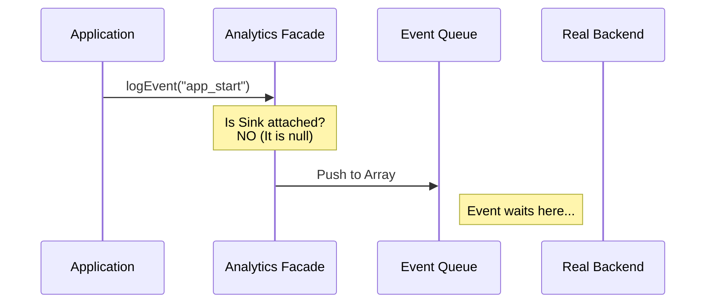
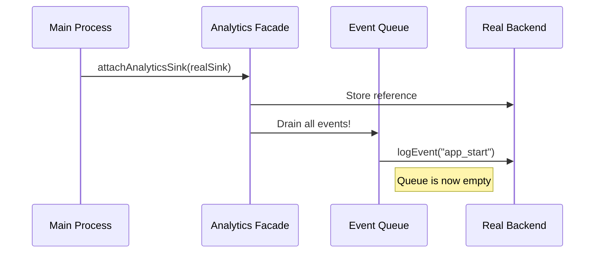

# Chapter 1: Public Analytics Facade

Welcome to the **Analytics** project tutorial! In this first chapter, we are going to explore the entry point of our telemetry system: the **Public Analytics Facade**.

## Why do we need a Facade?

Imagine you are mailing a letter. You walk up to a blue mailbox on the street corner and drop your letter inside.

*   You **don't** need to know if the mail truck is coming in 5 minutes or 5 hours.
*   You **don't** need to know which specific post office handles the sorting.
*   You **don't** need to know the driver's name.

You just drop the letter, and you trust the system to handle it.

The **Public Analytics Facade** is exactly like that mailbox. It is a lightweight "drop-off point" for the rest of the application. It solves a specific timing problem:

**The Problem:** When our application (Claude CLI) first starts up, we often want to log an event immediately (like "Application Started"). However, the complex machinery required to actually send data (network connections, authentication, configuration) takes a few milliseconds to load.

**The Solution:** We use a Facade that accepts events immediately. If the "mail truck" (the backend) isn't ready, the Facade holds the events in a queue and sends them automatically once the system is online.

## How to Log an Event

Using the facade is designed to be extremely simple. You import a function and call it. You don't need to worry about setting up configurations or connecting to databases here.

Here is how a developer logs an event:

```typescript
import { logEvent } from './analytics';

// We simply describe WHAT happened
logEvent('file_processed', {
  success: true,
  duration_ms: 150
});
```

**What happened here?**
1.  We called `logEvent` with an event name (`'file_processed'`).
2.  We passed simple data (metadata) about the event.
3.  The function returns immediately (void). The app keeps running without waiting for a network request.

### A Note on Safety
You might notice we passed booleans and numbers, but not arbitrary strings. This is intentional! We want to prevent accidentally logging sensitive user code or file paths.

If you try to log a raw string, TypeScript will complain to keep user data safe. We will cover how to handle data enrichment in [Metadata & Context Enrichment](03_metadata___context_enrichment.md).

## What Happens Under the Hood?

Now let's look inside the mailbox. The core logic of the Facade is determining whether the backend (which we call the **Sink**) is ready.

### Scenario 1: The "Cold" Start
When the app first boots, the Sink is `null`.



### Scenario 2: Attaching the Sink
A few milliseconds later, the rest of the application finishes loading. It creates the backend and "attaches" it to our Facade.



## Diving into the Code

Let's look at the actual implementation in `index.ts`. It is designed to have **zero dependencies** so it can be imported anywhere without causing circular reference errors.

### 1. The Queue and The Sink
We need a place to store the "mailbox" content (the queue) and a reference to the mail truck (the sink).

```typescript
// index.ts

// The "Mailbox" - simply an array of events
const eventQueue: QueuedEvent[] = []

// The "Mail Truck" - starts as null
let sink: AnalyticsSink | null = null
```

### 2. The Log Function
This is the function we called in the first example. It checks if the sink is ready.

```typescript
export function logEvent(
  eventName: string,
  metadata: LogEventMetadata,
): void {
  // If no backend is ready, save it for later
  if (sink === null) {
    eventQueue.push({ eventName, metadata, async: false })
    return
  }
  
  // If backend is ready, send it immediately
  sink.logEvent(eventName, metadata)
}
```

### 3. Attaching the Sink
This is the most critical part of the Facade. When the application is fully ready, it calls `attachAnalyticsSink`. This function connects the "machinery" and flushes any pending letters.

```typescript
export function attachAnalyticsSink(newSink: AnalyticsSink): void {
  // Prevent attaching twice
  if (sink !== null) return
  
  sink = newSink

  // If we have buffered events, send them now!
  if (eventQueue.length > 0) {
    const queuedEvents = [...eventQueue]
    eventQueue.length = 0 // Clear the buffer

    // Use microtask to avoid blocking app startup
    queueMicrotask(() => {
      for (const event of queuedEvents) {
        sink!.logEvent(event.eventName, event.metadata)
      }
    })
  }
}
```
*Note: We use `queueMicrotask` to ensure that draining the queue doesn't freeze the application right when it's trying to start up.*

## Summary

The **Public Analytics Facade** is a buffer that allows the application to log events immediately without worrying about the complexity of the backend.

1.  **Zero Dependencies:** It is safe to import anywhere.
2.  **Buffering:** It holds events in an array until the backend is ready.
3.  **Automatic Draining:** Once the backend attaches, old events are sent automatically.

But what exactly *is* the backend? Where do the events go once they leave the Facade?

In the next chapter, we will discuss the component that receives these events and decides where to send them.

[Next Chapter: The Analytics Sink (Router)](02_the_analytics_sink__router_.md)

---

Generated by [Code IQ](https://github.com/adityasoni99/Code-IQ)