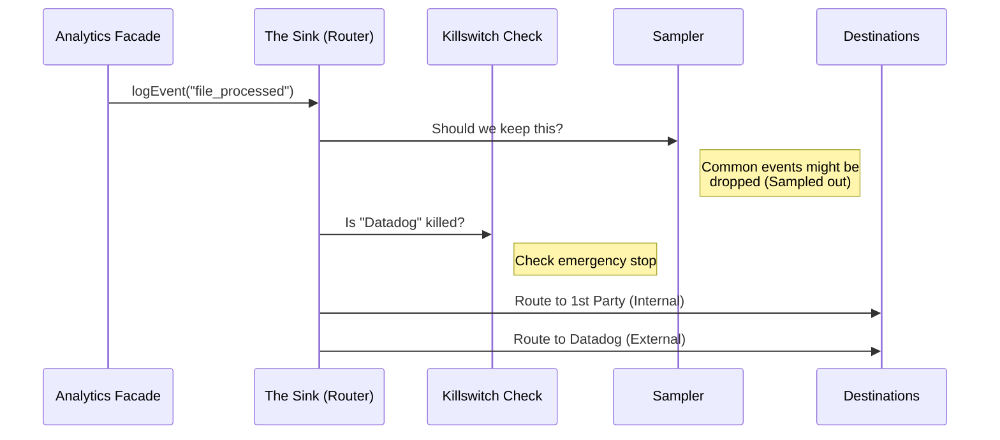

# Chapter 2: The Analytics Sink (Router)

In the previous chapter, [Public Analytics Facade](01_public_analytics_facade.md), we learned how to drop a "letter" (an event) into a mailbox. We established that the Facade is just a temporary holding area (a queue) that waits for the real machinery to start up.

In this chapter, we will meet that machinery: **The Analytics Sink**.

## The "Sorting Room" Analogy

If the Facade is the mailbox, the **Analytics Sink** is the central **Sorting Room** at the post office.

When the sorting room opens for business (initializes), it empties the mailbox. For every letter that comes in, the Sorting Room has to make three decisions:

1.  **Filtering (Sampling):** "We have too many of these letters today. Should we throw this one away to save space?"
2.  **Safety (Killswitches):** "Is the delivery truck broken? If so, stop accepting mail immediately."
3.  **Routing:** "Where does this go? To the local archive? To an external dashboard? Or both?"

The Sink is the **Router**. It takes one input (your event) and decides which pipelines to send it to.

## High-Level Flow

Before we look at code, let's visualize the life of an event once it reaches the Sink.



## Step 1: Opening for Business (Initialization)

The Sink doesn't exist when the app first launches. We have to create it and "attach" it to the Facade. This usually happens in the application's startup file (`main.tsx` or similar).

Here is the code that brings the Sink to life:

```typescript
// sink.ts
import { attachAnalyticsSink } from './index.js' // The Facade

export function initializeAnalyticsSink(): void {
  // Connect the "Sorting Room" to the "Mailbox"
  attachAnalyticsSink({
    logEvent: logEventImpl,
    logEventAsync: logEventAsyncImpl,
  })
}
```

**What happened here?**
We called `attachAnalyticsSink` and passed it our logic (`logEventImpl`). As soon as this runs, any events waiting in the Facade's queue are immediately flushed into the logic we describe below.

## Step 2: The Routing Logic

This is the heart of the router. `logEventImpl` receives an event and decides what to do with it.

### A. Sampling (The Filter)

First, we check if the event is "sampled." Sampling is a technique used to save money and storage. If an event happens 1 million times a day, we might only want to record 1% of them to get the general idea.

```typescript
// Inside logEventImpl...

// 1. Check if we should keep this event
const sampleResult = shouldSampleEvent(eventName)

// If result is 0, the event is dropped completely
if (sampleResult === 0) {
  return
}

// Otherwise, record the sample rate (e.g., 1 out of 10)
const metadataWithSampleRate = { ...metadata, sample_rate: sampleResult }
```

### B. Routing to Datadog

Next, we check if we should send this to **Datadog** (our external dashboard tool). This involves checking a "Killswitch" (explained below) and Feature Gates.

```typescript
// Inside logEventImpl...

if (shouldTrackDatadog()) {
  // Datadog is external, so we strip internal secrets (_PROTO fields)
  const safeMetadata = stripProtoFields(metadataWithSampleRate)
  
  // Send to Datadog Pipeline
  trackDatadogEvent(eventName, safeMetadata)
}
```
*We will cover the specific details of Datadog in [Datadog Integration](05_datadog_integration.md).*

### C. Routing to Internal (1st-Party) Logs

Finally, we almost always send data to our own internal system. This is our "source of truth."

```typescript
// Inside logEventImpl...

// Send to Internal Pipeline
// We send the full metadata here, including internal debug info
logEventTo1P(eventName, metadataWithSampleRate)
```
*We will cover the internal pipeline in [First-Party (Internal) Telemetry Pipeline](04_first_party__internal__telemetry_pipeline.md).*

## Step 3: Safety Valves (Killswitches)

Sometimes, things break. Maybe the Datadog API is down, or we are logging too much data and crashing the network.

We use **Killswitches** to instantly stop the Router from sending data to specific destinations without deploying new code.

The router uses a helper function `isSinkKilled`:

```typescript
// sinkKillswitch.ts

export function isSinkKilled(sink: SinkName): boolean {
  // Check our dynamic config (GrowthBook)
  const config = getDynamicConfig(SINK_KILLSWITCH_CONFIG_NAME, {})
  
  // If config says { datadog: true }, this returns true
  return config?.[sink] === true
}
```

When `shouldTrackDatadog()` is called in the routing logic, it checks this switch first. If the switch is "On" (meaning killed), the router skips Datadog entirely.

## Putting it All Together

The **Analytics Sink** is the brain of our telemetry. It ensures that:
1.  We don't log useless data (Sampling).
2.  We don't log when systems are broken (Killswitches).
3.  We send clean data to external tools (Datadog).
4.  We send complete data to internal tools (1st-Party).

However, you might have noticed we talked about `metadata` (the data inside the event). Sometimes, raw data isn't enough. We need to know *who* sent the event, or *what version* of the app they are running.

In the next chapter, we will learn how we automatically add this extra information to every single event.

[Next Chapter: Metadata & Context Enrichment](03_metadata___context_enrichment.md)

---

Generated by [Code IQ](https://github.com/adityasoni99/Code-IQ)