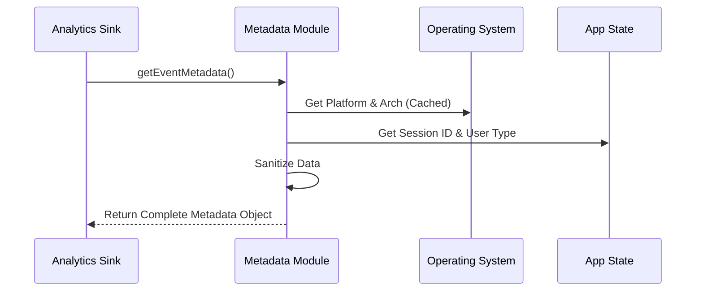

# Chapter 3: Metadata & Context Enrichment

In the previous chapter, [The Analytics Sink (Router)](02_the_analytics_sink__router_.md), we built the "Sorting Room" that receives events and decides where to send them.

However, if we just sent the raw event, it wouldn't be very useful. Imagine a detective finding a note that simply says: *"Error occurred."*

The detective would immediately ask:
*   **Who** sent this?
*   **Where** did it happen (Windows? Mac? Linux?)
*   **When** did the session start?
*   **What** version of the software are they running?

This chapter is about the **Metadata & Context Enrichment** system. It acts as an automatic "ID Card Generator" that attaches this vital information to every single event before it leaves the user's machine.

## The Problem: The "Blank Letter"
Without metadata, a log looks like this:

```json
{
  "event": "command_failed",
  "data": { "error_code": 500 }
}
```

This is impossible to debug. Is the error happening only on Windows? Is it only happening to free users? We don't know.

## The Solution: Automatic ID Cards
We want every event to automatically look like this:

```json
{
  "event": "command_failed",
  "data": { "error_code": 500 },
  "metadata": {
    "os": "darwin (macOS)",
    "version": "2.0.1",
    "session_id": "sess_12345",
    "is_ci": false
  }
}
```

This allows us to say: *"Ah, this error only happens on macOS for users on version 2.0.1."*

## Key Concept 1: The Environment Context

The first job of this system is to gather facts about the machine running the code. We call this the **Environment Context**.

We don't want to ask the Operating System for this info every time an event is logged (that would be slow). Instead, we gather it once and "memoize" (cache) it.

Here is how we build the profile of the machine:

```typescript
// metadata.ts
const buildEnvContext = memoize(async () => {
  // Ask the system for details
  const platform = process.platform // e.g., 'darwin', 'win32'
  const nodeVersion = process.version // e.g., 'v18.1.0'
  
  return {
    platform,
    nodeVersion,
    isCi: Boolean(process.env.CI), // Are we running in GitHub Actions?
    terminal: process.env.TERM // What terminal app is used?
  }
})
```

**Why is this important?**
If a bug only happens in "GitHub Actions" (CI) environments but works fine on local laptops, the `isCi` flag tells us exactly where to look.

## Key Concept 2: Safety & Sanitization (The Redactor)

This is the most critical part of this chapter.

**We must never accidentally log a user's secrets.**

A user might run a command like:
`claude create secret_plans_for_world_domination.txt`

If we logged the full filename, we would be violating the user's privacy. To prevent this, we have a **Sanitization Layer**. This layer acts like a government redactor, blacking out sensitive text before the event is mailed out.

### Example: Sanitizing File Extensions
Instead of logging the full filename, we might only log the *extension* (like `.ts` or `.json`) so we know what language they are working in, without knowing the file content.

But wait! What if a user names a file `my-api-key-12345`? That looks like an extension to a computer.

We implement safety checks:

```typescript
// metadata.ts
export function getFileExtensionForAnalytics(filePath: string) {
  const ext = extname(filePath) // Get the .part
  
  // If extension is suspiciously long, it might be a secret token
  // MAX_FILE_EXTENSION_LENGTH is usually around 10
  if (ext.length > MAX_FILE_EXTENSION_LENGTH) {
    return 'other' // SAFE! We hide the actual value
  }

  return ext
}
```

### Example: Sanitizing Tool Names
Our application supports plugins (called MCP tools). Some tools are standard (like "ReadFile"), but users can create custom tools with sensitive names (like "DeployToMySecretServer").

We check if the tool is "Official" or "Custom".

```typescript
// metadata.ts
export function sanitizeToolNameForAnalytics(toolName: string) {
  // If it's a generic MCP tool, we don't know if the name is safe.
  // We redact it to a generic string.
  if (toolName.startsWith('mcp__')) {
    return 'mcp_tool' 
  }
  
  // Built-in tools (like 'bash') are safe to log
  return toolName 
}
```

## How It Works: The Flow

When the [The Analytics Sink (Router)](02_the_analytics_sink__router_.md) receives an event, it calls `getEventMetadata` before sending the data anywhere.



## Diving into the Code

The main entry point is a function called `getEventMetadata`. It combines the static environment info with dynamic session info.

### 1. Gathering the Data
This function acts as the assembler. It pulls data from different parts of the application.

```typescript
// metadata.ts
export async function getEventMetadata() {
  // 1. Get the static machine info (Cached)
  const envContext = await buildEnvContext()
  
  // 2. Get dynamic session info (Changes per run)
  const sessionId = getSessionId()
  const isInteractive = getIsInteractive() // Is a human typing?

  // 3. Combine them
  return {
    sessionId,
    isInteractive,
    envContext, // The OS, Node version, etc.
    model: 'claude-3-5-sonnet' // The AI model being used
  }
}
```

### 2. Formatting for Different Destinations
Different analytics backends expect different formats.
*   **Datadog** (External) likes flat JSON.
*   **Data Warehouse** (Internal) likes strict schemas (snake_case).

The Metadata module provides helper functions to translate this "Identity Card" into the correct language for the destination.

```typescript
// metadata.ts
export function to1PEventFormat(metadata) {
  // Convert our nice camelCase to snake_case for the database
  return {
    session_id: metadata.sessionId,
    user_type: metadata.userType,
    env: {
      platform: metadata.envContext.platform,
      is_ci: metadata.envContext.isCi
    }
  }
}
```

## Summary

The **Metadata & Context Enrichment** system ensures that every event carries the context required to make it useful, while strictly protecting user privacy through sanitization.

1.  **Enrichment:** Adds "Who, Where, What" to every event.
2.  **Memoization:** Caches static info (OS, Arch) so it doesn't slow down the app.
3.  **Sanitization:** Aggressively strips or hashes PII (like file paths or custom tool names) to ensure safety.

Now that we have a fully enriched, sanitized event, where does it go? In the next chapter, we will look at our primary storage destination: the internal data warehouse.

[Next Chapter: First-Party (Internal) Telemetry Pipeline](04_first_party__internal__telemetry_pipeline.md)

---

Generated by [Code IQ](https://github.com/adityasoni99/Code-IQ)