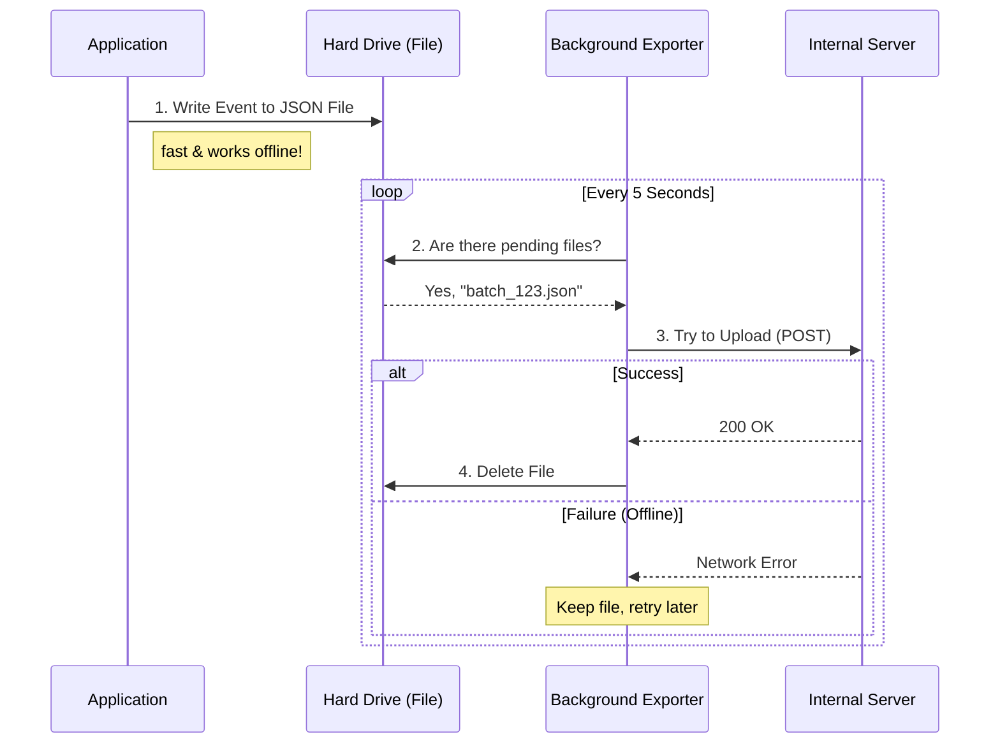

# Chapter 4: First-Party (Internal) Telemetry Pipeline

In the previous chapter, [Metadata & Context Enrichment](03_metadata___context_enrichment.md), we learned how to attach a detailed "ID Card" (metadata) to every event.

Now we have a perfectly formatted, sanitized event. Where does it go?

In this chapter, we explore the **First-Party Telemetry Pipeline**. This is our custom-built delivery system designed for maximum reliability. Unlike standard logging, which might lose data if the internet flickers, this system ensures that **if an event happens, we eventually receive it.**

## The Problem: The "Tunnel" Scenario

Imagine a user is using our CLI tool while riding a train through a tunnel. They run a command, and the internet cuts out.

If our code looked like this:
```typescript
// ❌ BAD: If internet is down, this data is lost forever
await fetch('https://api.anthropic.com/logs', { method: 'POST', body: event });
```
The request would fail, the application might crash or close, and we would never know that the user had trouble.

## The Solution: Store-and-Forward

To solve this, we use a technique called **Store-and-Forward**. It works exactly like the "Outbox" in an email client.

1.  **Store:** When an event happens, we don't try to send it immediately. We write it to a **file on the user's hard drive**. This is instant and works offline.
2.  **Forward:** A separate background process constantly checks the "Outbox" folder. If it sees files and has an internet connection, it uploads them.

If the upload fails? It leaves the file there and tries again later.

## High-Level Workflow

Let's visualize the journey of an event in this pipeline.



## Step 1: The "Safety Net" (Writing to Disk)

The core of this reliability is the `FirstPartyEventLoggingExporter`.

When `logEvent` is called, the exporter doesn't touch the network. It appends the event to a local file. We use a unique ID (`BATCH_UUID`) to ensure we don't overwrite other running processes.

```typescript
// firstPartyEventLoggingExporter.ts

// We use the file system (fs) to save data locally first
private async appendEventsToFile(
  filePath: string, 
  events: Event[]
): Promise<void> {
  // Convert event to a string (JSON)
  const content = events.map(e => JSON.stringify(e)).join('\n') + '\n'
  
  // Save it to the hard drive immediately
  await appendFile(filePath, content, 'utf8')
}
```

**Why this matters:** Even if the computer loses power 1 millisecond after this line runs, the event is saved on the disk. When the app restarts, it will find this file and upload it.

## Step 2: The Batch "Bus"

Sending one event at a time is inefficient (like driving a bus with only one passenger).

We use a **Batching** system. We wait until we have a group of events (e.g., 200 events) or a certain amount of time has passed (e.g., 5 seconds) before we try to upload.

This is managed by a standard library called OpenTelemetry, but we configure it like this:

```typescript
// firstPartyEventLogger.ts

new BatchLogRecordProcessor(eventLoggingExporter, {
  // Wait up to 10 seconds to fill the bus
  scheduledDelayMillis: 10000,
  // Or leave immediately if we have 200 passengers
  maxExportBatchSize: 200,
})
```

## Step 3: Reliability & Retries

This is the most complex part of the pipeline. What happens when the "Bus" tries to leave, but the road is closed (Server Error)?

We use a logic called **Quadratic Backoff**. This means we wait longer and longer between retries to avoid overwhelming the network.

1.  Attempt 1: Fail.
2.  Wait 0.5 seconds.
3.  Attempt 2: Fail.
4.  Wait 2 seconds.
5.  Attempt 3: Fail.
6.  Wait 8 seconds...

Here is a simplified look at the retry loop in the exporter:

```typescript
// firstPartyEventLoggingExporter.ts

private async retryFailedEvents(): Promise<void> {
  // Check the disk for old files
  const events = await this.loadEventsFromFile(filePath)
  
  // Try to send them
  try {
    await this.sendBatchWithRetry({ events })
    
    // If successful, clean up the disk!
    await this.deleteFile(filePath)
  } catch (error) {
    // If failed, schedule a retry for later
    this.scheduleBackoffRetry() 
  }
}
```

## Step 4: Authentication & Trust

Since this is an **Internal** pipeline, we need to ensure the data is coming from a trusted source.

Before sending the batch, the exporter checks if the user has authenticated (logged in).

1.  **Check Trust:** Has the user accepted the "Allow Telemetry" dialog?
2.  **Get Token:** Grab the OAuth token from the config.
3.  **Attach Header:** Add the token to the HTTP request.

```typescript
// firstPartyEventLoggingExporter.ts (Simplified)

const headers = {
  'Content-Type': 'application/json',
  'User-Agent': 'claude-code-cli'
}

// Only add the secret token if the user is verified
if (hasTrust && !tokenExpired) {
  headers['Authorization'] = `Bearer ${authToken}`
}

// Send the request
await axios.post('https://api.anthropic.com/logs', payload, { headers })
```

## Summary

The **First-Party Telemetry Pipeline** is the heavy-duty "cargo train" of our analytics system.

1.  **Store-and-Forward:** It saves to disk first, ensuring data survives crashes.
2.  **Batching:** It groups events for efficiency.
3.  **Resilience:** It retries failed uploads using backoff logic.
4.  **Recovery:** It picks up old files from previous sessions that failed to send.

This system is perfect for high-fidelity, crucial data. But sometimes, we need data to appear on a dashboard *immediately* to monitor system health, even if it's slightly less reliable.

For that, we use a different tool.

[Next Chapter: Datadog Integration](05_datadog_integration.md)

---

Generated by [Code IQ](https://github.com/adityasoni99/Code-IQ)