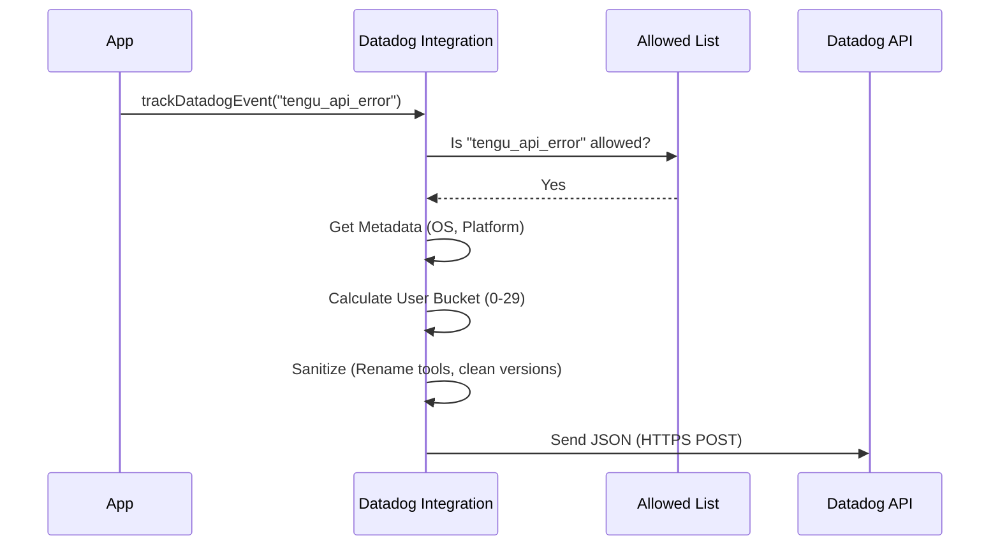

# Chapter 5: Datadog Integration

In the previous chapter, [First-Party (Internal) Telemetry Pipeline](04_first_party__internal__telemetry_pipeline.md), we built a heavy-duty "cargo train" for our data. It saves events to the disk and reliably uploads them in batches. This is great for detailed analysis, but it can be slow.

But what if the application is crashing **right now**?

If a bug is preventing users from even starting the app, we can't wait for a background process to upload a log file 10 minutes later. We need to know immediately.

This is where **Datadog** comes in.

## The Dashboard Analogy

Think of your application like a car.

*   **The Internal Pipeline (Chapter 4)** is the "Black Box" flight recorder. It records every single switch flip and sensor reading. If the car crashes, engineers examine this later to understand exactly what happened.
*   **The Datadog Integration (This Chapter)** is the **Dashboard** behind the steering wheel. It has a speedometer and a "Check Engine" light. It doesn't show you everything, but if that light turns red, you know immediately that something is wrong.

## Why a Separate Pipeline?

We build a specific integration for Datadog for three reasons:

1.  **Speed:** We want near real-time visibility into errors.
2.  **Alerting:** We want to wake up an engineer (PagerDuty) if error rates spike.
3.  **Cost Control:** Storing data in Datadog is expensive. We cannot send *everything*. We only send critical health indicators.

## Key Concept 1: The "VIP List" (Allowed Events)

Unlike our internal pipeline, which logs almost everything, Datadog is an exclusive club. We only let specific, high-importance events in.

We maintain a "Set" of allowed event names. If an event isn't on the list, the Datadog integration ignores it immediately.

```typescript
// datadog.ts

// Only these specific events are allowed to go to Datadog
const DATADOG_ALLOWED_EVENTS = new Set([
  'tengu_api_error',           // Something went wrong!
  'tengu_started',             // App started
  'chrome_bridge_disconnected' // Browser connection lost
  // ... a select few others
])
```

**Why?** This prevents us from accidentally flooding our dashboard (and our bill) with low-value debugging information.

## Key Concept 2: User Bucketing (Privacy + Metrics)

This is a clever trick to solve a hard problem.

**The Problem:** We want to answer the question: *"Is this bug affecting 1 user 100 times, or 100 different users?"*
**The Constraint:** We do **not** want to track specific user IDs in Datadog. It’s bad for privacy and makes the data "high cardinality" (too messy/expensive).

**The Solution:** We assign every user to a random "Bucket" numbered 0 to 29.

Imagine a classroom with 30 tables. When a student enters, we tell them "You sit at Table 5." We don't write down the student's name, we just mark an error coming from "Table 5."

If we see errors from Table 5, Table 12, and Table 29, we know ~3 users are affected. If we see 100 errors all from Table 5, we know it's likely just one user having a bad day.

### The Implementation

We hash the user's ID and use math (modulo) to pick a number between 0 and 29.

```typescript
// datadog.ts
const NUM_USER_BUCKETS = 30

const getUserBucket = memoize((): number => {
  const userId = getOrCreateUserID() // e.g., "user_abc123"
  
  // Turn string ID into a hash (long random-looking string)
  const hash = createHash('sha256').update(userId).digest('hex')
  
  // Convert part of hash to a number, then restrict to 0-29
  return parseInt(hash.slice(0, 8), 16) % NUM_USER_BUCKETS
})
```

## Key Concept 3: Sanitization (Blurring the Details)

Datadog charges based on how many unique "tags" we send. If we send exact version numbers like `2.0.1-dev-sha12345-timestamp`, Datadog treats every single build as a new category.

We need to "blur" the details to group things together.

### Example: Normalizing Versions
We strip out the messy timestamp and commit hash, keeping only the main version.

```typescript
// Input:  "2.0.53-dev.20251124.t173302.sha526cc6a"
// Output: "2.0.53-dev.20251124"

if (typeof allData.version === 'string') {
  allData.version = allData.version.replace(
    /^(\d+\.\d+\.\d+-dev\.\d{8})\.t\d+\.sha[a-f0-9]+$/,
    '$1',
  )
}
```

### Example: Generic Tool Names
If a user writes a custom tool called `deploy_to_my_secret_server`, we don't want that specific name in our dashboard. We rename all custom tools to simply `mcp`.

```typescript
// If the tool name looks like a custom MCP tool...
if (allData.toolName.startsWith('mcp__')) {
  // Rename it to a generic category
  allData.toolName = 'mcp'
}
```

## The Workflow

Here is what happens when an event is sent to Datadog.



## Diving into the Code

Let's look at the main function, `trackDatadogEvent`. It ties everything together.

### 1. The Check
First, we check if we should even run.

```typescript
export async function trackDatadogEvent(
  eventName: string,
  properties: any
): Promise<void> {
  // 1. Only run in production
  if (process.env.NODE_ENV !== 'production') return

  // 2. Check the "VIP List"
  if (!DATADOG_ALLOWED_EVENTS.has(eventName)) return
  
  // ... continue to processing
}
```

### 2. Preparing the Data
We fetch the metadata we built in [Metadata & Context Enrichment](03_metadata___context_enrichment.md), add our specific Datadog properties, and calculate the user bucket.

```typescript
  // ... inside trackDatadogEvent

  const metadata = await getEventMetadata()
  
  const allData = {
    ...metadata,
    ...properties,
    // Add the anonymous bucket ID
    userBucket: getUserBucket(), 
  }
```

### 3. Sending the Batch
Just like the internal pipeline, we don't want to make a network request for every single event. We add it to a `logBatch` array.

```typescript
  // Create the log object
  const log = {
    message: eventName,
    service: 'claude-code',
    ...allData // Attach all our cleaned data
  }

  logBatch.push(log)

  // If we have 100 logs, send immediately. Otherwise wait.
  if (logBatch.length >= 100) {
    void flushLogs()
  } else {
    scheduleFlush() // Wait 15 seconds
  }
```

## Summary

The **Datadog Integration** is our rapid-response system.

1.  **Selective:** It only tracks critical events (Allowed List).
2.  **Anonymous:** It uses "User Buckets" to track reach without tracking identity.
3.  **Clean:** It sanitizes data to keep our dashboard tidy and costs low.

We have now covered how we define events, how we route them, how we enrich them, and how we send them to both our long-term storage and our real-time dashboard.

But what happens if we need to turn off a specific log *after* we have released the software to users? We can't go to their computers and update the code.

In the final chapter, we will look at how we control this system remotely.

[Next Chapter: Dynamic Configuration (GrowthBook)](06_dynamic_configuration__growthbook_.md)

---

Generated by [Code IQ](https://github.com/adityasoni99/Code-IQ)