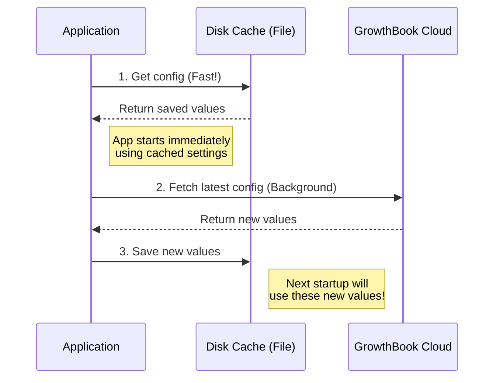

# Chapter 6: Dynamic Configuration (GrowthBook)

Welcome to the final chapter of the Analytics project!

In the previous chapter, [Datadog Integration](05_datadog_integration.md), we built a real-time dashboard that acts like a "Check Engine" light. It tells us immediately if something is wrong.

**But here is the scary part:** Imagine you see that light turn red. A new feature is crashing the application for 50% of your users.

If you have to write a code fix, review it, build a new version, and ask thousands of users to download the update... that might take days. By then, the users are gone.

We need a way to turn that broken feature **off** instantly, without deploying new code.

Enter **Dynamic Configuration** (powered by GrowthBook). This is the "Remote Control" for our application.

## The Concept: Hardcoded vs. Dynamic

### The Old Way (Hardcoded)
Usually, developers write code like this:

```typescript
const IS_NEW_UI_ENABLED = true; // ❌ Hardcoded!

if (IS_NEW_UI_ENABLED) {
  showNewInterface();
}
```

To change this to `false`, you have to change the source code and release a new version of the software.

### The New Way (Dynamic)
With Dynamic Configuration, we write this:

```typescript
// ✅ Dynamic! Ask the system what to do.
const isEnabled = getFeatureValue('new_ui_enabled');

if (isEnabled) {
  showNewInterface();
}
```

Now, we can log into the GrowthBook website, flip a switch, and within minutes, `isEnabled` becomes `false` on every user's machine around the world.

## Use Case 1: The "Killswitch" (Feature Flags)
The most common use case is a boolean (true/false) flag.
*   **Feature Gating:** "Only show the new AI tool to internal employees."
*   **Killswitches:** "Disable the `upload_file` command because the server is down."

## Use Case 2: The "Knob" (Remote Configuration)
Sometimes we need more than just On/Off. We need to tune numbers or text.
*   **Sampling Rates:** "Log 10% of events" -> "Log 50% of events."
*   **Limits:** "Max file size is 5MB" -> "Max file size is 10MB."

## How It Works: The "Morning Newspaper" Strategy

Fetching configuration from a server takes time (network latency). We cannot block the application startup while we wait for the internet.

To solve this, we use a **stale-while-revalidate** strategy, which is like reading the morning newspaper.

1.  **Immediate:** When the user wakes up (app starts), they read the newspaper on their doorstep (the **Disk Cache**). It might be from yesterday, but it's instant.
2.  **Background:** While they are reading, the delivery truck comes with today's news (the **Network Request**).
3.  **Update:** We save the new news to the doorstep for next time.

### The Flow



## Diving into the Code

Let's look at `growthbook.ts`. This file wraps the official GrowthBook SDK to handle our specific caching needs.

### 1. Identify the User (Targeting)
Before we ask for config, we need to tell GrowthBook *who* is asking. This allows us to say "Turn this feature on for Windows users only."

We use the data we learned about in [Metadata & Context Enrichment](03_metadata___context_enrichment.md).

```typescript
// growthbook.ts

function getUserAttributes(): GrowthBookUserAttributes {
  // Get the standard user profile
  const user = getUserForGrowthBook()

  return {
    id: user.deviceId,
    platform: user.platform, // 'win32', 'darwin'
    appVersion: user.appVersion,
    // ... other attributes
  }
}
```

### 2. Reading a Value (The Fast Way)
This is the most important function in the entire file. `getFeatureValue_CACHED_MAY_BE_STALE` allows us to check a flag **synchronously** (instantly) without using `await`.

It looks at the file we saved on the hard drive during the *previous* run.

```typescript
// growthbook.ts

export function getFeatureValue_CACHED_MAY_BE_STALE<T>(
  feature: string,
  defaultValue: T,
): T {
  // 1. Check if we have this feature in our disk cache
  const config = getGlobalConfig() // Reads ~/.claude.json
  const cached = config.cachedGrowthBookFeatures?.[feature]
  
  // 2. If found, return it immediately!
  if (cached !== undefined) {
    return cached as T
  }

  // 3. If not found, use the default (safe fallback)
  return defaultValue
}
```

*Note: The name `MAY_BE_STALE` reminds developers that this value might be a few hours old, which is usually fine for UI features.*

### 3. Refreshing in the Background
While the app is running, we connect to GrowthBook to get updates. This happens in `initializeGrowthBook`.

```typescript
// growthbook.ts

// Create the client with our user attributes
const gb = new GrowthBook({
  apiHost: 'https://api.anthropic.com/',
  clientKey: getGrowthBookClientKey(),
  attributes: getUserAttributes(),
})

// Fetch from network
gb.init({ timeout: 5000 }).then(async () => {
  // When network returns, save the new values to disk!
  syncRemoteEvalToDisk()
})
```

### 4. Syncing to Disk
When the new data arrives, we save it so it's ready for the *next* time the user opens the app.

```typescript
// growthbook.ts

function syncRemoteEvalToDisk(): void {
  // Get all the new values the server sent us
  const fresh = Object.fromEntries(remoteEvalFeatureValues)
  
  // Save to our global config file
  saveGlobalConfig(current => ({
    ...current,
    cachedGrowthBookFeatures: fresh,
  }))
}
```

## Advanced: Remote Evaluation

You might notice a setting `remoteEval: true` in the code.

Standard feature flags download *rules* to the client (e.g., "If version > 2.0, return true"). The client does the math.

**Remote Evaluation** means we send the user's attributes to the server, the server does the math, and sends back only the final result (`true`).

**Why do we use this?**
1.  **Security:** Users can't reverse-engineer our rollout logic by looking at the rules.
2.  **Privacy:** We don't download rules meant for other companies/groups.
3.  **Simplicity:** The client code is dumber and lighter.

## Putting It All Together

We have now built a complete telemetry and control system.

1.  **Facade:** The app logs an event.
2.  **Metadata:** We attach user info (OS, Version).
3.  **Router:** We decide where the event goes.
4.  **GrowthBook:** We use the "Remote Control" to:
    *   Turn off the Router if it's broken (Killswitch).
    *   Change how many events we log (Sampling).
    *   Enable new features for specific users.

### Conclusion

The **Dynamic Configuration** module is the final piece of the puzzle. It closes the feedback loop.

*   **Step 1:** We release a feature.
*   **Step 2:** We collect data via the **Telemetry Pipeline**.
*   **Step 3:** We see an issue in **Datadog**.
*   **Step 4:** We use **GrowthBook** to disable the feature instantly.

You now understand the full lifecycle of data within the `analytics` project. You know how to log events safely, how they are transported, and how we control the system remotely.

**End of Tutorial.**

---

Generated by [Code IQ](https://github.com/adityasoni99/Code-IQ)