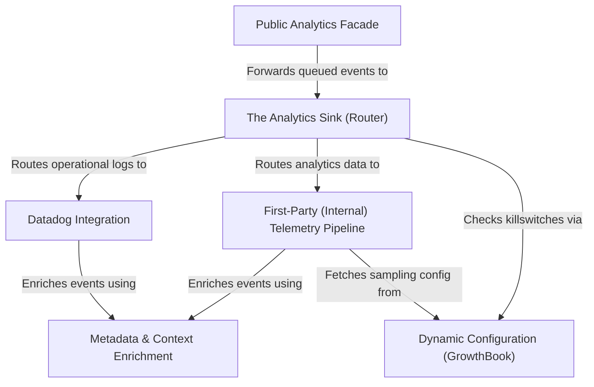

# Tutorial: analytics

This project implements a robust **telemetry and analytics system** designed to track application usage and health. It acts as a centralized hub that accepts events via a public **facade**, enriches them with *sanitized* user and system context, and intelligently routes them to specific destinations like **Datadog** (for real-time monitoring) or an internal **first-party pipeline** (for detailed data analysis). The entire system is remotely managed via **dynamic configuration**, allowing the team to control sampling rates and toggle features on the fly.

## Chapters

1. [Public Analytics Facade](01_public_analytics_facade.md)
2. [The Analytics Sink (Router)](02_the_analytics_sink__router_.md)
3. [Metadata & Context Enrichment](03_metadata___context_enrichment.md)
4. [First-Party (Internal) Telemetry Pipeline](04_first_party__internal__telemetry_pipeline.md)
5. [Datadog Integration](05_datadog_integration.md)
6. [Dynamic Configuration (GrowthBook)](06_dynamic_configuration__growthbook_.md)

---

Generated by [Code IQ](https://github.com/adityasoni99/Code-IQ)