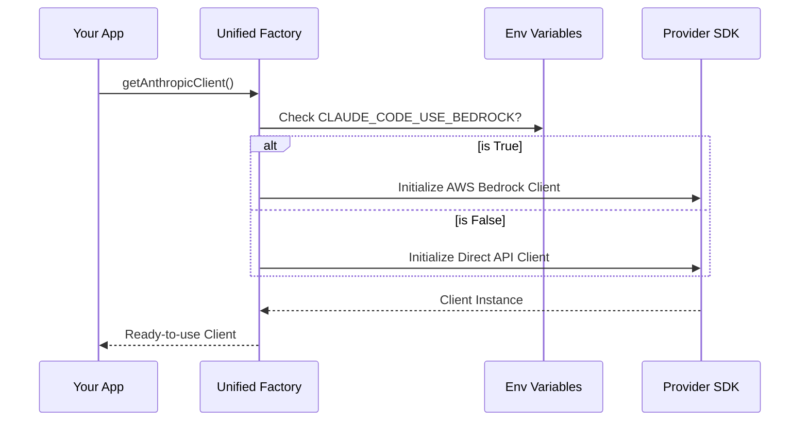

# Chapter 1: Unified Client Factory

Welcome to the **API** project! This is the first chapter of our journey into how we communicate with Large Language Models (LLMs) like Claude.

## The Problem: Too Many Plugs

Imagine you are traveling around the world. In the US, you need one type of power plug. In the UK, you need another. In Europe, yet another. It's frustrating to carry three different chargers for the same phone. You just want a **universal travel adapter**.

In the world of AI, "talking to Claude" isn't always the same. Depending on your environment, you might access Claude through:
1.  **Anthropic's Direct API** (using an API Key).
2.  **AWS Bedrock** (using AWS credentials).
3.  **Google Vertex AI** (using Google Cloud credentials).
4.  **Azure Foundry** (using Microsoft credentials).

Each of these "countries" (providers) requires different authentication, different URLs, and different headers.

## The Solution: The Unified Client Factory

The **Unified Client Factory** is our "Universal Travel Adapter." It is a single function that looks at your environment and automatically gives you the correct "charger" (Client) to talk to Claude.

You don't need to worry about whether you are on AWS or using a direct API key. You just ask the factory for a client, and it handles the rest.

### Key Use Case

You are building a tool that needs to send a prompt to Claude. You want this tool to work on your personal laptop (using an API key) *and* on your company's secure AWS server (using IAM roles), without changing your code.

**How the Factory helps:**
Instead of writing `if (aws) { doAwsThing() } else { doApiThing() }` everywhere in your code, you call `getAnthropicClient()` once.

## How to Use It

Using the factory is designed to be extremely simple. The complexity is hidden inside.

```typescript
import { getAnthropicClient } from './client.js'

// 1. Ask the factory for a client
const client = await getAnthropicClient({
  maxRetries: 3,
});

// 2. Use the client (It looks the same regardless of provider!)
// This part is covered in depth in the next chapter.
```

**What happens here?**
The `client` variable now holds an object capable of sending messages. If you set the environment variable `CLAUDE_CODE_USE_BEDROCK=1`, that object is configured for AWS. If you didn't, it's configured for the Direct API.

## Under the Hood: How It Works

Let's look at what happens inside `getAnthropicClient` when you call it.

### The Decision Flow

The factory acts like a traffic controller. It checks your environment variables to decide which path to take.



### Step-by-Step Implementation

The implementation is located in `client.ts`. We will break it down into small, manageable pieces.

#### 1. Setting Standard Headers
First, regardless of which provider we use, we want to identify ourselves. We set headers like `User-Agent` and `Session-Id`. This helps with [Telemetry & Observability](07_telemetry___observability.md).

```typescript
// inside getAnthropicClient...

const defaultHeaders = {
  'x-app': 'cli',
  'User-Agent': getUserAgent(),
  // Tracking the session helps with debugging later
  'X-Claude-Code-Session-Id': getSessionId(),
  ...customHeaders, 
}
```

#### 2. The AWS Bedrock Branch
The factory checks if `CLAUDE_CODE_USE_BEDROCK` is set. If so, it dynamically imports the Bedrock SDK and sets up AWS credentials. This relies on [Account & Entitlements](03_account___entitlements.md) logic to fetch keys.

```typescript
if (isEnvTruthy(process.env.CLAUDE_CODE_USE_BEDROCK)) {
  const { AnthropicBedrock } = await import('@anthropic-ai/bedrock-sdk')
  
  // Create configuration specific to AWS
  const bedrockArgs = {
    ...ARGS,
    awsRegion: getAWSRegion(), // e.g., 'us-east-1'
  }
  
  return new AnthropicBedrock(bedrockArgs)
}
```
*Note how we return `AnthropicBedrock` here. To your app, this looks just like a normal Anthropic client.*

#### 3. The Google Vertex AI Branch
Similarly, if we are in a Google Cloud environment, we initialize the Vertex SDK. This involves complex authentication with Google's `GoogleAuth` library, but the factory hides that complexity from you.

```typescript
if (isEnvTruthy(process.env.CLAUDE_CODE_USE_VERTEX)) {
  const { AnthropicVertex } = await import('@anthropic-ai/vertex-sdk')
  
  // Google requires project IDs and specific regions
  return new AnthropicVertex({
    ...ARGS,
    region: getVertexRegionForModel(model),
    googleAuth: new GoogleAuth({/* scopes... */}),
  })
}
```

#### 4. The Default (Direct API)
Finally, if no specific cloud provider is requested, we default to the standard Anthropic API. This usually requires an API Key (starting with `sk-ant...`).

```typescript
// Fallback to standard client
const clientConfig = {
  // If we are a subscriber, we use OAuth tokens
  // Otherwise, we use the API Key provided
  apiKey: apiKey || getAnthropicApiKey(),
  ...ARGS,
}

return new Anthropic(clientConfig)
```

## Summary

In this chapter, we learned about the **Unified Client Factory**.

*   **Goal:** To create a single entry point for connecting to Claude, regardless of the underlying provider (AWS, Google, Azure, or Direct).
*   **Mechanism:** It checks environment variables to determine the correct "adapter" to use.
*   **Benefit:** Your main application logic never needs to know *where* Claude is hosted or *how* to authenticate. It just works.

Now that we have a client instance, how do we actually send messages without crashing if the network blips?

[Next Chapter: Resilient Request Executor](02_resilient_request_executor.md)

---

Generated by [Code IQ](https://github.com/adityasoni99/Code-IQ)