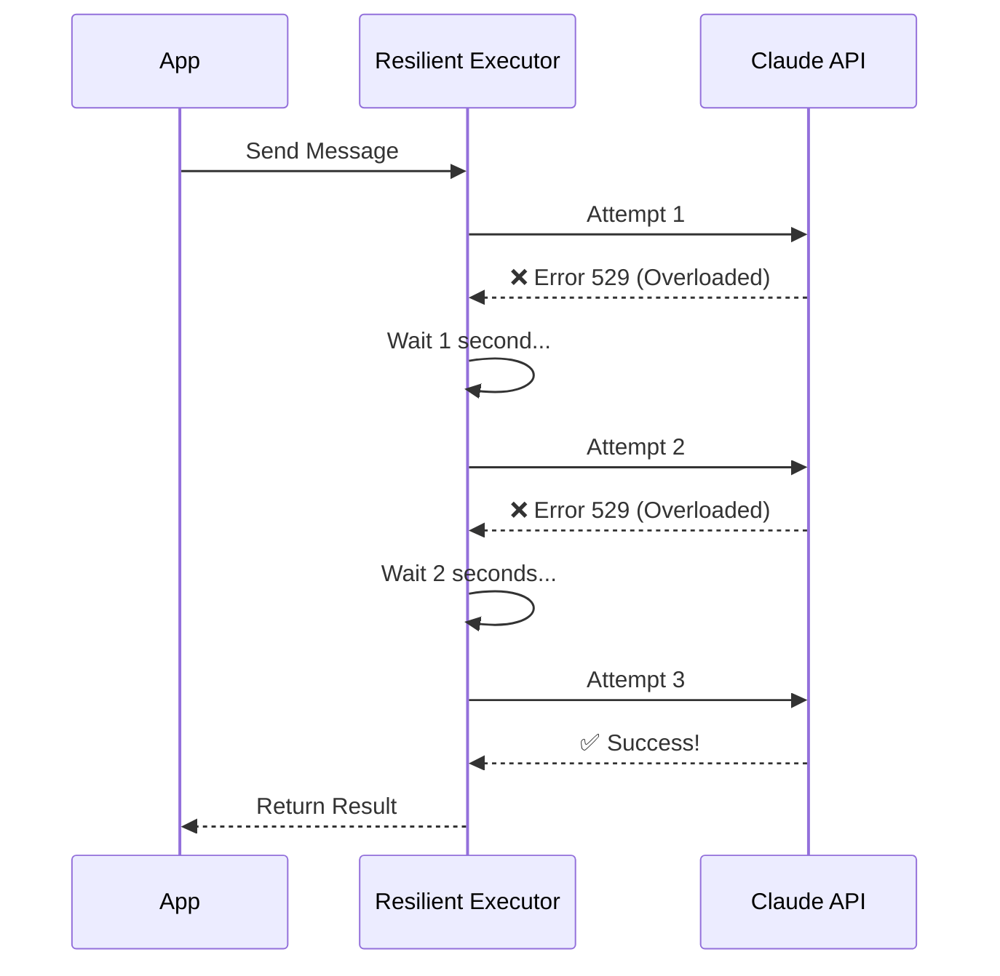

# Chapter 2: Resilient Request Executor

In the previous [Unified Client Factory](01_unified_client_factory.md) chapter, we built a "Universal Travel Adapter" to connect to Claude regardless of the provider (AWS, Google, or Direct).

Now we have a connection, but connections can be flaky. The internet hiccups, servers get overloaded, and sometimes wifi drops.

## The Problem: The "Fragile" Request

Imagine you send a text message to a friend, but your signal drops for one second.
1.  **Fragile approach:** The phone screams "ERROR" and deletes your draft.
2.  **Resilient approach:** The phone sees the failure, waits 2 seconds, and tries sending it again automatically. You don't even notice something went wrong.

We want our API calls to be like the **Resilient approach**.

## The Solution: The Resilient Request Executor

The **Resilient Request Executor** is a wrapper function called `withRetry`. It wraps around your API call and acts like a smart autopilot.

### Key Capabilities
1.  **Automatic Retries:** If the request fails due to a temporary issue (like a network blip), it tries again.
2.  **Exponential Backoff:** It doesn't just spam the server. It waits 1 second, then 2 seconds, then 4 seconds...
3.  **Smart Fallbacks:** If the fast model (Flash) is overloaded, it can automatically switch to a more robust model to get the job done.
4.  **Human-Readable Errors:** It translates cryptic computer errors (like `ECONNRESET` or `SSL_ERROR`) into English.

## How to Use It

Using the executor is simple. Instead of calling the client directly, you pass your "task" to the `withRetry` function.

```typescript
import { withRetry } from './withRetry.js'
import { getAnthropicClient } from './client.js'

// 1. Define your task
const myTask = async (client, attempt) => {
  return client.messages.create({
    model: 'claude-3-opus',
    messages: [{ role: 'user', content: 'Hello!' }]
  });
};

// 2. Run it safely
const result = await withRetry(getAnthropicClient, myTask, {
  maxRetries: 5,
  model: 'claude-3-opus'
});
```

**What happens here?**
If the API fails on the first try (e.g., Server Overloaded), `withRetry` catches the error, waits a bit, and calls `myTask` again with a fresh client.

## Under the Hood: How It Works

Let's look at the lifecycle of a request when things go wrong.

### The Retry Flow



### Step-by-Step Implementation

The magic happens in `withRetry.ts`. We will simplify the code to show the core logic.

#### 1. The Retry Loop
The core of the system is a simple loop that runs until we run out of attempts.

```typescript
// inside withRetry.ts

for (let attempt = 1; attempt <= maxRetries + 1; attempt++) {
  try {
    // Get a fresh client (handles token refreshes if needed)
    const client = await getClient();
    
    // Try to run the user's operation
    return await operation(client, attempt, context);

  } catch (error) {
    // If it fails, we land here...
    lastError = error;
    // Decision logic happens next
  }
}
```

#### 2. Determining if we should Retry
Not all errors are retryable. If the error is "Invalid API Key" (401), retrying won't fix it. If the error is "Server Overloaded" (529), retrying helps.

We use helper functions to make this decision.

```typescript
// inside the catch block...

// 1. Check if it's a transient capacity error (Rate Limit or Overload)
if (isTransientCapacityError(error)) {
  // These are safe to retry!
} 
// 2. Check if it's a fatal error (like 400 Bad Request)
else if (!shouldRetry(error)) {
  // Give up immediately
  throw new CannotRetryError(error);
}
```

#### 3. Calculating the Delay (Backoff)
We calculate how long to sleep. We add "Jitter" (randomness) so that if 1,000 users fail at once, they don't all retry at the exact same millisecond.

```typescript
function getRetryDelay(attempt) {
  // Base delay grows exponentially: 500ms, 1000ms, 2000ms...
  const baseDelay = 500 * Math.pow(2, attempt - 1);
  
  // Add random jitter (up to 25%)
  const jitter = Math.random() * 0.25 * baseDelay;
  
  return baseDelay + jitter;
}
```

#### 4. Handling Auth Errors Automatically
Sometimes a request fails because an OAuth token expired. `withRetry` is smart enough to detect this and refresh credentials before the next attempt.

```typescript
if (error.status === 401 || isOAuthTokenRevokedError(error)) {
  // Force a token refresh logic
  await handleOAuth401Error(failedToken);
  
  // The loop continues, and getClient() will fetch a NEW valid token
  client = await getClient(); 
}
```

### Formatting Errors
If all retries fail, or if the error is fatal, we need to tell the user what happened. Raw errors like `ERR_TLS_CERT_ALTNAME_INVALID` are scary.

We use `errorUtils.ts` to translate them.

```typescript
// inside errorUtils.ts

export function formatAPIError(error: APIError): string {
  // Check for SSL errors (common in corporate VPNs)
  if (error.code === 'UNABLE_TO_VERIFY_LEAF_SIGNATURE') {
    return 'SSL verification failed. Check your corporate proxy settings.';
  }

  // Check for Timeouts
  if (error.code === 'ETIMEDOUT') {
    return 'Request timed out. Check your internet connection.';
  }

  return error.message;
}
```

## Summary

In this chapter, we learned about the **Resilient Request Executor**.

*   **Goal:** Ensure our app doesn't crash when the network blips or the server is busy.
*   **Mechanism:** It wraps API calls in a retry loop with exponential backoff.
*   **Benefit:** Users experience a stable application, and we handle complex edge cases (like expired tokens or rate limits) in one central place.

Now that we can reliably send requests, we need to know *who* is sending them and what they are allowed to do.

[Next Chapter: Account & Entitlements](03_account___entitlements.md)

---

Generated by [Code IQ](https://github.com/adityasoni99/Code-IQ)