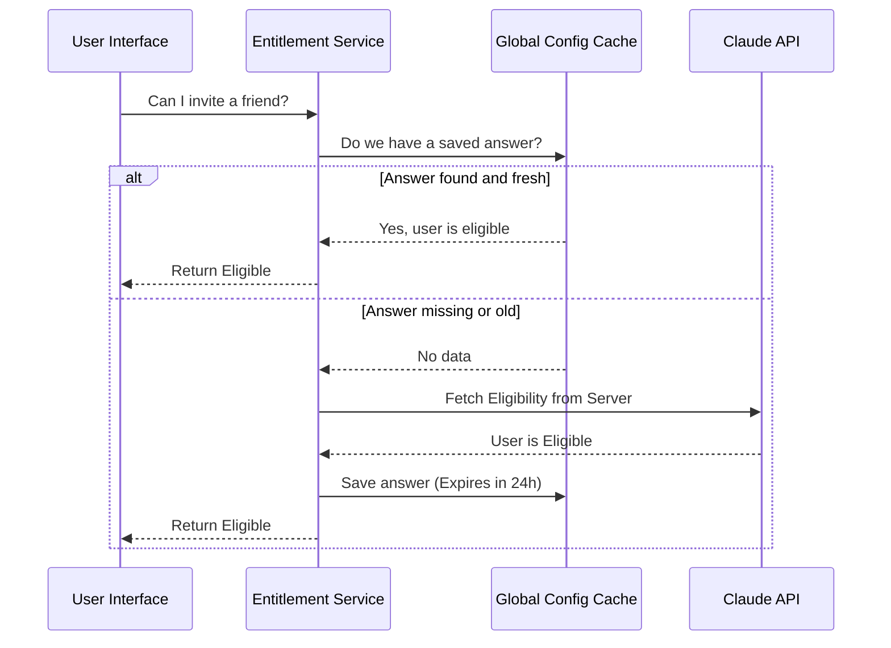

# Chapter 3: Account & Entitlements

In the previous [Resilient Request Executor](02_resilient_request_executor.md) chapter, we built a robust system to ensure our messages get delivered to the server, retrying automatically if the network hiccups.

Now we have a reliable phone line. But just because you *can* call the server, doesn't mean the server will *let you* do whatever you want.

## The Problem: The "VIP Club"

Imagine you walk into a high-end gym.
1.  **Authentication:** You scan your badge at the door. The gym knows *who* you are.
2.  **Entitlements:** You try to enter the VIP Sauna. The door is locked. Why? Because your membership tier is "Basic," not "Gold."

In software, knowing who the user is (Authentication) is different from knowing what they are allowed to do (Authorization/Entitlements).

Without a system to manage this, your code would be full of messy checks:
```javascript
// The messy way
if (user.paid && user.credits > 0 && !server.isBusy) {
  runFeature();
} else {
  crash();
}
```
We need a **Concierge Service** that handles these checks gracefully, caching the answers so we don't annoy the user (or the server) by asking "Can I come in?" every single second.

## The Solution: Account & Entitlements Services

In the `api` project, this isn't one single file. It is a collection of specialized services (like `usage`, `referral`, `grove`) that govern access.

They handle:
1.  **Quotas:** "Do you have enough credits left?"
2.  **Feature Flags:** "Is the 'Grove' privacy feature enabled for you?"
3.  **Referrals:** "Are you allowed to invite friends?"
4.  **Admin Requests:** "Can you ask for a limit increase?"

### Key Use Case

You are building a UI that shows the user how many messages they have left for the day. You want to show a warning bar if they are running low, but you don't want to slow down the app by querying the billing database every time they type a character.

## How to Use It

These services are designed to be "read-only" checks for the most part. You ask them for the current state.

### 1. Checking Usage Limits
To check if the user is about to hit their rate limit, we use the `fetchUtilization` function from `usage.ts`.

```typescript
import { fetchUtilization } from './usage.js';

// Ask the concierge: "How much have we used?"
const usage = await fetchUtilization();

if (usage?.seven_day?.utilization > 90) {
  console.log("Warning: You are 90% through your weekly limit!");
}
```

### 2. Checking Privacy Settings ("Grove")
"Grove" is our internal name for specific privacy and data training settings. We need to respect the user's choice.

```typescript
import { getGroveSettings } from './grove.js';

const settings = await getGroveSettings();

if (settings.success && settings.data.grove_enabled) {
  console.log("User has opted into data improvement.");
} else {
  console.log("Strict privacy mode active.");
}
```

## Under the Hood: How It Works

These services rely heavily on **Caching**. If we ask for the user's referral eligibility, we save that answer for 24 hours. This makes the app feel instant.

### The Caching Flow



### Step-by-Step Implementation

Let's look at the implementation details of three key areas: Referrals (Caching), Usage (Real-time), and Admin Requests (Actionable).

#### 1. Smart Caching (Referrals)
In `referral.ts`, we implement the "Check Cache First" strategy. We don't want to block the user interface while waiting for the network.

```typescript
// inside referral.ts

export async function getCachedOrFetchPassesEligibility() {
  const config = getGlobalConfig();
  const cachedEntry = config.passesEligibilityCache?.[orgId];
  
  // 1. If we have fresh data, return it immediately!
  if (cachedEntry && isFresh(cachedEntry)) {
    return cachedEntry;
  }

  // 2. If data is missing/stale, fetch in the BACKGROUND
  // The 'void' keyword means "don't wait for this to finish"
  void fetchAndStorePassesEligibility();

  // 3. Return what we have (even if null for now) to keep UI fast
  return cachedEntry || null;
}
```
**Why this matters:** The app starts up instantly. Even if the data is 1 hour old, it's better to show *something* than a loading spinner.

#### 2. Real-Time Checks (Usage)
Unlike referrals (which change rarely), usage limits change every second. In `usage.ts`, we fetch data directly but add safety checks to avoid crashing on authentication errors.

```typescript
// inside usage.ts

export async function fetchUtilization() {
  // 1. Safety Check: Is the user logged in?
  if (!isClaudeAISubscriber()) return {};

  // 2. Safety Check: Is our access token valid?
  const tokens = getClaudeAIOAuthTokens();
  if (isOAuthTokenExpired(tokens.expiresAt)) {
    return null; // Don't try, we know it will fail
  }

  // 3. Fetch current stats
  const response = await axios.get(usageUrl, { headers });
  return response.data;
}
```

#### 3. Requesting More Access (Admin)
What if the user hits a limit? In `adminRequests.ts`, we allow users to request upgrades. This connects the user's frustration (hitting a limit) directly to a solution.

```typescript
// inside adminRequests.ts

export async function createAdminRequest(type: 'limit_increase') {
  // Prepares the request to the organization admin
  const url = `${BASE_URL}/org/${orgUUID}/admin_requests`;
  
  const response = await axios.post(url, {
    request_type: type,
    details: null
  });

  return response.data; // Returns "pending" status
}
```

#### 4. The "Bootstrap" Loader
When the application first starts, we need to know the "rules of the road" immediately. The `bootstrap.ts` file acts as the initial configuration loader.

It fetches a large bundle of settings (available models, feature flags) in one go, so we don't have to make 50 separate requests.

```typescript
// inside bootstrap.ts

export async function fetchBootstrapData() {
  // Fetch the big config object
  const response = await fetchBootstrapAPI();

  // Only save to disk if something actually changed
  // This prevents wearing out the hard drive or triggering re-renders
  if (!isEqual(currentConfig, response)) {
    saveGlobalConfig({
      clientDataCache: response.client_data
    });
  }
}
```

## Summary

In this chapter, we explored **Account & Entitlements**.

*   **Goal:** To manage *permission* to use features, not just connection to them.
*   **Mechanism:** A collection of services (Usage, Referral, Grove) that mix real-time checks with smart background caching.
*   **Benefit:** The application feels fast (because of caching) but secure (because permissions are enforced). Users are guided gracefully when they hit limits.

Now that we know *who* the user is and *what* they can do, we often need to deal with files—uploading code for analysis or reading local configuration.

[Next Chapter: File Asset Manager](04_file_asset_manager.md)

---

Generated by [Code IQ](https://github.com/adityasoni99/Code-IQ)