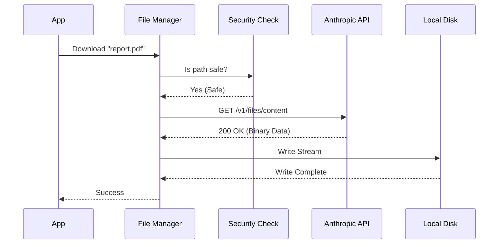

# Chapter 4: File Asset Manager

In the previous [Account & Entitlements](03_account___entitlements.md) chapter, we learned how to verify *who* the user is and *what* features they are allowed to access.

Now that we know the user is allowed to be here, they usually want to do work. Often, that work involves files: asking Claude to "Read this PDF," "Fix this image," or "Write a Python script."

## The Problem: The "Fragile Courier"

Imagine you want to ship a package to a friend.
1.  **Size Limits:** If the box is too heavy, the post office rejects it.
2.  **Paperwork:** You need specific customs forms (Headers) or the package is returned.
3.  **Lost Packages:** Sometimes the truck breaks down (Network Error). You need a system to automatically send a replacement.
4.  **Security:** You don't want a delivery driver walking into your house and putting a package in your bedroom. You want it left safely on the porch.

Handling file uploads and downloads in code is exactly like this. If you just try to "throw" a file at the API, it will often fail due to size limits, network timeouts, or security restrictions.

## The Solution: The File Asset Manager

The **File Asset Manager** (implemented in `filesApi.ts`) is our "Digital Courier Service." It abstracts away the complexity of moving binary data between your local computer and Claude's cloud.

### Key Capabilities
1.  **Automatic Retries:** If a download fails halfway through, it tries again.
2.  **Safety Checks:** It prevents files from being written to dangerous places on your computer (Path Traversal protection).
3.  **Parallel Processing:** It uses a fleet of trucks, not just one. It can download 5 files at the same time.
4.  **Protocol Management:** It knows exactly which "Beta Headers" the API requires.

### Key Use Case

You are building a CLI tool. The user asks Claude to "Generate a chart and save it as `chart.png`." Claude sends back a File ID. Your tool needs to download that binary data and save it to the user's disk without crashing.

## How to Use It

The manager provides simple, high-level functions. You don't need to know HTTP or Axios to use it.

### Downloading a File
To download a file, you use `downloadAndSaveFile`.

```typescript
import { downloadAndSaveFile } from './filesApi.js';

const fileInfo = {
  fileId: 'file_011CNha...',
  relativePath: 'documents/report.pdf'
};

const result = await downloadAndSaveFile(fileInfo, {
  sessionId: 'sess_123',
  oauthToken: 'sk-...'
});

if (result.success) {
  console.log(`Saved to ${result.path}`);
}
```

**What happens here?**
The manager connects to the API, authenticates, downloads the bytes, ensures the folder `documents/` exists, and writes the file. If the internet blips, it retries automatically.

### Uploading a File
Uploading is just as easy. The manager checks file sizes before even attempting the upload to save bandwidth.

```typescript
import { uploadFile } from './filesApi.js';

const result = await uploadFile(
  '/Users/me/data.txt', // Absolute path
  'data.txt',           // Name Claude sees
  config
);

if (result.success) {
  console.log(`File uploaded! ID: ${result.fileId}`);
}
```

## Under the Hood: How It Works

Let's look at the lifecycle of a file download.

### The Download Flow



### Step-by-Step Implementation

The implementation is in `filesApi.ts`. We will break down the critical mechanisms.

#### 1. Security First: The "Porch" Rule
Before we write anything to disk, we must ensure the file path is safe. Hackers might try to name a file `../../../../etc/passwd` to overwrite system files.

We use `buildDownloadPath` to lock files into a safe "sandbox" directory.

```typescript
// inside filesApi.ts

export function buildDownloadPath(base, sessionId, relativePath) {
  const normalized = path.normalize(relativePath);
  
  // 1. Check for ".." to prevent escaping the folder
  if (normalized.startsWith('..')) {
    return null; // Block unsafe paths!
  }

  // 2. Force the path to be inside the session folder
  return path.join(base, sessionId, 'uploads', normalized);
}
```

#### 2. The Retry Logic
Network connections are unstable. We wrap our requests in a retry loop (similar to [Resilient Request Executor](02_resilient_request_executor.md), but specific for files).

```typescript
// inside filesApi.ts

async function retryWithBackoff(operation, attemptFn) {
  for (let attempt = 1; attempt <= MAX_RETRIES; attempt++) {
    // Try the operation
    const result = await attemptFn(attempt);

    // If successful, return data
    if (result.done) return result.value;

    // If failed, wait a bit (Exponential Backoff)
    await sleep(500 * Math.pow(2, attempt - 1));
  }
  throw new Error("Failed after retries");
}
```

#### 3. Handling Special Headers
The Files API is often in "Beta." This means we need to send a secret handshake (header) to prove we know how to use it. The manager handles this globally.

```typescript
// inside filesApi.ts

const FILES_API_BETA_HEADER = 'files-api-2025-04-14';

const headers = {
  Authorization: `Bearer ${token}`,
  // This tells the server "We understand the new Files API"
  'anthropic-beta': FILES_API_BETA_HEADER, 
};
```

#### 4. Parallel Processing (The Fleet)
If you have 10 files to download, doing them one-by-one is slow. Doing all 10 at once might crash your computer. We use a **Concurrency Limit**.

Imagine a bank with 5 teller windows. Even if 100 people are in line, only 5 are served at once.

```typescript
// inside filesApi.ts

async function parallelWithLimit(items, fn, concurrency) {
  // 1. Create a list of "workers"
  const workers = [];
  
  // 2. Only start 'concurrency' number of workers (e.g., 5)
  for (let i = 0; i < Math.min(concurrency, items.length); i++) {
    workers.push(worker());
  }

  // 3. Wait for them to finish
  await Promise.all(workers);
}
```

## Summary

In this chapter, we explored the **File Asset Manager**.

*   **Goal:** To move binary files reliably between the user's disk and the API.
*   **Mechanism:** A robust client that handles retries, size validation, security checks, and parallel processing.
*   **Benefit:** We don't worry about network glitches or malicious file paths. We just ask to "save this file," and the manager ensures it arrives safely on the "porch."

Now that we are moving files and chatting with Claude, the "State" of our session (variable values, conversation history) is constantly changing. How do we keep everything in sync?

[Next Chapter: Session State Sync](05_session_state_sync.md)

---

Generated by [Code IQ](https://github.com/adityasoni99/Code-IQ)