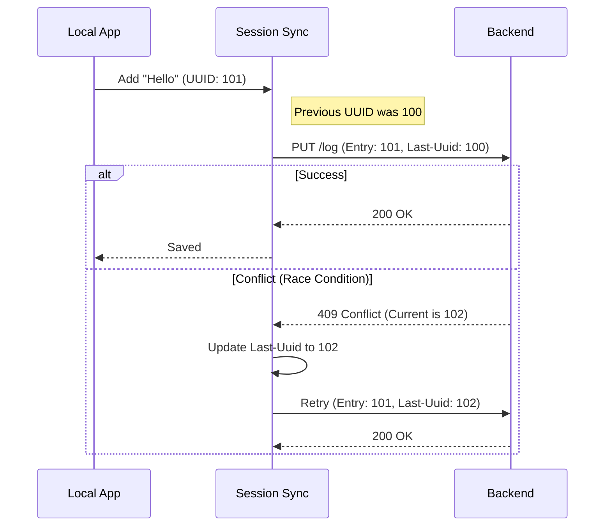

# Chapter 5: Session State Sync

In the previous [File Asset Manager](04_file_asset_manager.md) chapter, we learned how to reliably move files between the user's computer and the cloud.

Now we have a Client that talks to Claude, and a File Manager that moves data. But here is a question: **Does Claude remember what we said 5 minutes ago?** By default, Large Language Models are "stateless"—they forget everything immediately after answering.

## The Problem: The "Amnesiac" Assistant

Imagine playing a long video game. You play for 4 hours, defeat a boss, and collect a rare sword. Then, your power goes out. When you restart the game, you are back at the start menu. You lost everything.

Without **Session State Sync**, our CLI tool is like that video game without a memory card.
1.  **Persistence:** If you close the terminal, the conversation is gone.
2.  **Continuity:** You can't start a task on your laptop and finish it on the web interface.
3.  **Concurrency:** If two processes try to update the history at the same time, the conversation gets scrambled.

## The Solution: Session State Sync

The **Session State Sync** module (located in `sessionIngress.ts`) is our "Auto-Save" and "Cloud Sync" engine.

It has two main jobs:
1.  **Ingress (Saving):** Every time the user speaks or the tool acts, it saves that event to the backend securely.
2.  **Teleporting (Loading):** When you open the app, it fetches the entire history and "replays" it to bring you back to exactly where you left off.

### Key Use Case

You are using the CLI to debug a script. You ask Claude to "Analyze this error."
1.  The **Session State Sync** saves your question to the server.
2.  Your internet cuts out for a second. The Sync module retries until the save is confirmed.
3.  Later, you open the web dashboard. The Sync module "teleports" that conversation to the browser so you can see the analysis there.

## How to Use It

As a developer using this API, you primarily interact with two functions: `appendSessionLog` (to save) and `getSessionLogs` (to load).

### 1. Saving History (Ingress)
When a message is sent, we "append" it to the log.

```typescript
import { appendSessionLog } from './sessionIngress.js';

const messageEntry = {
  uuid: 'msg_123...', // Unique ID for this line
  role: 'user',
  content: 'Hello Claude!'
};

// Send to server
await appendSessionLog(sessionId, messageEntry, uploadUrl);
```
**What happens here?**
The system queues this message and ensures it is written to the server in the correct order.

### 2. Loading History (Teleporting)
When the app starts, we need to hydrate the state.

```typescript
import { getTeleportEvents } from './sessionIngress.js';

// Fetch the entire conversation history
const history = await getTeleportEvents(
  sessionId, 
  token, 
  orgId
);

// Replay history to the user
history.forEach(entry => renderMessage(entry));
```

## Under the Hood: How It Works

The hardest part of syncing isn't sending data—it's sending data **in the right order** without corrupting the file, especially when the internet is bad.

### The "Ticket Number" System (Optimistic Concurrency)

Imagine a deli counter. You have ticket #45. The baker will only serve you after #44 is done.

The **Session State Sync** uses a similar concept called a `Last-Uuid`.
1.  The client says: "I am adding Message B. The previous message was Message A."
2.  The server checks: "Is the current last message 'Message A'?"
    *   **Yes:** "Okay, saved Message B."
    *   **No:** "Conflict! Someone else added something. Update your records."

### The Sync Flow



### Step-by-Step Implementation

Let's look at `sessionIngress.ts` to see how this reliability is built.

#### 1. Sequential Processing
We cannot send 5 messages in parallel. If "Step 2" arrives before "Step 1", the conversation makes no sense. We use a `sequential` wrapper to force a single-file line.

```typescript
// inside sessionIngress.ts

function getOrCreateSequentialAppend(sessionId: string) {
  // Check if we already have a queue for this session
  let sequentialAppend = sequentialAppendBySession.get(sessionId);
  
  if (!sequentialAppend) {
    // Create a new queue that runs one item at a time
    sequentialAppend = sequential(async (entry, url, headers) => {
      return await appendSessionLogImpl(sessionId, entry, url, headers);
    });
  }
  return sequentialAppend;
}
```

#### 2. The Retry Loop
Just like the [Resilient Request Executor](02_resilient_request_executor.md), we wrap the save operation in a loop. If the server is busy (5xx) or the network drops, we try again.

```typescript
// inside appendSessionLogImpl...

for (let attempt = 1; attempt <= MAX_RETRIES; attempt++) {
  try {
    // Attempt to save to the server
    const response = await axios.put(url, entry, { headers });
    
    if (response.status === 200) {
      // Success! Update our local "Last-UUID" tracker
      lastUuidMap.set(sessionId, entry.uuid);
      return true;
    }
    // ... error handling below ...
  } catch (error) {
    // Wait a bit, then loop again
    await sleep(calculateDelay(attempt));
  }
}
```

#### 3. Handling Conflicts (The 409 Error)
This is the most critical part. A `409 Conflict` means our local state is out of sync with the server.

```typescript
if (response.status === 409) {
  const serverLastUuid = response.headers['x-last-uuid'];

  // Did we actually save it already? (Network glitch on response)
  if (serverLastUuid === entry.uuid) {
    return true; // It's actually fine!
  }

  // Someone else wrote to the log. Adopt their UUID and try again.
  if (serverLastUuid) {
    lastUuidMap.set(sessionId, serverLastUuid);
    continue; // Retry the loop immediately with new info
  }
}
```

#### 4. Teleporting (Replaying Events)
When we fetch logs, we might get thousands of events. We need to handle "Pagination" (reading page by page).

```typescript
export async function getTeleportEvents(sessionId, accessToken) {
  const allEvents = [];
  let cursor = undefined;

  // Loop until the server says "No more pages"
  while (true) {
    const response = await axios.get(url, { params: { cursor } });
    
    allEvents.push(...response.data.events);
    
    // Check if there is a next page
    if (!response.data.next_cursor) break;
    cursor = response.data.next_cursor;
  }

  return allEvents;
}
```

## Summary

In this chapter, we explored **Session State Sync**.

*   **Goal:** To ensure the conversation history is never lost and remains consistent across devices.
*   **Mechanism:** It acts as an "Auto-Save" that writes events sequentially. It uses **Optimistic Concurrency** (Checking the previous Message ID) to handle conflicts.
*   **Benefit:** Users can close the app, lose internet, or switch devices, and their "Game Save" is always perfectly intact.

Now that we have a memory of what we sent, we need to manage the *cost* and *size* of that memory. Large conversations use many "tokens," which can get expensive and slow.

[Next Chapter: Prompt Cache Monitor](06_prompt_cache_monitor.md)

---

Generated by [Code IQ](https://github.com/adityasoni99/Code-IQ)