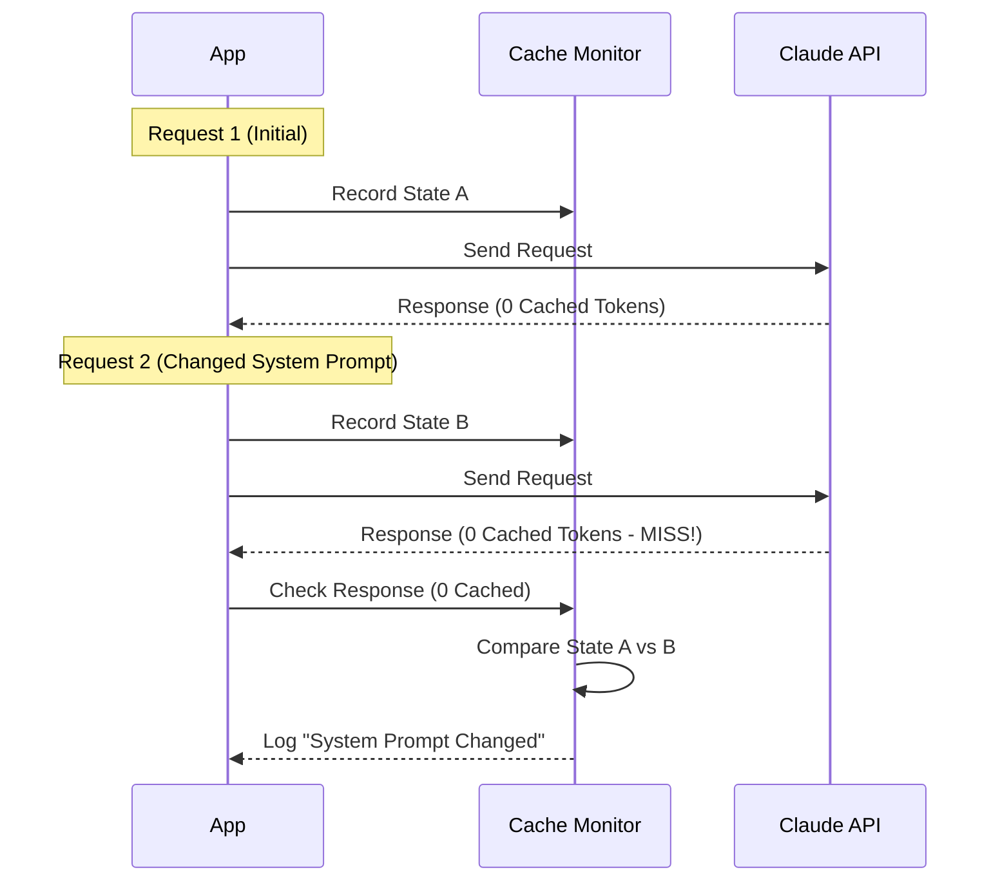

# Chapter 6: Prompt Cache Monitor

In the previous [Session State Sync](05_session_state_sync.md) chapter, we learned how to keep our conversation history safe and consistent.

As our conversation history grows, we face a new problem: **Size**. Sending the entire history of a project (thousands of lines of code) to the AI for every single message is expensive and slow.

## The Problem: The "Forgetful Barista"

Imagine you visit a coffee shop every morning.
1.  **Ideal Scenario:** You walk in, nod at the barista, and they hand you your "Usual" (Grand Soy Latte). It takes 10 seconds.
2.  **The "Cache Break":** One day, you decide to wear a new hat. The barista doesn't recognize you. You have to explain your order from scratch. It takes 3 minutes.

In the world of LLMs, **Prompt Caching** is the barista remembering your context. If the cache works, the API is fast and cheap (you pay 90% less!).

However, prompt caching is **fragile**. If you change a single character in your System Prompt or add a new Tool, the cache "breaks." The API treats you like a stranger, processes everything from scratch, and charges you full price.

## The Solution: The Prompt Cache Monitor

The **Prompt Cache Monitor** (implemented in `promptCacheBreakDetection.ts`) is an intelligent observer. It watches every message you send.

If the cache breaks (latency spikes), it tells you exactly **why**:
*   "You changed the system prompt."
*   "You added a new tool definition."
*   "The cache expired because you waited more than 5 minutes."

### Key Use Case

You are a developer tuning the "System Prompt" (the instructions that tell Claude how to behave). You change "Be helpful" to "Be very helpful."

Suddenly, your API costs double. You don't know why. The **Prompt Cache Monitor** detects this and logs: `[PROMPT CACHE BREAK] system prompt changed (+5 chars)`. Now you know the cause.

## How to Use It

This system runs automatically in the background, but understanding how it works helps you write better code. It operates in two phases: **Record** (Before sending) and **Check** (After receiving).

### 1. Recording State (Phase 1)
Before we send a request to Claude, we take a "Snapshot" of everything that might affect the cache.

```typescript
import { recordPromptState } from './promptCacheBreakDetection.js';

// Before calling the API...
recordPromptState({
  model: 'claude-3-5-sonnet',
  system: systemPrompts,    // Your instructions
  toolSchemas: tools,       // Your available tools
  querySource: 'repl_main'  // Where is this coming from?
});
```

**What happens here?**
The monitor calculates a "fingerprint" (hash) of your prompt and tools. It saves this fingerprint in memory.

### 2. Checking for Breaks (Phase 2)
After Claude replies, the API tells us how many tokens were "read from cache." We pass this number to the monitor.

```typescript
import { checkResponseForCacheBreak } from './promptCacheBreakDetection.js';

// After getting the response...
await checkResponseForCacheBreak(
  'repl_main',     // The source key
  cacheReadTokens, // e.g., 0 (Bad) or 5000 (Good)
  createdTokens,
  messages
);
```

**What happens here?**
If `cacheReadTokens` is significantly lower than the previous request, the monitor compares the current fingerprint with the old one and logs the difference.

## Under the Hood: How It Works

How does the computer know *why* the cache broke? It uses a technique called **Hashing and Diffing**.

### The Inspection Flow



### Step-by-Step Implementation

The magic happens in `promptCacheBreakDetection.ts`. Let's break down the logic.

#### 1. Fingerprinting (Hashing)
We don't want to store huge strings of text in memory. Instead, we convert objects into a simple number (a hash). If the text changes, the number changes.

```typescript
// inside promptCacheBreakDetection.ts

function computeHash(data: unknown): number {
  // Convert object to string
  const str = JSON.stringify(data);
  
  // Create a unique number from that string
  // If even one comma changes, this number changes completely
  return djb2Hash(str);
}
```

#### 2. Storing Previous State
We use a `Map` to remember the state of the *previous* successful request. This acts as our baseline.

```typescript
const previousStateBySource = new Map<string, PreviousState>();

// When recording state...
const prev = previousStateBySource.get(key);

if (!prev) {
  // First time? Just save the current state and exit.
  previousStateBySource.set(key, {
    systemHash: computeHash(system),
    toolsHash: computeHash(tools),
    // ... other fields
  });
  return;
}
```

#### 3. Detecting Changes (Diffing)
When a new request comes in, we compare the new hash to the old hash. If they are different, we note it as a "Pending Change."

```typescript
// Compare current vs previous
const systemPromptChanged = systemHash !== prev.systemHash;
const toolSchemasChanged = toolsHash !== prev.toolsHash;

if (systemPromptChanged || toolSchemasChanged) {
  // We found a difference! Store this fact.
  prev.pendingChanges = {
    systemPromptChanged,
    toolSchemasChanged,
    // ... details about what changed
  };
}
```

#### 4. The "Verdict" Logic
When the response comes back, we look at the token usage. If the cache usage dropped significantly, we check our "Pending Changes" list to explain why.

```typescript
export async function checkResponseForCacheBreak(
  cacheReadTokens, 
  prevCacheReadTokens
) {
  // Did we lose a significant amount of cache?
  const tokenDrop = prevCacheReadTokens - cacheReadTokens;
  
  // If cache is healthy (95% hit), do nothing.
  if (cacheReadTokens >= prevCacheReadTokens * 0.95) return;

  // If cache broke, look at the notes we made earlier
  if (pendingChanges.systemPromptChanged) {
    console.warn("Cache Break Reason: System prompt changed");
  }
}
```

#### 5. Time-To-Live (TTL) Checks
Sometimes you didn't change anything, but the cache still broke. Why? Because caches expire (usually after 5 minutes or 1 hour of inactivity).

The monitor calculates the time gap to detect this.

```typescript
const timeSinceLastMsg = Date.now() - lastMsgTime;

if (parts.length === 0) {
  // If no code changed, check the clock
  if (timeSinceLastMsg > 5 * 60 * 1000) {
    reason = 'possible 5min TTL expiry';
  }
}
```

## Summary

In this chapter, we explored the **Prompt Cache Monitor**.

*   **Goal:** To save money and improve speed by ensuring prompt caching is working effectively.
*   **Mechanism:** It creates "fingerprints" of requests. If a cache miss occurs, it compares the current fingerprint to the previous one to find the culprit.
*   **Benefit:** Developers get immediate feedback if they accidentally break the cache (e.g., by changing a tool description), preventing unexpected bills.

Now we have a fully functional system: Clients, Resiliency, Files, Sync, and Optimization. But how do we see all these metrics in one place?

[Next Chapter: Telemetry & Observability](07_telemetry___observability.md)

---

Generated by [Code IQ](https://github.com/adityasoni99/Code-IQ)