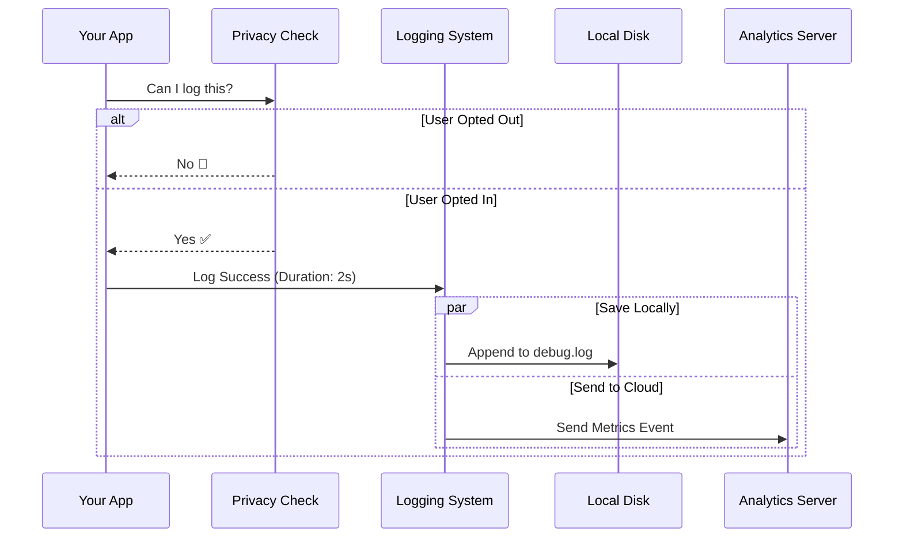

# Chapter 7: Telemetry & Observability

In the previous [Prompt Cache Monitor](06_prompt_cache_monitor.md) chapter, we learned how to optimize our API usage to save money and time.

Now we have a fully functioning application. The Client connects, the File Manager moves data, and the Session Sync saves our history. But we have one final question: **How is the patient doing?**

## The Problem: Flying Blind

Imagine you are flying a plane, but you have no dashboard.
1.  **No Speedometer:** You don't know if you are flying fast or slow (Latency).
2.  **No Fuel Gauge:** You don't know how much energy you've used (Token Cost).
3.  **No Black Box:** If the plane crashes, you have no idea why (Debugging).

Without **Telemetry & Observability**, your code is a "Black Box." If a user complains "It's slow," you have to guess why. Is it the network? Is the AI thinking too long? Is the file upload stuck?

## The Solution: The Nervous System

**Telemetry & Observability** is the nervous system of the `api` project. It connects to every other module we've built—the Client, the File Manager, the Session Sync—and sends vital signals back to the brain.

It is responsible for:
1.  **Metrics:** Recording numbers (e.g., "Request took 450ms", "Used 150 tokens").
2.  **Logging:** Writing down events (e.g., "Error: 500 Server Error").
3.  **Privacy:** Checking "Does the user want us to track this?" before sending data.
4.  **Deep Debugging:** Dumping the raw text sent to Claude to a file so we can inspect it later.

### Key Use Case

A user reports a bug: "I asked Claude to write a poem, but it crashed."
*   **Without Observability:** You ask the user to "try again" and hope it works.
*   **With Observability:** You check the logs. You see a `502 Bad Gateway` error. You check the "Prompt Dump" and see the user sent a 10MB text file that choked the system. You know exactly what to fix.

## How to Use It

The telemetry system is designed to run automatically, but as a developer, you need to trigger the logs at the right time.

### 1. Checking Permission
Before we log anything, we must respect the user's privacy settings. This is done via `metricsOptOut.ts`.

```typescript
import { checkMetricsEnabled } from './metricsOptOut.js';

const status = await checkMetricsEnabled();

if (status.enabled) {
  console.log("We are allowed to send analytics.");
} else {
  console.log("User opted out. Keep secrets locally.");
}
```

### 2. Logging a Success
When an API call finishes successfully, we record the stats using `logAPISuccess` from `logging.ts`.

```typescript
import { logAPISuccess } from './logging.js';

// After the request finishes...
logAPISuccess({
  model: 'claude-3-opus',
  durationMs: 4500,        // How long it took
  messageTokens: 1024,     // Size of response
  costUSD: 0.03,           // How much it cost
  usage: apiResponse.usage // Raw token counts
});
```

### 3. Logging an Error
If things go wrong (like in our [Resilient Request Executor](02_resilient_request_executor.md)), we log the failure details.

```typescript
import { logAPIError } from './logging.js';

try {
  // ... api call ...
} catch (error) {
  logAPIError({
    error: error,
    model: 'claude-3-opus',
    durationMs: 1200,
    attempt: 2 // We tried twice before failing
  });
}
```

## Under the Hood: How It Works

This system acts like a filter and a broadcaster. It takes raw events, cleans them up, checks if it's allowed to share them, and then saves them.

### The Observability Flow



### Step-by-Step Implementation

Let's look at the three main components: Privacy, Logging, and Debug Dumping.

#### 1. The "Do Not Disturb" Sign (Privacy)
In `metricsOptOut.ts`, we handle the opt-out logic. We don't want to ask the server "Is metrics enabled?" for every single request (that would be slow). So, we cache the answer.

```typescript
// inside metricsOptOut.ts

export async function checkMetricsEnabled() {
  // 1. Check local memory first (Fastest)
  if (cachedStatus) return cachedStatus;

  // 2. Check disk config (Fast)
  const config = getGlobalConfig();
  if (config.metricsStatus) return config.metricsStatus;

  // 3. Ask the server (Slow - only done once per day)
  const result = await fetchMetricsStatusAPI();
  saveToDisk(result);
  
  return result;
}
```

#### 2. The Ship's Log (Logging)
In `logging.ts`, we handle the formatting. Raw errors are messy. This file cleans them up so they look nice in your analytics dashboard.

It also calculates "Total Duration" including retries. If the [Resilient Request Executor](02_resilient_request_executor.md) tried 3 times, we want to know the *total* time the user waited, not just the time of the last attempt.

```typescript
// inside logging.ts

export function logAPISuccessAndDuration(params) {
  // Calculate total time user waited
  const durationMsIncludingRetries = Date.now() - params.startIncludingRetries;

  // Send the clean event
  logAPISuccess({
    ...params,
    durationMsIncludingRetries,
    // Detect if we used a proxy/gateway (like Helicone)
    gateway: detectGateway(params.headers) 
  });
}
```

#### 3. The "Black Box" Recorder (Dump Prompts)
Sometimes, metrics aren't enough. You need to see the *exact* JSON sent to the API to reproduce a bug. `dumpPrompts.ts` handles this.

It creates a hidden file on your computer containing the full conversation history for debugging.

```typescript
// inside dumpPrompts.ts

function dumpRequest(body, timestamp, filePath) {
  // Parse the raw JSON string
  const req = JSON.parse(body);

  // We only want to log user messages to keep the file small
  const entries = req.messages
    .filter(msg => msg.role === 'user')
    .map(msg => JSON.stringify({ 
       type: 'message', 
       timestamp, 
       data: msg 
    }));

  // Append to a local file (e.g., ~/.claude/dump-prompts/session_1.jsonl)
  appendToFile(filePath, entries);
}
```
**Why is this separate?**
Sending full prompt text to an analytics server is a privacy risk and requires huge bandwidth. We only write this to the *user's local disk* for them to inspect if they choose to.

#### 4. The Zero-State (Empty Usage)
Often in code, we need a "placeholder" for usage statistics before a request finishes. Instead of using `null` or `undefined` (which cause crashes), `emptyUsage.ts` provides a safe default.

```typescript
// inside emptyUsage.ts

export const EMPTY_USAGE = {
  input_tokens: 0,
  output_tokens: 0,
  cost: 0,
  // ... safely initialized to zero
};
```

## Summary

In this final chapter, we explored **Telemetry & Observability**.

*   **Goal:** To stop "flying blind" and understand how our application performs in the real world.
*   **Mechanism:**
    *   **Privacy First:** Checks `metricsOptOut` before doing anything.
    *   **Logging:** `logging.ts` captures costs, latency, and errors.
    *   **Debugging:** `dumpPrompts.ts` saves raw data locally for deep inspection.
*   **Benefit:** When things break, we know *why*. When things are slow, we know *where*. And we respect user privacy every step of the way.

### Conclusion

Congratulations! You have completed the **API Project Tutorial**.

We have built a complete, production-grade system for interacting with LLMs:
1.  **Unified Client Factory:** Connecting to any provider.
2.  **Resilient Request Executor:** Handling network failures.
3.  **Account & Entitlements:** Managing permissions.
4.  **File Asset Manager:** Moving data safely.
5.  **Session State Sync:** remembering conversations.
6.  **Prompt Cache Monitor:** Optimizing costs.
7.  **Telemetry:** Watching it all work.

You now understand the "Nervous System" and the "Brain" of a modern AI application. Happy coding!

---

Generated by [Code IQ](https://github.com/adityasoni99/Code-IQ)