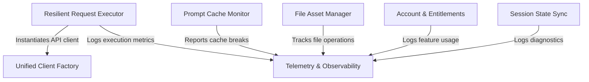

# Tutorial: api

A **unified interface** for interacting with LLM providers like Anthropic, AWS Bedrock, and Google Vertex. It features a **resilient request executor** that manages retries, rate limits, and errors to ensure reliability across different backends. The system also includes modules for **session state synchronization**, **file asset management**, and deep **observability** to track usage, prompt caching efficiency, and user entitlements.

## Chapters

1. [Unified Client Factory](01_unified_client_factory.md)
2. [Resilient Request Executor](02_resilient_request_executor.md)
3. [Account & Entitlements](03_account___entitlements.md)
4. [File Asset Manager](04_file_asset_manager.md)
5. [Session State Sync](05_session_state_sync.md)
6. [Prompt Cache Monitor](06_prompt_cache_monitor.md)
7. [Telemetry & Observability](07_telemetry___observability.md)

---

Generated by [Code IQ](https://github.com/adityasoni99/Code-IQ)