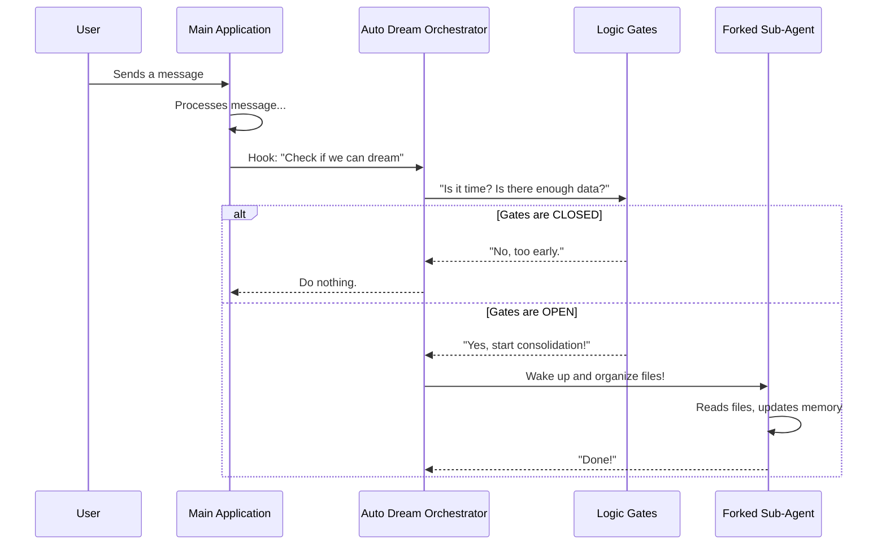

# Chapter 1: Auto-Dream Orchestrator

Welcome to the **Auto-Dream** project! If you are building an AI system that needs to "remember" things long-term, you face a tricky challenge: when should the AI organize its memories?

If the AI stops to organize its files after every single sentence you type, it becomes slow and expensive. But if it never organizes them, it forgets important details.

The **Auto-Dream Orchestrator** is the solution. It acts like a **Night Watchman**. It stays in the background, waiting for the perfect moment—when the building is quiet and enough work has piled up—to start the cleaning process.

## The Goal: "Sleep on it"

Imagine a busy office. Throughout the day, people throw files onto a desk.
1.  **Inefficient:** A filing clerk runs to the cabinet every time one single paper lands on the desk.
2.  **Efficient:** The clerk waits until 5:00 PM (Time Gate) AND waits until there is a decent stack of papers (Session Gate) before filing them all at once.

The **Auto-Dream Orchestrator** implements that efficient logic for our AI's memory.

## Key Concepts

Before we look at code, let's understand the three main parts of this orchestrator:

1.  **The Hook:** This is the trigger. Every time the AI finishes a task, it pokes the Orchestrator saying, "Hey, can we dream now?"
2.  **The Gates:** The Orchestrator has a checklist. "Has it been 24 hours?" "Are there 5 new conversations?" If the answer is "No," it goes back to sleep.
3.  **The Runner:** If the answer is "Yes," the Orchestrator spins up a **Sub-Agent** (a separate AI process) to do the heavy lifting so the main user isn't interrupted.

## How It Works: The Flow

Here is what happens every time the application finishes an interaction.



## Internal Implementation

Let's look at how this is built in `autoDream.ts`. We will break the code down into tiny, manageable pieces.

### 1. The Setup (Initialization)

We don't want to create a new "Watchman" every time. We create one `runner` that lives in the background. We use a function called `initAutoDream` to set this up.

```typescript
// Define a variable to hold our runner function
let runner: ((context: REPLHookContext) => Promise<void>) | null = null

export function initAutoDream(): void {
  // This 'lastSessionScanAt' is remembered between calls (closure scope)
  let lastSessionScanAt = 0

  runner = async function runAutoDream(context) {
     // ... logic happens here ...
  }
}
```
**Explanation:** This creates a permanent space for our orchestrator logic. The variable `lastSessionScanAt` acts like a stopwatch the Watchman keeps in their pocket.

### 2. The Hook (Triggering the Process)

How does the main application talk to the Orchestrator? It calls `executeAutoDream`.

```typescript
// This is called automatically when the AI finishes a turn
export async function executeAutoDream(
  context: REPLHookContext,
  appendSystemMessage?: AppendSystemMessageFn,
): Promise<void> {
  // If the runner exists, run it!
  await runner?.(context, appendSystemMessage)
}
```
**Explanation:** This function is the doorbell. It doesn't contain logic itself; it just forwards the request to the `runner` we defined in step 1.

### 3. Checking the "Config" (The Rules)

Before doing work, the Orchestrator needs to know the rules. How many hours should it wait? How many files does it need?

```typescript
function getConfig(): AutoDreamConfig {
  // We try to get values from a feature flag system
  const raw = getFeatureValue_CACHED_MAY_BE_STALE('tengu_onyx_plover', null)
  
  // If no config found, use these defaults:
  return {
    minHours: raw?.minHours ?? 24,    // Wait 24 hours
    minSessions: raw?.minSessions ?? 5 // Wait for 5 conversations
  }
}
```
**Explanation:** This sets the standard. By default, we only dream once a day (`24` hours) and only if we've had `5` conversations.

### 4. The Decision (Gating Logic)

Inside the `runner` function, we check our gates. If any check fails, we stop immediately (return).

```typescript
    // Inside runner...
    const cfg = getConfig()

    // 1. Time Gate: Check how many hours since we last worked
    const hoursSince = (Date.now() - lastAt) / 3_600_000
    if (hoursSince < cfg.minHours) return

    // 2. Session Gate: Check if we have enough new conversations
    if (sessionIds.length < cfg.minSessions) {
      return // Not enough work to do yet
    }
```
**Explanation:** This is the core efficiency logic. We will cover the specific logic for these checks in [Gating Logic](02_gating_logic.md) and how we find those sessions in [Session Discovery](03_session_discovery.md).

### 5. Starting the Dream (Forking)

If all gates pass, we hire the worker! We use `runForkedAgent` to start a separate process so we don't freeze the main application.

```typescript
      // All gates passed! Let's start the dream.
      const prompt = buildConsolidationPrompt(memoryRoot, transcriptDir, extra)

      const result = await runForkedAgent({
        promptMessages: [createUserMessage({ content: prompt })],
        querySource: 'auto_dream',
        // ... other settings
      })
```
**Explanation:** We create a prompt telling the agent "Please look at these files and organize them." Then we launch it. You can learn more about how we construct this request in [Dream Prompt Strategy](05_dream_prompt_strategy.md).

## Handling Safety (Locks)

Imagine if two Watchmen tried to organize the files at the exact same time. They would bump into each other and ruin the filing system!

To prevent this, the Orchestrator uses a **Lock**.

```typescript
      // Try to put a "Do Not Disturb" sign on the door
      const priorMtime = await tryAcquireConsolidationLock()
      
      // If someone else is already working, we stop.
      if (priorMtime === null) return
```
**Explanation:** This ensures only one dream happens at a time. We will explore this safety mechanism in detail in [Consolidation Lock & Timestamp](04_consolidation_lock___timestamp.md).

## Conclusion

The **Auto-Dream Orchestrator** is the manager of the memory system. It ensures that memory consolidation happens efficiently, without annoying the user or wasting resources. It balances the need to be up-to-date with the cost of running complex AI tasks.

In the next chapter, we will zoom in on the specific rules the Orchestrator uses to make its decisions.

[Next Chapter: Gating Logic](02_gating_logic.md)

---

Generated by [Code IQ](https://github.com/adityasoni99/Code-IQ)