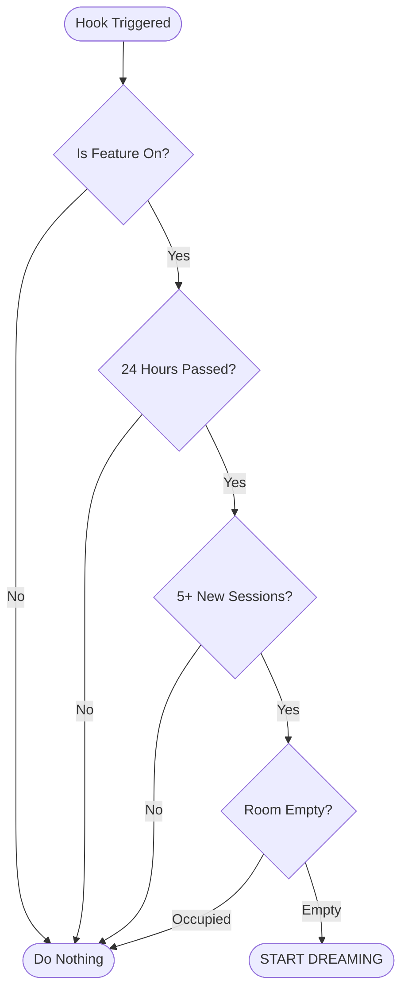

# Chapter 2: Gating Logic

In the previous chapter, [Auto-Dream Orchestrator](01_auto_dream_orchestrator.md), we introduced the "Night Watchman"—a background process that organizes memory.

But a watchman needs instructions. They shouldn't start cleaning if the office is still full of people, and they shouldn't clean if the office hasn't been used since yesterday.

This set of instructions is called **Gating Logic**.

## The Problem: When to Run?

Running an AI "dream" (memory consolidation) is expensive. It takes time and computing power. We need to balance two things:
1.  **Freshness:** We want the AI to remember new things reasonably soon.
2.  **Economy:** We don't want to run a complex process just because you said "Hello."

## The Solution: The Three Gates

Think of Gating Logic like a high-tech security door that requires three distinct keys to open. If *any* key is missing, the door stays shut, and the AI goes back to sleep.

The three keys are:
1.  **Time Gate:** Has enough time passed since the last dream? (Default: 24 hours)
2.  **Session Gate:** Have enough new conversations happened? (Default: 5 sessions)
3.  **Safety Lock:** Is the room empty? (Is another dream currently running?)

## Visualizing the Logic

Here is the decision tree the system goes through every single time the user finishes a turn.



## Implementation: Step-by-Step

Let's look at how this is written in `autoDream.ts`.

### 1. The Configuration (The Rules)

First, we need to define our rules. We get these from a configuration system (which might be a remote feature flag).

```typescript
// Define what a "Config" looks like
type AutoDreamConfig = {
  minHours: number    // How long to wait (Time Gate)
  minSessions: number // How much work to accumulate (Session Gate)
}

// Our default settings
const DEFAULTS: AutoDreamConfig = {
  minHours: 24,
  minSessions: 5,
}
```

This sets the baseline: we wait **24 hours** and **5 sessions**.

### 2. The Time Gate

The first check is the cheapest to run. We simply check the clock. We look at a file timestamp to see when we last finished a dream.

```typescript
    // Read the timestamp of the last successful dream
    const lastAt = await readLastConsolidatedAt()

    // Calculate hours passed
    const hoursSince = (Date.now() - lastAt) / 3_600_000
    
    // GATE 1: If it's too soon, stop here.
    if (hoursSince < cfg.minHours) return
```
**Explanation:** If `hoursSince` is only 12, and our limit is 24, the function `return`s immediately. We don't waste energy checking files if the time isn't right.

### 3. The Session Gate

If the Time Gate passes, we perform a slightly more expensive check. We scan the hard drive to count how many *new* conversation transcripts exist.

```typescript
    // Find sessions modified AFTER the last dream time
    let sessionIds = await listSessionsTouchedSince(lastAt)
    
    // Filter out the one we are currently in (it's not finished!)
    sessionIds = sessionIds.filter(id => id !== currentSession)

    // GATE 2: Do we have enough new data?
    if (sessionIds.length < cfg.minSessions) {
      return // Not enough work to do yet
    }
```
**Explanation:** This is like checking the laundry basket. Even if it's "Laundry Day" (Time Gate), we don't wash clothes if the basket only has one sock. We wait until there is a full load (5 sessions).

*Note: We will learn exactly how `listSessionsTouchedSince` works in [Session Discovery](03_session_discovery.md).*

### 4. The Safety Lock

Finally, if it is time AND we have enough work, we try to enter the room. This uses a "Lock" mechanism to ensure two processes don't edit memory files at the same time.

```typescript
    // GATE 3: Try to put a "Do Not Disturb" sign on the door
    const priorMtime = await tryAcquireConsolidationLock()
    
    // If the lock returns null, someone else is already in there.
    if (priorMtime === null) return
```
**Explanation:** If `priorMtime` is valid, we have successfully locked the door and can begin. If it is `null`, it means another specific agent is already dreaming, so we back off.

*Note: We will dive deep into how this locking mechanism works in [Consolidation Lock & Timestamp](04_consolidation_lock___timestamp.md).*

## Why this order matters

You might notice we check **Time**, then **Sessions**, then **Lock**. This order is intentional for performance:

1.  **Time:** Very fast (just math). Checked first.
2.  **Sessions:** Slower (requires reading file lists). Checked second.
3.  **Lock:** Changes state (writes to a file). Checked last, only when we are absolutely sure we want to proceed.

## Conclusion

**Gating Logic** is the discipline of the system. It prevents the AI from becoming "obsessive" (cleaning too often) or "lazy" (never cleaning). It ensures that every time the AI enters a "dream state," it is doing meaningful, efficient work.

Now that we know *when* to run, we need to understand how the system finds the specific files it needs to read.

[Next Chapter: Session Discovery](03_session_discovery.md)

---

Generated by [Code IQ](https://github.com/adityasoni99/Code-IQ)