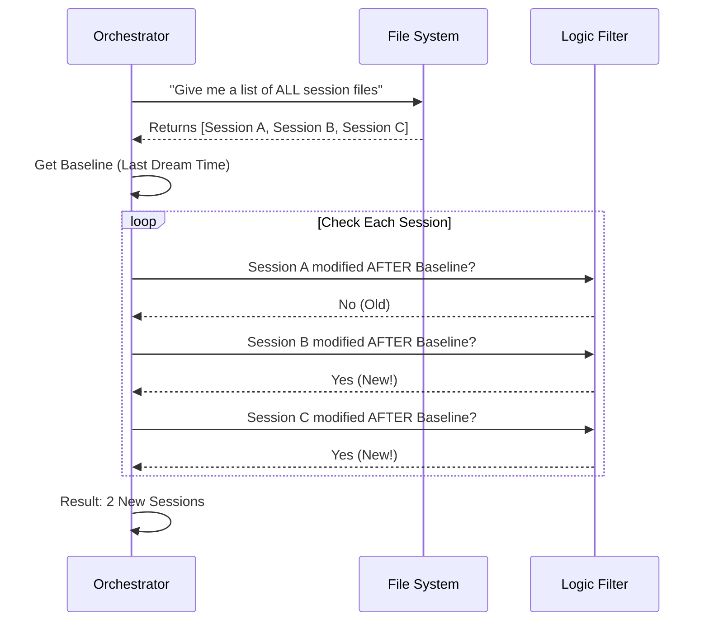

# Chapter 3: Session Discovery

In the previous chapter, [Gating Logic](02_gating_logic.md), we established the rules for when the AI should "dream." One of the most important rules was the **Session Gate**: "Have enough new conversations happened?"

But how does the system actually count "new" conversations without reading everything from scratch? This process is called **Session Discovery**.

## The Goal: Efficiency

Imagine you are a mail clerk. You processed all the outgoing mail yesterday at 5:00 PM.
Today, you need to check if there is enough mail to warrant a trip to the post office.

1.  **The Slow Way:** Open every single envelope in the bin, read the date inside, and decide if it's new.
2.  **The Fast Way:** Just look at the timestamp stamped on the outside of the envelope. If it arrived after 5:00 PM yesterday, count it.

**Session Discovery** uses the "Fast Way." It scans the file system to find conversation transcripts that have changed since the last time the AI organized its memory.

## Key Concepts

To understand how we discover sessions, we need to understand three simple concepts:

1.  **The Baseline (`sinceMs`):** The exact moment (in milliseconds) the last dream finished. This is our "5:00 PM yesterday."
2.  **The Candidates:** All the conversation files (transcripts) stored in the project folder.
3.  **The Filter:** The logic that compares the file's "Last Modified" time (`mtime`) against the Baseline.

## How It Works: The Logic Flow

Here is how the system decides which files are "new" and need processing.



## Internal Implementation

The code for this logic lives in `consolidationLock.ts`. Even though the file is named "Lock," it also handles the utilities for checking timestamps.

Let's look at the function `listSessionsTouchedSince`. We will break it down into small steps.

### Step 1: Where are we looking?

First, we need to know which folder holds the conversation history.

```typescript
import { getProjectDir } from '../../utils/sessionStorage.js'
import { getOriginalCwd } from '../../bootstrap/state.js'

// Get the directory where transcripts are saved
const dir = getProjectDir(getOriginalCwd())
```
**Explanation:** `getOriginalCwd()` finds the root of your project, and `getProjectDir` adds the path to the hidden `.aide` folder where transcripts live.

### Step 2: Get the Candidates

Next, we ask the file system for a list of all files in that directory.

```typescript
import { listCandidates } from '../../utils/listSessionsImpl.js'

// Get a list of all session files with their stats (metadata)
// The 'true' argument tells it to fetch timestamps
const candidates = await listCandidates(dir, true)
```
**Explanation:** `listCandidates` does the heavy lifting. It returns an object for every file that includes its `sessionId` and its `mtime` (modification time).

### Step 3: The Time Comparison (The Core Logic)

This is the most critical part. We filter the list using simple math.

```typescript
// Filter: Keep only files modified AFTER 'sinceMs'
// 'sinceMs' is the timestamp passed into the function
const newSessions = candidates.filter(c => c.mtime > sinceMs)
```
**Explanation:**
*   If `c.mtime` is **bigger** than `sinceMs`, the file is newer. We keep it.
*   If `c.mtime` is **smaller**, the file is older. We ignore it.

### Step 4: Formatting the Output

Finally, we just return the list of IDs (names) of the sessions we found.

```typescript
// Extract just the IDs
return newSessions.map(c => c.sessionId)
```

## Putting It Together

When we combine those steps, we get the actual function used in the codebase:

```typescript
export async function listSessionsTouchedSince(
  sinceMs: number,
): Promise<string[]> {
  const dir = getProjectDir(getOriginalCwd())
  const candidates = await listCandidates(dir, true)
  
  // Return IDs of files modified after the cutoff time
  return candidates.filter(c => c.mtime > sinceMs).map(c => c.sessionId)
}
```

## A Special Case: The "Current" Session

There is one tricky detail. The session you are currently using is *also* a file on the disk. Every time you type a message, that file gets updated.

Technically, the current session is "new" (modified just now). But we don't want to organize it yet because the conversation isn't finished! It's like trying to wash the clothes you are currently wearing.

In `autoDream.ts`, we handle this by explicitly removing the current session from the list:

```typescript
    // Inside autoDream.ts...
    
    // Get the list of new files
    let sessionIds = await listSessionsTouchedSince(lastAt)
    
    // Get the ID of the session we are currently in
    const currentSession = getSessionId()

    // Filter it out!
    sessionIds = sessionIds.filter(id => id !== currentSession)
```

## Why This Matters

This "Session Discovery" mechanism is what makes **Auto-Dream** lightweight. 

Instead of reading megabytes of text history every time you press Enter, the system only does two cheap things:
1.  Reads a number (Time Check).
2.  Checks file dates (Session Discovery).

Only when these cheap checks pass does it actually spin up the expensive AI process.

## Conclusion

We now know *when* to run (Gating Logic) and *what* to process (Session Discovery).

However, there is still a major safety risk. What if two different "Night Watchmen" try to organize the files at the exact same time? They might overwrite each other's work!

To prevent this, we need a locking mechanism.

[Next Chapter: Consolidation Lock & Timestamp](04_consolidation_lock___timestamp.md)

---

Generated by [Code IQ](https://github.com/adityasoni99/Code-IQ)