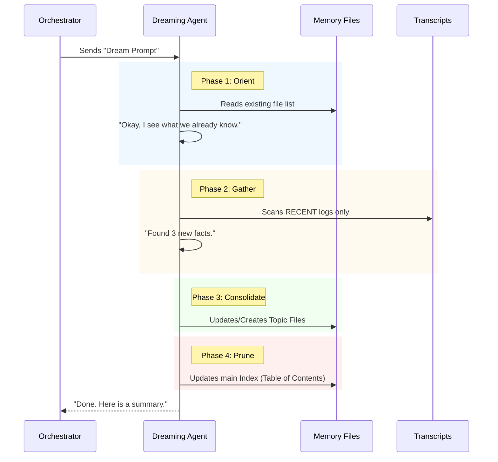

# Chapter 5: Dream Prompt Strategy

In the previous chapter, [Consolidation Lock & Timestamp](04_consolidation_lock___timestamp.md), we secured the room. We ensured that only one "Night Watchman" enters the office at a time to organize files.

But once the Watchman is inside... what exactly do they do?

If we just tell an AI, "Organize my memories," it might do anything. It might write a poem, delete important files, or hallucinate facts that never happened.

To prevent this, we give the AI a very strict script to follow. This script is the **Dream Prompt Strategy**.

## The Problem: The "Creative" Clerk

AI models are creative by nature. In a memory system, creativity is dangerous.
*   **Bad:** The AI invents a conversation that never happened because it "sounded cool."
*   **Good:** The AI strictly summarizes exactly what was said, noting dates and facts.

We need a Standard Operating Procedure (SOP)—a checklist that the AI must follow step-by-step to ensure data integrity.

## The Solution: The 4-Phase Protocol

The **Dream Prompt Strategy** divides the memory consolidation task into four distinct phases. It forces the AI to behave like a disciplined archivist, not a creative writer.

### The Four Phases

1.  **Orient (Look Around):** Before doing anything, check what memories already exist so we don't create duplicates.
2.  **Gather (Find New Info):** Look at the new conversation logs (transcripts). Use tools like `grep` to find specific details without reading millions of words.
3.  **Consolidate (Write):** Write the actual memory files. Convert "yesterday" to specific dates (e.g., "Oct 12th").
4.  **Prune (Update Index):** Update the main index file. Delete old, wrong information and keep the list short.

## Visualizing the Strategy

Here is the flow of instructions contained within the prompt:



## Internal Implementation

The code for generating this prompt lives in `consolidationPrompt.ts`. It doesn't use complex logic; it is mostly a **Template String builder**. It constructs a long text message that gets sent to the AI.

Let's look at how we build this, piece by piece.

### 1. The Setup

We define a function that takes the file paths as input. The AI needs to know *where* the files are located on the computer.

```typescript
// consolidationPrompt.ts

export function buildConsolidationPrompt(
  memoryRoot: string,    // Where memories are stored
  transcriptDir: string, // Where conversation logs are
  extra: string,         // Any extra context
): string {
  // We start the prompt string here...
  return `# Dream: Memory Consolidation
  
You are performing a dream. Synthesize what you've learned recently...

Memory directory: \`${memoryRoot}\`
Session transcripts: \`${transcriptDir}\`
`
}
```
**Explanation:** This sets the stage. We tell the AI its role ("performing a dream") and give it the map (directory paths).

### 2. Phase 1 & 2: Orient and Gather

Next, we append the specific instructions for the first two phases. Note the specific instruction to use `grep`.

```typescript
/* ... continued inside the string ... */

`## Phase 1 — Orient
- \`ls\` the memory directory to see what exists.
- Read the index file. Don't create duplicates!

## Phase 2 — Gather recent signal
- Look for new info in logs.
- Don't read whole files! Use \`grep\` to find specifics.
`
```
**Explanation:**
*   **Efficiency:** We explicitly tell the AI *not* to read whole files ("grep narrowly"). Reading huge files costs money and tokens. We want it to search for keywords.

### 3. Phase 3: Consolidate

This is the writing phase. We give strict formatting rules.

```typescript
/* ... continued ... */

`## Phase 3 — Consolidate
- Write or update memory files.
- Convert relative dates ("yesterday") to absolute ("2023-10-27").
- If a new fact contradicts an old memory, DELETE the old one.
`
```
**Explanation:**
*   **Absolute Dates:** This is crucial. If the AI writes "The project started yesterday," and you read that file a year later, it is useless. It must write "The project started Oct 27."

### 4. Phase 4: Prune (The Janitor)

Finally, we tell the AI to clean up the index (the Table of Contents).

```typescript
/* ... continued ... */

`## Phase 4 — Prune and index
- Update the index file.
- Keep it under 25KB!
- Remove pointers to stale memories.
- Resolve contradictions.
`
```
**Explanation:**
*   **Size Limits:** We force the index to stay small (`25KB`). If we didn't, the index would eventually become too large for the AI to read, and the whole system would break.

## The Resulting Output

When `buildConsolidationPrompt` runs, it produces a single string that looks like this (simplified):

> **# Dream: Memory Consolidation**
>
> You are performing a dream...
>
> **Phase 1:** Look at `src/memories/`...
> **Phase 2:** Search `src/logs/` for new info...
> **Phase 3:** Write files. Change "yesterday" to dates...
> **Phase 4:** Update `index.md`. Remove old links...

This text is then sent to the "Forked Agent" we discussed in [Chapter 1](01_auto_dream_orchestrator.md). The agent reads this, nods, and executes the tools strictly in order.

## Why "Prompt Engineering" Matters Here

You might wonder, "Why not just write code to do this?"

Because **meaning** is fuzzy.
*   Code can easily move files.
*   Code *cannot* easily decide if "The user likes blue" contradicts "The user prefers dark themes."

We use the AI (via this prompt) because it understands language. We use the **Strategy** (the phases) to constrain that understanding so it produces useful, organized files instead of random noise.

## Conclusion

The **Dream Prompt Strategy** is the brain of the operation. It turns a vague desire ("organize my files") into a rigorous, 4-step workflow: **Orient, Gather, Consolidate, Prune**.

Now the AI has its orders. It runs the dream, updates the files, and finishes. But how do we know if it actually did a good job? Or if it crashed halfway through?

We need a way to watch it work.

[Next Chapter: Progress Monitoring](06_progress_monitoring.md)

---

Generated by [Code IQ](https://github.com/adityasoni99/Code-IQ)