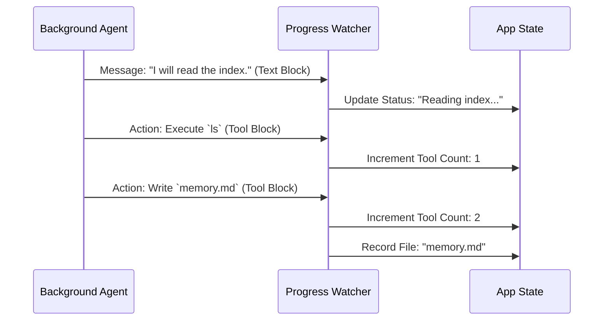

# Chapter 6: Progress Monitoring

In the previous chapter, [Dream Prompt Strategy](05_dream_prompt_strategy.md), we learned how to craft the perfect set of instructions for our AI. We handed it a script and told it to start organizing files.

But here is the problem: **The "Dreaming" Agent runs in the background.**

It's like sending a worker into the basement to fix the plumbing. If you can't see them, how do you know if they are actually working? How do you know if they are stuck? Or worse, how do you know if they are breaking things?

This chapter introduces **Progress Monitoring**: a way to stand at the top of the stairs and listen to what the worker is doing, reporting back to the boss (the User) without interrupting the work.

## The Goal: Transparency

When the Auto-Dream system is running, the main application is still active. The user might be chatting with the AI about something else.

We need a system that:
1.  **Listens** to the background agent.
2.  **Filters** the noise (we don't need every detail).
3.  **Updates** a status indicator (so the user knows "Memory is being updated").

## Key Concepts

To understand how we monitor progress, we need to understand how the AI "speaks" when it works.

### 1. The Stream
The AI doesn't wait until it's finished to talk. It sends data in a **Stream**—a continuous flow of information, chunk by chunk.

### 2. Message Blocks
The AI's messages aren't just simple strings. They are broken into **Blocks**:
*   **Text Blocks:** The AI thinking or planning ("I need to search for the file...").
*   **Tool Blocks:** The AI taking action ("Running `grep` command...").

### 3. The Watcher
The Watcher is a function that sits between the AI and the Main App. It catches these blocks, categorizes them, and updates the scorecard.

## Visualizing the Flow

Here is how the data flows from the background process to the user's screen.



## Internal Implementation

The code for this logic is located in `autoDream.ts`. The specific function is called `makeDreamProgressWatcher`.

It acts as a filter. Let's break down how we build it.

### Step 1: The Factory (Creating the Watcher)

We need to create a specific watcher for *this specific dream task*. We pass in the `taskId` so we know which scorecard to update.

```typescript
// Define a function that returns a NEW monitoring function
function makeDreamProgressWatcher(
  taskId: string,
  setAppState: Function,
) {
  // This inner function is the actual listener
  return (msg: Message) => {
    // Logic goes here...
  }
}
```
**Explanation:** This acts like a factory. We tell it, "Create a watcher for Task #123." It returns a function ready to listen to Task #123.

### Step 2: Filtering the Noise

The AI sends many types of messages. We only care about the **Assistant's** turn (when the AI is speaking or acting).

```typescript
    // Inside the listener...
    if (msg.type !== 'assistant') return

    let text = ''
    let toolUseCount = 0
    const touchedPaths: string[] = []
```
**Explanation:** If the message is from the User (us) or the System (errors), we ignore it. We prepare three empty baskets: one for text, one for counting tools, and one for file names.

### Step 3: Parsing the Blocks

Now we look inside the message content. We loop through every "block" of information.

```typescript
    // Loop through every piece of the message
    for (const block of msg.message.content) {
      
      // If it's just talking/reasoning...
      if (block.type === 'text') {
        text += block.text
      } 
      // ... continued below ...
```
**Explanation:** If the block is text, we add it to our `text` basket. This captures the AI's internal monologue, like "I found a conflict in dates, resolving now."

### Step 4: Counting Tools

If the block is a tool use (like reading a file or running a command), we count it.

```typescript
      // ... continued ...
      else if (block.type === 'tool_use') {
        toolUseCount++
        
        // Check if the tool is editing a file
        checkForFileEdits(block, touchedPaths)
      }
    }
```
**Explanation:** Every time the AI uses a tool, we tick the counter up. This helps us track "activity." If the counter is going up, the agent is alive and working.

### Step 5: Reporting Back

Finally, after sorting the blocks, we send a summary to the main application state using `addDreamTurn`.

```typescript
    // Send the summary to the main app
    addDreamTurn(
      taskId,
      { text: text.trim(), toolUseCount },
      touchedPaths,
      setAppState,
    )
```
**Explanation:** This updates the "Scorecard" in real-time. The UI can now display: *"Dreaming... Used 5 tools. Currently editing memory.md"*.

## Tracking File Edits

You might notice we track `touchedPaths`. Why?

When the dream wakes up, we want to tell the user exactly what changed. "I optimized your memory by updating **vacation_plans.md**."

To do this, we look specifically for the `file_edit` or `file_write` tools inside the watcher:

```typescript
        // detailed check inside the loop
        if (
          block.name === 'file_edit' ||
          block.name === 'file_write'
        ) {
          // Grab the filename from the tool arguments
          const input = block.input
          touchedPaths.push(input.file_path)
        }
```

## The Final Notification

When the dream finishes completely, the `autoDream` runner uses this data to leave a polite note for the user.

```typescript
      // Inside autoDream runner function
      
      if (dreamState.filesTouched.length > 0) {
        // Tell the user what we did
        appendSystemMessage({
          ...createMemorySavedMessage(dreamState.filesTouched),
          verb: 'Improved',
        })
      }
```

This results in a small message in your chat window:
> **System:** Improved memory files: `project_alpha.md`, `meeting_notes.md`.

## Conclusion

**Progress Monitoring** is the bridge between the hidden background process and the visible user interface. It parses the raw stream of the AI's thoughts and actions, converting them into meaningful status updates.

### Series Wrap-Up

Congratulations! You have navigated the entire **Auto-Dream** architecture.

1.  **[Auto-Dream Orchestrator](01_auto_dream_orchestrator.md):** The manager that decides when to trigger the process.
2.  **[Gating Logic](02_gating_logic.md):** The rules (Time & Session counts) that prevent over-cleaning.
3.  **[Session Discovery](03_session_discovery.md):** The scanner that identifies new, unorganized files.
4.  **[Consolidation Lock & Timestamp](04_consolidation_lock___timestamp.md):** The safety mechanism that prevents collisions.
5.  **[Dream Prompt Strategy](05_dream_prompt_strategy.md):** The strict script the AI follows to organize data.
6.  **Progress Monitoring:** The reporter that keeps the user informed.

By combining these six concepts, we create an AI memory system that is **efficient**, **safe**, and **transparent**. It allows the AI to "sleep on it," organizing its thoughts so it can be smarter and more helpful the next time you talk.

---

Generated by [Code IQ](https://github.com/adityasoni99/Code-IQ)