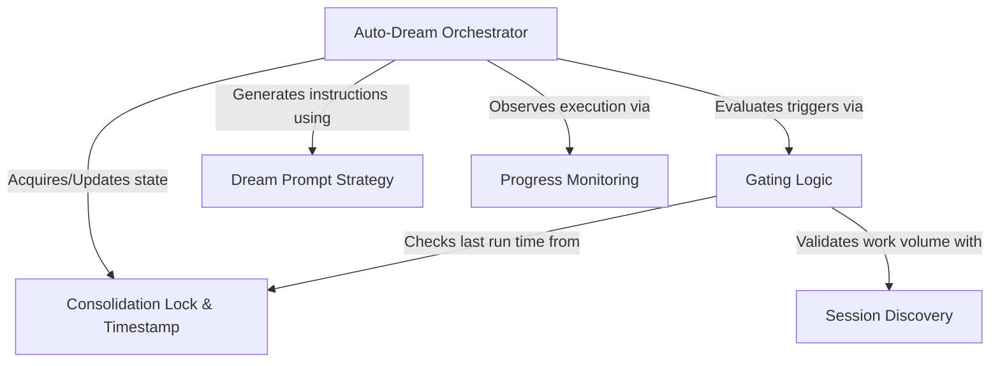

# Tutorial: autoDream

**Auto-Dream** is a background system designed to automatically consolidate an AI's recent conversation transcripts into durable memory files. It operates like a *night watchman*, using strict **Gating Logic** to ensure it only "dreams" when enough time has passed and sufficient new data exists. When triggered, it spins up a sub-agent to review, organize, and prune memory files without interrupting the user's active workflow.

## Chapters

1. [Auto-Dream Orchestrator](01_auto_dream_orchestrator.md)
2. [Gating Logic](02_gating_logic.md)
3. [Session Discovery](03_session_discovery.md)
4. [Consolidation Lock & Timestamp](04_consolidation_lock___timestamp.md)
5. [Dream Prompt Strategy](05_dream_prompt_strategy.md)
6. [Progress Monitoring](06_progress_monitoring.md)

---

Generated by [Code IQ](https://github.com/adityasoni99/Code-IQ)