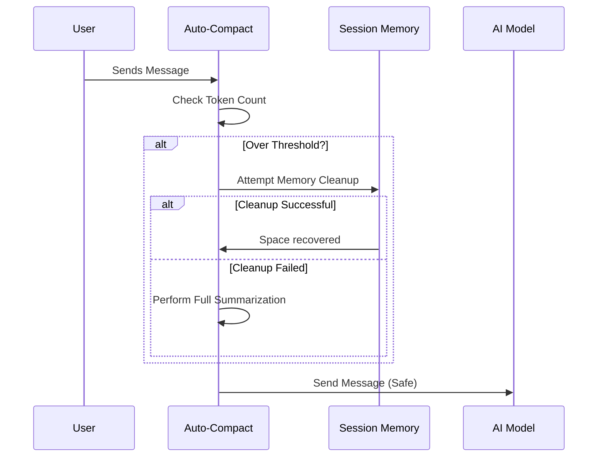

# Chapter 1: Automated Context Management (Auto-Compact)

Welcome to the first chapter of the **Compact** project tutorial!

In this series, we will explore how to manage long conversations with AI models so that you never run out of space. We will start with the most critical system: the automated monitor that keeps your conversation healthy.

## The Motivation: The "Full Backpack" Problem

Imagine you are going on a hike. You have a backpack (the **Context Window**) that can only hold a specific amount of weight. 

As you walk, you keep picking up rocks, souvenirs, and water bottles (your **Messages**). Eventually, the backpack gets full. If you try to stuff one more item in, the zipper breaks (an **Error**), and you can't continue the hike.

**Use Case:**
You are in a deep debugging session with an AI coding assistant. You've exchanged 50+ messages. Suddenly, the AI stops responding and throws an error: `prompt_too_long`. You are forced to restart and lose all your history.

**The Solution:**
**Auto-Compact** is like a helpful hiking buddy. Before you pick up a new item, your buddy checks your backpack. If it's getting too heavy, they automatically rearrange items or throw out trash to make space *before* the zipper breaks.

## Key Concepts

Before we look at code, let's understand the three numbers that drive this system:

1.  **Context Window**: The absolute hard limit of the AI model (e.g., 200,000 tokens).
2.  **Effective Window**: We can't use 100% of the space for history; we need to save room for the AI's *new* answer and the summary we might generate later.
3.  **The Threshold**: The specific point where Auto-Compact decides, "Okay, that's enough, let's clean up."

## Determining the Limits

How do we decide when the backpack is full? We don't wait for 100% usage. We need a safety buffer.

### 1. Calculating the Safe Space

First, we calculate the **Effective Context Window**. We reserve space for the "compaction" process itself (generating a summary) so we don't crash while trying to save ourselves.

```typescript
// Reserve space for the summary output (approx 20k tokens)
const MAX_OUTPUT_TOKENS_FOR_SUMMARY = 20_000

export function getEffectiveContextWindowSize(model: string): number {
  // Get the hard limit from the model definition
  let contextWindow = getContextWindowForModel(model)

  // Subtract the reserved space to be safe
  return contextWindow - MAX_OUTPUT_TOKENS_FOR_SUMMARY
}
```
*Explanation: If a model allows 200,000 tokens, we pretend the limit is actually 180,000. This ensures we always have 20,000 tokens available to write a summary of the conversation.*

### 2. Setting the Trigger Point

Next, we set the specific threshold that triggers the automated cleanup. We use a buffer constant (e.g., 13,000 tokens).

```typescript
export const AUTOCOMPACT_BUFFER_TOKENS = 13_000

export function getAutoCompactThreshold(model: string): number {
  const effectiveWindow = getEffectiveContextWindowSize(model)
  
  // Trigger compaction slightly before we hit the effective limit
  return effectiveWindow - AUTOCOMPACT_BUFFER_TOKENS
}
```
*Explanation: We take our effective window (from step 1) and subtract another buffer. This creates a "warning zone" where the system triggers cleanup before things get critical.*

## The Monitor Loop

Now that we know our limits, we need a function that checks the current conversation state. This function runs before every turn in the conversation.

### Checking the Usage

This function answers a simple question: **"Are we over the limit?"**

```typescript
export async function shouldAutoCompact(messages, model): Promise<boolean> {
  // 1. Calculate how many tokens are currently in the conversation
  const tokenCount = tokenCountWithEstimation(messages)

  // 2. Get the trigger point we calculated earlier
  const threshold = getAutoCompactThreshold(model)

  // 3. Return true if we have exceeded the threshold
  return tokenCount >= threshold
}
```
*Explanation: We count the tokens in the `messages` array. If that number is higher than our `threshold`, Auto-Compact needs to run.*

## Internal Implementation: Under the Hood

What actually happens when you send a message? The system doesn't just send it to the AI. It first passes through the Auto-Compact layer.

### The Flow



### The "Manager" Function

The function `autoCompactIfNeeded` is the brain of this operation. It decides whether to act and handles errors.

One important feature here is the **Circuit Breaker**. If compaction fails multiple times (e.g., the conversation is just impossibly long), we stop trying so we don't waste resources or get stuck in an infinite loop.

```typescript
const MAX_FAILURES = 3

export async function autoCompactIfNeeded(messages, context, tracking) {
  // Circuit Breaker: If we failed 3 times in a row, give up.
  if (tracking.failures >= MAX_FAILURES) return { wasCompacted: false }

  // Check if we are actually over the limit
  const shouldRun = await shouldAutoCompact(messages, context.model)
  if (!shouldRun) return { wasCompacted: false }

  // ... proceed to compaction logic ...
}
```
*Explanation: We look at a `tracking` object that remembers previous attempts. If we have failed too many times, we abort immediately. Otherwise, we check `shouldAutoCompact`.*

### Attempting Compaction

If `shouldRun` is true, the system attempts to clean up. It tries two strategies.

First, it tries a lighter, faster method called **Session Memory Compaction** (which we will cover in the next chapter).

```typescript
// Strategy 1: Try Session Memory Compaction first
const memResult = await trySessionMemoryCompaction(messages, agentId)

if (memResult) {
  // If that worked, we are done!
  return { wasCompacted: true, result: memResult }
}
```
*Explanation: This is the "light cleanup." We check if we can remove temporary data or compress recent events without doing a full heavy summary.*

If that doesn't work (or isn't enough), it performs a full **Conversation Summarization**.

```typescript
// Strategy 2: Full Conversation Compaction
try {
  const result = await compactConversation(messages, context, ...);
  return { wasCompacted: true, result, failures: 0 }; // Reset failures on success
} catch (error) {
  // If it fails, increase the failure count for the circuit breaker
  return { wasCompacted: false, failures: tracking.failures + 1 };
}
```
*Explanation: This is the "heavy cleanup." It rewrites the conversation history. Note that if this crashes, we increment the failure count so the Circuit Breaker knows about it next time.*

## Summary

In this chapter, you learned:
1.  **Auto-Compact** runs in the background to prevent "context full" errors.
2.  It uses an **Effective Window** calculation (Model Limit minus Safety Buffer) to decide when to trigger.
3.  It acts as a **Circuit Breaker**, stopping attempts if they fail repeatedly to prevent infinite loops.

But how exactly does the system try to clean up the conversation? It usually starts with a lighter touch before rewriting history.

[Next Chapter: Session Memory Optimization](02_session_memory_optimization.md)

---

Generated by [Code IQ](https://github.com/adityasoni99/Code-IQ)