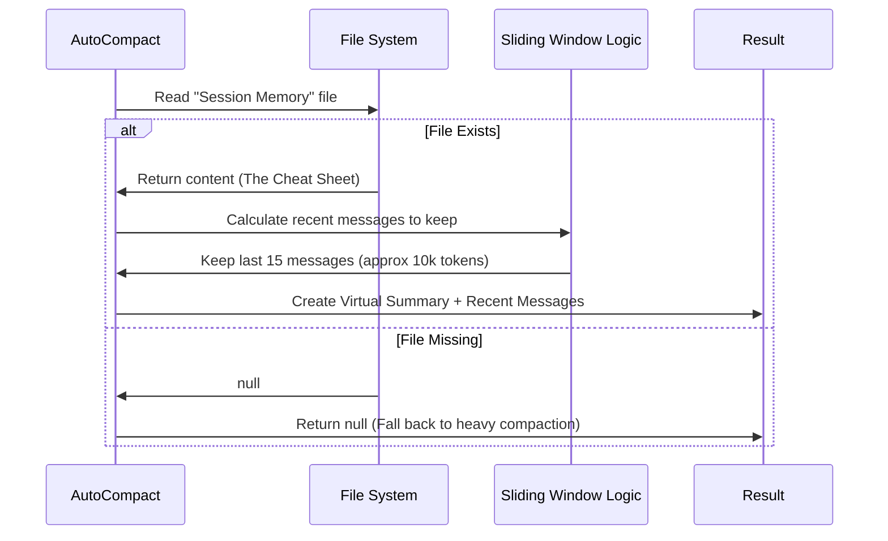

# Chapter 2: Session Memory Optimization

In the previous chapter, [Automated Context Management (Auto-Compact)](01_automated_context_management__auto_compact_.md), we learned how the system acts like a hiking buddy, monitoring your backpack (Context Window) to see when it gets too heavy.

But once we decide the backpack is full, **how** do we make space?

In this chapter, we will explore the **fastest, most efficient way** to clean up your conversation history: **Session Memory Optimization**.

## The Motivation: The "Cheat Sheet" vs. The Rewrite

Imagine you are a student taking a very long exam. You have written 50 pages of notes. Your brain (the Context Window) is full. You need to clear your head to keep working. You have two options:

1.  **The Slow Way (Standard Compaction):** You stop working. You read all 50 pages from scratch. You write a new summary. This takes 10 minutes and a lot of energy.
2.  **The Fast Way (Session Memory):** You have a friend who has been quietly updating a "Cheat Sheet" in the background while you worked. When your brain gets full, you just grab that Cheat Sheet and throw away the old notes. This takes 1 second.

**Use Case:**
You are in a coding session. You hit the token limit.
*   **Without Optimization:** The system pauses for 30 seconds to "Summarize conversation..." costing you time and API money.
*   **With Optimization:** The system instantly swaps old messages for a pre-calculated summary from your disk. You don't even notice the pause.

## Key Concepts

To implement this "Cheat Sheet" strategy, we need three things:

1.  **Session Memory File:** A text file stored on your computer that contains the "background summary" of the project state.
2.  **The Anchor (Last Summarized ID):** A marker that tells us, "Everything before message #42 is already in the cheat sheet."
3.  **The Sliding Window:** We can't just delete everything. We need to keep the last few messages so the conversation feels natural.

## How It Works: The "Try" Pattern

This optimization is the **first line of defense**. It is designed to be fast, but it might not always be available (e.g., if the background file hasn't been created yet).

Therefore, the main function is named `trySessionMemoryCompaction`. It returns a result if successful, or `null` if we need to try something harder.

### 1. Checking Availability

First, we check if the feature is turned on and if the "Cheat Sheet" file actually exists on the disk.

```typescript
export async function trySessionMemoryCompaction(messages, ...) {
  // 1. Check if the feature is enabled
  if (!shouldUseSessionMemoryCompaction()) return null

  // 2. Read the "Cheat Sheet" from disk
  const sessionMemory = await getSessionMemoryContent()

  // If the file is missing or empty, we can't use this shortcut.
  if (!sessionMemory || await isSessionMemoryEmpty(sessionMemory)) {
    return null
  }
  
  // ... continue logic
}
```
*Explanation: We look for the Session Memory file. If it's not there, we give up immediately and return `null`, which tells the system to use the slower method (Chapter 3).*

### 2. Determining What to Keep (The Sliding Window)

If we have the summary file, we don't need to generate a new one. However, we shouldn't delete *all* messages. The AI needs the most recent context (like the question you just asked) to answer correctly.

We calculate a **"Keep Index"** based on token limits (e.g., keep the last 10,000 tokens).

```typescript
// Calculate where to cut the history
const startIndex = calculateMessagesToKeepIndex(
  messages,
  lastSummarizedIndex
)

// Slice the array to keep only recent messages
const messagesToKeep = messages.slice(startIndex)
```
*Explanation: We figure out a safe starting point (`startIndex`). Everything before this point is replaced by the Session Memory file. Everything after is kept as active context.*

### 3. Creating the Virtual Summary

Finally, we create a fake user message that says, "Here is the summary of what happened before." We inject the content from our file into this message.

```typescript
// Create a new "User Message" containing the file content
const summaryMessage = createUserMessage({
  content: `...Summary Content from Disk...`,
  isCompactSummary: true
})

// Return the hybrid state: [Summary] + [Recent Messages]
return {
  summaryMessages: [summaryMessage],
  messagesToKeep: messagesToKeep,
  wasCompacted: true
}
```
*Explanation: The AI doesn't know this summary came from a file. It just sees a concise summary followed by recent messages, allowing it to continue working seamlessly.*

## Internal Implementation: Under the Hood

Let's visualize the flow. Notice how we **do not** call the AI Model (API) to generate the summary. This is why it is so fast.



### The Logic of `calculateMessagesToKeepIndex`

This is the brain of the operation. We want to keep as much context as possible without overflowing the limit. The system counts tokens backwards from the most recent message.

```typescript
export function calculateMessagesToKeepIndex(messages, lastSummaryIdx) {
  let totalTokens = 0
  let startIndex = messages.length

  // Loop backwards through messages
  for (let i = messages.length - 1; i >= 0; i--) {
    totalTokens += estimateMessageTokens(messages[i])

    // Stop if we have enough tokens (e.g. 10,000)
    if (totalTokens >= config.minTokens) {
      startIndex = i
      break
    }
  }
  return startIndex
}
```
*Explanation: We start at the end of the conversation and add up tokens. Once we hit our target (e.g., 10,000 tokens), we stop. That becomes our "cut point."*

### Handling Complex Tool Usage

There is one critical rule in the internal code: **Do not separate a Question from its Answer.**

In AI terms, if the AI calls a tool (e.g., `readFile`), and we keep that request, we *must* also keep the result (`file content`). If we cut the history in the middle, the AI will get confused ("I see a result, but I don't remember asking for it").

The real code includes a safeguard for this:

```typescript
// Internal safeguard in calculateMessagesToKeepIndex
if (hasToolUseWithIds(message, neededToolUseIds)) {
    // If we kept the result, force the index back 
    // to include the tool request too.
    adjustedIndex = i
}
```

## Summary

In this chapter, we learned:
1.  **Session Memory Optimization** avoids expensive AI calls by reusing a background "Cheat Sheet" file.
2.  It works by combining that file with a **Sliding Window** of recent messages.
3.  It handles logic to ensure we don't split related messages (like Tool Use and Tool Results).

**But what if this fails?**
What if there is no session memory file? Or what if the conversation is so new that the background system hasn't run yet?

In that case, we must do things the hard way. We must ask the AI to read the conversation and summarize it on the fly.

[Next Chapter: Conversation Summarization (Compaction)](03_conversation_summarization__compaction_.md)

---

Generated by [Code IQ](https://github.com/adityasoni99/Code-IQ)