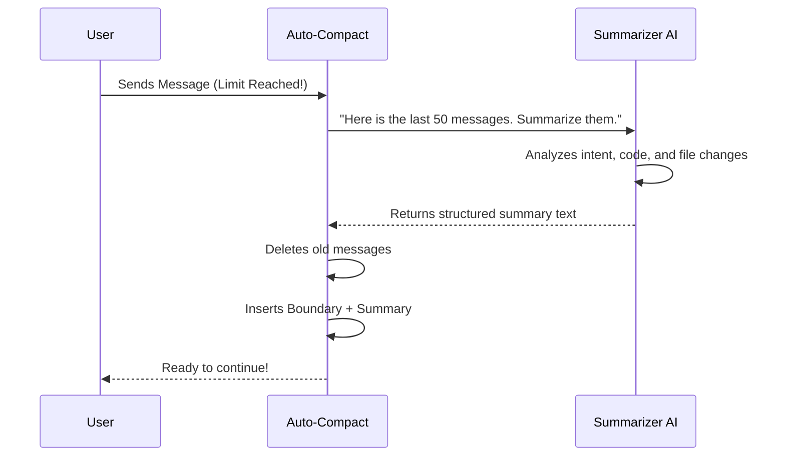

# Chapter 3: Conversation Summarization (Compaction)

In the previous chapter, [Session Memory Optimization](02_session_memory_optimization.md), we looked at the "fast path"—loading a pre-made "cheat sheet" from your hard drive to save space.

But what happens if that cheat sheet doesn't exist? Or what if you've done so much work *since* the last save that the cheat sheet is outdated?

In these cases, we have to do things the hard way. We must read the entire conversation and rewrite it into a concise summary. This is the core engine of the project, simply called **Compaction**.

## The Motivation: The "Executive Summary"

Imagine you are a CEO. Your team hands you a 200-page transcript of every meeting they've had for the last month. You don't have time (or memory space) to read every single word, joke, or "um, wait, let me fix that typo" comment.

You need an **Executive Summary**. You want a single page that says:
1.  What is the goal?
2.  What technical decisions were made?
3.  What files did we change?
4.  What are we doing next?

**Use Case:**
You are 100 messages deep into refactoring a complex database class. You hit the token limit. The system triggers **Compaction**. It takes your 100 messages (the "transcript") and replaces them with 1 message (the "summary") that preserves all the technical context but discards the chatter.

## Key Concepts

To pull this off, we use three main components:

1.  **The Summarizer Agent**: A temporary AI process that reads your history and writes the summary.
2.  **The Structured Prompt**: We don't just say "summarize this." We give the AI a strict template to ensure it captures code snippets and filenames.
3.  **The Boundary Marker**: A special line in the sand. Messages *before* this line are gone (replaced by the summary); messages *after* are kept.

## How It Works: The Flow

When `compactConversation` is called, the system pauses your main chat and runs a background task.



## The Specialized Prompt

The secret sauce of this system is *how* we ask for the summary. If we aren't careful, the AI might say, "The user worked on code," which is useless.

We use a **Structured Prompt** to force specific details.

### The Template
Inside `prompt.ts`, we instruct the AI to output specific sections:

1.  **Primary Request:** What does the user actually want?
2.  **Key Technical Concepts:** Frameworks, patterns, or libraries used.
3.  **Files and Code:** *Crucial.* Lists specific file paths and important code snippets.
4.  **Errors and Fixes:** What went wrong and how we solved it.
5.  **Pending Tasks:** What is left to do?

### The Code Implementation
Here is a simplified look at how the prompt is constructed:

```typescript
// From prompt.ts
export function getCompactPrompt(customInstructions?: string): string {
  // We explicitly forbid tool use - we just want text.
  let prompt = `CRITICAL: Respond with TEXT ONLY. Do NOT call any tools.
  
  Your task is to create a detailed summary...
  Include:
  1. Primary Request and Intent
  2. Key Technical Concepts
  3. Files and Code Sections (Include full snippets!)
  ...`

  return prompt
}
```
*Explanation: We explicitly tell the AI **not** to use tools (like reading files) because we just want it to process the text history it already has.*

## Performing the Compaction

Now, let's look at the main engine in `compact.ts`. This function coordinates the whole process.

### Step 1: generating the Summary
First, we send the history to the AI to get our summary text.

```typescript
// From compact.ts (Simplified)
async function streamCompactSummary({ messages, summaryRequest, ... }) {
  // We create a temporary "fork" of the agent to do this work
  // so we don't mess up the main conversation state.
  
  const response = await queryModelWithStreaming({
    messages: [...messages, summaryRequest], // History + "Please summarize"
    systemPrompt: "You are a helpful AI assistant...",
    // ... other options
  });

  return response; // Contains the summary text
}
```

### Step 2: Creating the Result
Once we have the text, we don't just paste it in. We wrap it in a `UserMessage` so the AI thinks the user provided this context.

```typescript
// From compact.ts (Simplified)
const summaryMessage = createUserMessage({
  content: `This session is continued from a previous conversation. 
            Summary of earlier history: \n\n${summaryText}`,
  isCompactSummary: true // Flags this for the UI
});
```

### Step 3: The Boundary Marker
We also create a "Boundary" message. This is a system message that acts as a divider. It helps the system calculate token usage later (we know everything *above* this marker is compressed).

```typescript
// From compact.ts (Simplified)
const boundaryMarker = createCompactBoundaryMessage(
  'auto', // Triggered automatically
  preCompactTokenCount, // How many tokens we saved
  lastMessageUuid // Where we made the cut
);
```

### Step 4: Putting it Together
Finally, the function returns the new, clean state of the world.

```typescript
// From compact.ts
return {
  boundaryMarker,      // The "Wall"
  summaryMessages,     // The "Executive Summary"
  attachments,         // Files we need to keep open (more on this later)
  messagesToKeep,      // Recent messages we didn't delete
};
```
*Explanation: This return object replaces your old 100-message array. The "backpack" is now light again, containing only the boundary, the summary, and perhaps the last 2 or 3 messages.*

## Partial Compaction: The Surgical Knife

Sometimes, you don't want to summarize *everything*. You might want to summarize only the first half of the conversation but keep the detailed logs of the last 10 minutes.

This is called **Partial Compaction**.

The logic is similar, but instead of summarizing the whole array, we slice it:

```typescript
// From compact.ts
export async function partialCompactConversation(allMessages, pivotIndex, ...) {
  // Slice the array at the pivot point
  const messagesToSummarize = allMessages.slice(0, pivotIndex);
  const messagesToKeep = allMessages.slice(pivotIndex);

  // Summarize only the first chunk
  const summary = await streamCompactSummary({ messages: messagesToSummarize ... });
  
  // Return the Summary combined with the kept messages
  return {
    summaryMessages: [createSummary(summary)],
    messagesToKeep: messagesToKeep
  };
}
```

## Summary

In this chapter, you learned:
1.  **Compaction** is the process of replacing a long history with a structured summary.
2.  We use a **Structured Prompt** to ensure code snippets and technical decisions aren't lost.
3.  The history is replaced by a **Boundary Marker** and the **Summary Message**.
4.  **Partial Compaction** allows us to summarize just the older parts of a conversation while keeping recent debugging details intact.

Now that we have a Summary and a Boundary Marker, how exactly do we organize these messages in the array? How do we ensure the AI knows which messages belong to which "era" of the conversation?

[Next Chapter: Message Grouping & Boundaries](04_message_grouping___boundaries.md)

---

Generated by [Code IQ](https://github.com/adityasoni99/Code-IQ)