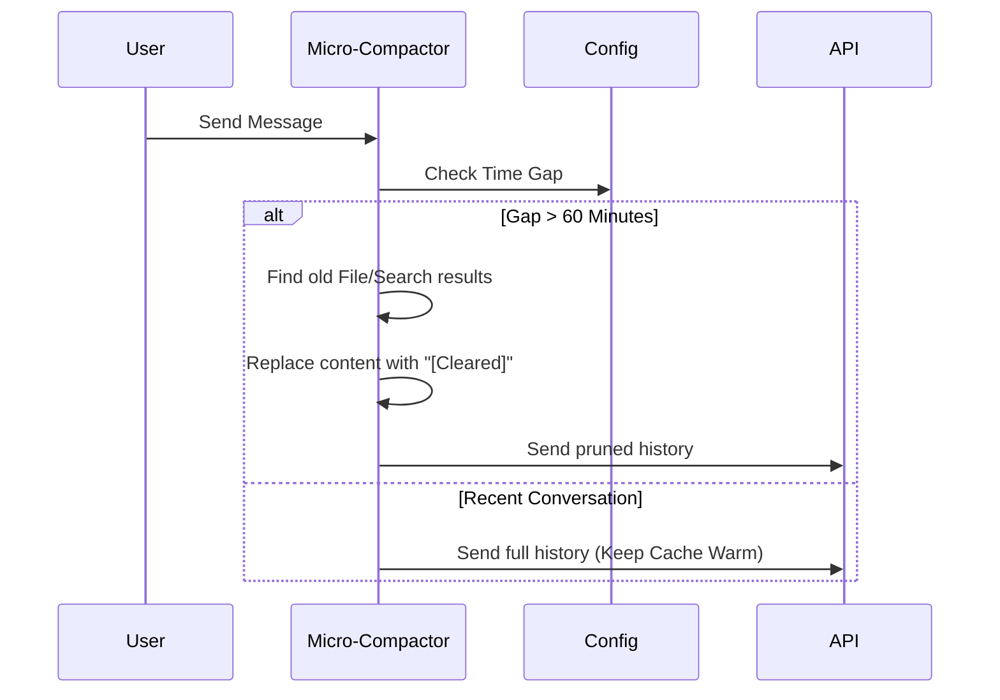

# Chapter 5: Micro-Compaction & Pruning

In the previous chapter, [Message Grouping & Boundaries](04_message_grouping___boundaries.md), we learned how to safely group messages so we don't break the conversation flow.

But sometimes, the problem isn't the *number* of messages—it's that one specific message is enormous.

What if you asked the AI to read a 10,000-line log file? You needed the AI to see it *once* to find an error. Now that the error is found, that massive block of text is just sitting in your history, eating up valuable space.

In this chapter, we explore **Micro-Compaction**: a surgical strategy to remove "heavy" items like old file outputs or images without summarizing the entire conversation.

## The Motivation: Clearing the Browser Cache

Think of your computer. When your hard drive gets full, you have two choices:
1.  **Reinstall Windows (Full Compaction):** Wipe everything and start fresh with a summary. Effective, but drastic and slow.
2.  **Empty the Trash / Clear Cache (Micro-Compaction):** Delete specifically the large temporary files you don't need anymore, but keep your OS and settings exactly as they are.

**Use Case:**
You are debugging a crash.
1.  **You:** "Read `server.log`."
2.  **AI:** (Reads 50,000 tokens of text). "I found the error on line 400."
3.  **You:** "Okay, fix line 400."

Ten minutes later, you are still working. That 50,000-token log is still in the history, costing you money and memory every time you send a message. You don't need the log anymore—you just need the AI to remember *that it read the log*.

## Key Concepts

Micro-Compaction relies on three simple concepts:

1.  **Targeted Pruning:** We identify specific "heavy" types of messages (File Reads, Images, Web Search results).
2.  **The "Stale" Trigger:** If you step away from the computer for a while (e.g., 1 hour), the AI's short-term cache expires anyway. This is the perfect time to clean up history without interrupting your flow.
3.  **Placeholder Replacement:** We replace the massive text block with a tiny note: `[Old tool result content cleared]`.

## How It Works: The "Time-Based" Strategy

The system watches the clock. If there is a significant gap between messages, it assumes the context is "cold" and performs cleanup.

### 1. The Trigger
We define a threshold (usually 60 minutes). If the time since the last AI message exceeds this, we run Micro-Compaction.

```typescript
// From timeBasedMCConfig.ts
export const TIME_BASED_MC_CONFIG_DEFAULTS = {
  enabled: true,
  gapThresholdMinutes: 60, // If 1 hour passes...
  keepRecent: 5,           // ...keep the last 5 heavy items, clear the rest.
}
```
*Explanation: We set a rule. If we haven't talked for an hour, the system is allowed to delete old heavy data, but it must keep the 5 most recent items so the immediate context isn't lost.*

### 2. Identifying "Heavy" Items
We don't want to delete your code or your questions. We only target specific tools that produce large outputs.

```typescript
// From microCompact.ts
const COMPACTABLE_TOOLS = new Set([
  'fs_read_file',    // Reading files
  'grep',            // Searching large text
  'web_search',      // Search results
  'repl_input'       // Shell outputs
])
```
*Explanation: This list defines our "trash targets." If a message isn't in this list (like a user chat message), it is safe and won't be touched.*

### 3. The Replacement
When the trigger fires, the system scans the history. It finds the old "heavy" items and swaps their content.

**Before:**
> Tool Output: (20 pages of log text...)

**After:**
> Tool Output: `[Old tool result content cleared]`

The AI still sees that the tool was run, but the token cost drops from 10,000 to 5.

## Internal Implementation: Under the Hood

When you send a message, the system checks the timestamp *before* calling the API.

### The Flow



### The Logic: `maybeTimeBasedMicrocompact`

This function decides if we should prune the history.

First, it calculates the time difference.

```typescript
// From microCompact.ts (Simplified)
function evaluateTimeBasedTrigger(messages) {
  const lastMsg = messages.findLast(m => m.type === 'assistant')
  
  // Calculate minutes since the last AI response
  const gapMinutes = (Date.now() - lastMsg.timestamp) / 60000

  // If gap is small (e.g. 5 mins), do nothing.
  if (gapMinutes < 60) return null
  
  return gapMinutes
}
```
*Explanation: We look at the timestamp of the last message. If the user has been active recently, we return `null` because we don't want to disturb their active "hot" cache.*

If the gap is large, we perform the cleanup.

```typescript
// From microCompact.ts (Simplified)
const result = messages.map(message => {
  // If this is a tool result we want to clear...
  if (shouldClearTool(message)) {
    // ...replace the heavy text with a placeholder.
    return { 
      ...message, 
      content: '[Old tool result content cleared]' 
    }
  }
  return message
})
```
*Explanation: We map over the array. Normal messages pass through unchanged. Old heavy tool outputs get swapped for the placeholder string.*

### Advanced: API-Side Context Management

There is a second, more advanced way to handle this. Instead of modifying the text locally, we can send instructions to the AI provider (like Anthropic) to "forget" data automatically.

This is handled in `apiMicrocompact.ts`.

```typescript
// From apiMicrocompact.ts
export function getAPIContextManagement() {
  return {
    edits: [{
      type: 'clear_tool_uses', // "Hey API, please clear..."
      trigger: { 
        type: 'input_tokens', 
        value: 180_000         // "...if we hit 180k tokens..."
      },
      exclude_tools: ['file_edit'] // "...but NEVER delete file edits."
    }]
  }
}
```
*Explanation: This configuration tells the API itself: "If I get close to the limit, start dropping the oldest tool outputs, but keep the file edits because those are important."*

## Summary

In this chapter, you learned:
1.  **Micro-Compaction** is a lightweight alternative to full summarization.
2.  It works by "surgical pruning"—replacing heavy tool outputs (logs, images) with tiny placeholders.
3.  We use a **Time-Based Trigger** (e.g., 60 minutes) to perform this cleanup when the user steps away, ensuring we don't break the active cache.

Now we have a fully optimized system. We monitor limits (Auto-Compact), we use cheat sheets (Session Memory), we summarize history (Compaction), we group messages safely (Boundaries), and we prune heavy files (Micro-Compaction).

But what happens if we crash? Or if the user closes the window and comes back later? How do we rebuild this complex state?

[Next Chapter: Context Rehydration & Cleanup](06_context_rehydration___cleanup.md)

---

Generated by [Code IQ](https://github.com/adityasoni99/Code-IQ)