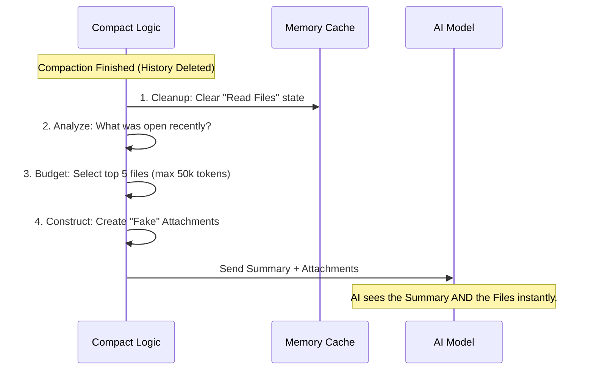

# Chapter 6: Context Rehydration & Cleanup

Welcome to the final chapter of the **Compact** project tutorial!

In the previous chapter, [Micro-Compaction & Pruning](05_micro_compaction___pruning.md), we learned how to surgically remove specific heavy messages. Before that, in [Conversation Summarization (Compaction)](03_conversation_summarization__compaction_.md), we learned how to wipe the slate clean and replace history with a summary.

But here is the problem: **Summaries are not enough.**

If you are working on a file called `server.ts` and the conversation gets compacted, the AI might remember "The user is working on the server." However, it loses the **actual content** of `server.ts`. If you ask, "Fix the bug on line 50," the AI will fail because it can no longer "see" the file.

In this chapter, we explore **Context Rehydration**: the process of immediately reloading critical "short-term memory" (files, plans, skills) after a wipe, so the AI can resume work instantly.

## The Motivation: The "Moving House" Analogy

Imagine you are moving to a new house.
1.  **Compaction:** You pack all your belongings into boxes. The house is empty.
2.  **The Problem:** You arrive at the new house. You are tired. You want to brush your teeth. But your toothbrush is buried in Box #42.
3.  **Rehydration:** A smart mover took your toothbrush, phone charger, and pajamas, and put them in a special "Essentials Bag" right by the door. You can function immediately, even before unpacking the rest.

**Use Case:**
You are debugging `login.ts`.
1.  **Before Compaction:** The AI has `login.ts` in its context window.
2.  **Compaction:** The system deletes the history to save space.
3.  **After Compaction (Without Rehydration):** You ask "Change the password field." The AI says, "I don't see a password field. Can you show me the file?" (Frustrating!)
4.  **After Compaction (With Rehydration):** The system automatically re-attaches `login.ts`. The AI says, "Done." (Seamless).

## Key Concepts

To make this work, we need three mechanisms:

1.  **The Cleanup:** First, we must clear internal caches. The AI thinks it has "read" certain files, but we just deleted them. We need to reset its brain so it knows to look again.
2.  **The Token Budget:** We can't re-upload *everything* the user ever looked at, or we'll fill the context window again immediately. We need a budget (e.g., 50,000 tokens).
3.  **Prioritized Attachments:** We need to decide what is most important. Usually, this is:
    *   **Active Plan:** What are we trying to achieve?
    *   **Recent Files:** What was I looking at 5 minutes ago?
    *   **Learned Skills:** What tools have I discovered?

## How It Works: The Flow

This process runs *immediately* after the Summary is generated.



## Step 1: Cleaning Up (The Reset)

When we delete messages, the system's internal tracking gets out of sync. For example, the `readFileState` cache remembers that we read `data.json`. If we don't clear this, the system might try to be smart and say, "I already read that," even though the content is gone from the history.

We use `runPostCompactCleanup` to wipe these slates.

```typescript
// From postCompactCleanup.ts
export function runPostCompactCleanup(querySource?: QuerySource): void {
  // 1. Reset the micro-compaction trackers
  resetMicrocompactState()

  // 2. Clear the cache that remembers which files are loaded
  getUserContext.cache.clear?.()
  resetGetMemoryFilesCache('compact')

  // 3. Clear other temporary states like approval flags
  clearClassifierApprovals()
  
  // ... other cleanups
}
```
*Explanation: This function acts like a "Reset" button for the internal state management, ensuring the system doesn't rely on stale data that no longer exists in the conversation history.*

## Step 2: Restoring Files (Rehydration)

Now that we are clean, we need to bring back the important files. We use a function called `createPostCompactFileAttachments`.

It looks at the `readFileState` (which tracks what files were accessed) *before* we cleared it, and picks the best candidates.

### The Budget Logic
We define strict limits so we don't crash the session again.

```typescript
// From compact.ts
export const POST_COMPACT_MAX_FILES_TO_RESTORE = 5
export const POST_COMPACT_TOKEN_BUDGET = 50_000
export const POST_COMPACT_MAX_TOKENS_PER_FILE = 5_000
```

### The Selection Process
We sort files by "Recency" (timestamp) and filter them to fit the budget.

```typescript
// From compact.ts (Simplified)
export async function createPostCompactFileAttachments(readFileState, ...) {
  // 1. Sort files by most recently accessed
  const recentFiles = Object.values(readFileState)
    .sort((a, b) => b.timestamp - a.timestamp)
    .slice(0, POST_COMPACT_MAX_FILES_TO_RESTORE) // Take top 5

  // 2. Loop through and create attachments
  const results = await Promise.all(recentFiles.map(file => {
    // Generate the attachment message (re-reads the file from disk)
    return generateFileAttachment(file.filename, ...)
  }))

  // 3. Apply Token Budget
  let usedTokens = 0
  return results.filter(attachment => {
    const cost = estimateTokens(attachment)
    // Only keep it if we have budget left
    if (usedTokens + cost <= POST_COMPACT_TOKEN_BUDGET) {
      usedTokens += cost
      return true
    }
    return false
  })
}
```
*Explanation: We take the 5 most recent files. We try to add them one by one. If a file is too big or we run out of our 50,000 token budget, we stop adding files.*

## Step 3: Restoring Plans and Skills

Files aren't the only thing the AI needs. If the AI was following a step-by-step plan (created via a Plan tool), we must restore that too.

### Restoring the Plan
We check if a plan file exists for this agent.

```typescript
// From compact.ts
export function createPlanAttachmentIfNeeded(agentId?: AgentId) {
  // Check if a plan exists in memory
  const planContent = getPlan(agentId)

  if (!planContent) return null

  // Create a synthetic message containing the plan
  return createAttachmentMessage({
    type: 'plan_file_reference',
    planContent,
    // ...
  })
}
```
*Explanation: This ensures the AI remembers, "Oh right, I was on Step 3 of 5: 'Run the database migration'."*

### Restoring Skills
If the AI learned a new "Skill" (a custom tool definition) during the session, we re-inject it. However, skills can be huge. We truncate them to save space, keeping just the definitions.

```typescript
// From compact.ts (Simplified)
function truncateToTokens(content: string, maxTokens: number): string {
  if (estimate(content) <= maxTokens) return content
  
  // If too long, cut it and add a note
  return content.slice(0, maxChars) + 
    '\n\n[... skill content truncated; read full file if needed]'
}
```
*Explanation: We give the AI the "header" of the skill so it knows the skill exists. If it really needs the full code of the skill, the note tells it to read the file explicitly.*

## The Final Assembly

Finally, the `compactConversation` function (from Chapter 3) puts it all together. It returns an array of messages that looks like this:

1.  **Boundary Marker:** "System: The previous conversation was summarized."
2.  **Summary:** "User: Here is what we did..."
3.  **Rehydrated Context (The "Essentials Bag"):**
    *   [Attachment: `active_plan.md`]
    *   [Attachment: `login.ts`]
    *   [Attachment: `server.ts`]
    *   [Attachment: `learned_skills.xml`]

The AI receives this package and treats it as the new "Starting Point." It knows the history (Summary), and it has its tools ready (Attachments).

## Conclusion of the Tutorial

Congratulations! You have navigated through the entire architecture of the **Compact** project.

Let's recap what we've built:
1.  **Auto-Compact** watches the context window like a hawk.
2.  **Session Memory** provides a fast "cheat sheet" to avoid API calls.
3.  **Compaction** performs the heavy lifting of summarizing text.
4.  **Message Grouping** ensures we don't break tool chains and cause errors.
5.  **Micro-Compaction** surgically removes heavy logs and images.
6.  **Rehydration** brings the AI back to life with its essential files and plans.

Together, these systems allow users to have infinite conversations with AI agents without ever worrying about "Context Full" errors. The AI simply evolves, forgets the noise, remembers the signal, and keeps working.

Thank you for reading the **Compact** developer guide!

---

Generated by [Code IQ](https://github.com/adityasoni99/Code-IQ)