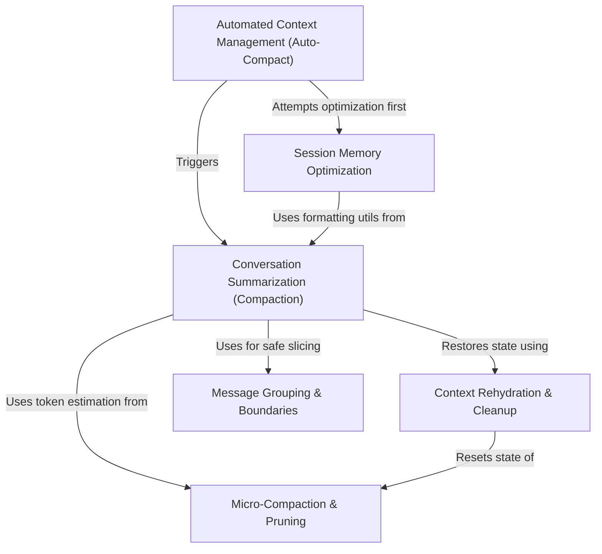

# Tutorial: compact

The **compact** project serves as an intelligent memory management system for long-running AI sessions. Acting like an automated garbage collector, it monitors the *context window* and prevents "out of memory" errors by using **Auto-Compact** to trigger cleanup. The system employs **Conversation Summarization** to "zip" old message history into concise summaries and **Micro-Compaction** to prune unnecessary data, while ensuring critical information is preserved via **Context Rehydration** so the AI never loses track of its active files or tasks.

## Chapters

1. [Automated Context Management (Auto-Compact)](01_automated_context_management__auto_compact_.md)
2. [Session Memory Optimization](02_session_memory_optimization.md)
3. [Conversation Summarization (Compaction)](03_conversation_summarization__compaction_.md)
4. [Message Grouping & Boundaries](04_message_grouping___boundaries.md)
5. [Micro-Compaction & Pruning](05_micro_compaction___pruning.md)
6. [Context Rehydration & Cleanup](06_context_rehydration___cleanup.md)

---

Generated by [Code IQ](https://github.com/adityasoni99/Code-IQ)