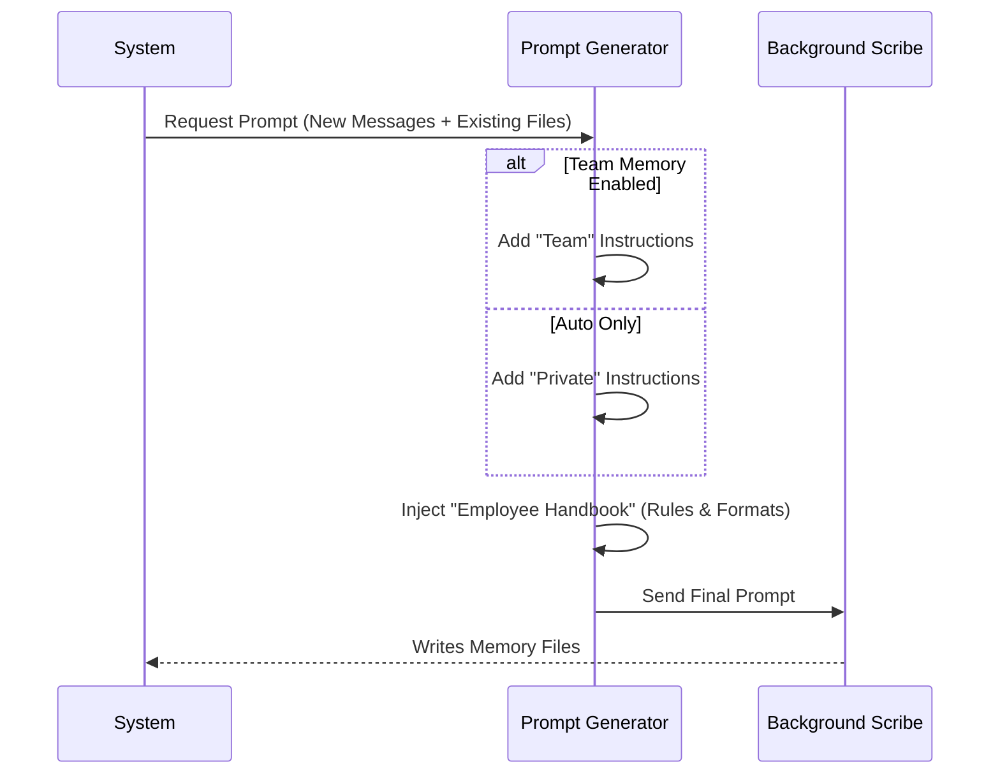

# Chapter 1: Extraction Prompt Templates

Welcome to the **extractMemories** project tutorial! If you've ever wished your AI assistant could remember details about your project, your preferences, or your team's rules without you having to repeat them, you are in the right place.

We start our journey with the foundation of the memory system: **The Extraction Prompt**.

### The Problem: Amnesia
By default, Large Language Models (LLMs) are "stateless." When you close a session, they forget everything. To fix this, we need a way to save important details to a file.

But we don't want the AI to stop chatting with you just to write notes. That breaks the flow.

### The Solution: The Background Scribe
Imagine you have a personal scribe standing quietly in the corner of the room.
1.  You and the main AI talk.
2.  The scribe listens.
3.  Periodically, the scribe writes down important facts into a notebook.

The **Extraction Prompt Template** is the **Employee Handbook** for that scribe. It tells them *who* they are, *what* tools they can use, and exactly *how* to format their notes.

---

## Central Use Case: "Remembering a Task"

Let's look at a simple scenario.

**User says:** "I'm currently refactoring the login page. Please don't use jQuery."

We want our background scribe (the subagent) to see this and create a memory file.

**Goal Output (File: `memory/task_rules.md`):**
```markdown
---
type: active_context
description: Current work on login page
---
The user is refactoring the login page.
Rule: Do not use jQuery.
```

To get this result, we must feed the subagent a specific prompt.

---

## Key Concepts

The prompt is just a long text string, but it has three distinct parts that act like a program.

### 1. The Persona & Constraints
First, we tell the AI it is **not** the main assistant. It is a "Memory Extraction Subagent."

We also set strict rules. Since this agent runs in the background, it shouldn't try to run complex code or delete files. It should only read and write memories.

### 2. The Form (Frontmatter)
Data is useless if it's messy. We force the AI to use **YAML Frontmatter**. This is a block of metadata at the top of the file (between `---` lines).

**The Prompt says:**
> "Write each memory to its own file using this frontmatter format..."

**The AI creates:**
```yaml
---
type: user_preference
verification: verified
---
```

### 3. Update vs. Duplicate
A common problem with AI memory is duplicate data. If you mention the login page twice, we don't want two files. The prompt explicitly instructs the AI to **Update** existing files rather than creating new ones.

---

## Implementation Walkthrough

How does the system build this prompt? It constructs it dynamically based on the current situation.

### The Flow

1.  **Analyze Context:** The system checks if "Team Memory" (shared project memory) is turned on.
2.  **Select Template:** It picks either the "Auto-Only" template (private memory only) or the "Combined" template.
3.  **Inject Manifest:** It inserts a list of existing memories (we'll cover this in [Memory Manifest Injection](02_memory_manifest_injection.md)).
4.  **Final Prompt:** The complete set of instructions is sent to the subagent.



---

## Code Deep Dive

Let's look at the code in `prompts.ts`. We'll break it down into small, manageable pieces.

### 1. The Opener (The Persona)

This function sets the stage. It tells the model exactly what tools are allowed. Notice how we explicitly forbid dangerous commands like `rm` (remove).

```typescript
// prompts.ts
function opener(newMessageCount: number, existingMemories: string): string {
  return [
    `You are now acting as the memory extraction subagent.`,
    `Analyze the most recent ~${newMessageCount} messages...`,
    // Strict tool permissions
    `Available tools: file_read, grep, glob...`, 
    `Bash rm is not permitted.`,
  ].join('\n')
}
```
*Why this matters:* This ensures the background agent doesn't accidentally delete your project files while trying to be helpful. For more on how we enforce this, see [Scoped Tool Permissions](05_scoped_tool_permissions.md).

### 2. The Format Instructions

This part of the prompt gives the model the "Form" to fill out. It provides a concrete example of the expected YAML structure.

```typescript
// prompts.ts
const howToSave = [
  '## How to save memories',
  'Write each memory to its own file using this frontmatter format:',
  '',
  // The prompt includes an example block so the AI copies the style
  ...MEMORY_FRONTMATTER_EXAMPLE, 
  '',
  '- Organize memory semantically by topic',
  '- Do not write duplicate memories.',
]
```
*Why this matters:* By giving a "one-shot" example (an actual block of code in the prompt), the LLM is much more likely to follow the syntax perfectly.

### 3. Building the Full Prompt

Finally, we stitch it all together. This function decides which version of the handbook to hand out.

```typescript
// prompts.ts
export function buildExtractCombinedPrompt(
  newMessageCount: number,
  existingMemories: string
): string {
  // If Team Memory is OFF, fall back to the simpler prompt
  if (!feature('TEAMMEM')) {
    return buildExtractAutoOnlyPrompt(newMessageCount, existingMemories)
  }

  // Otherwise, combine the Opener, the Types, and the Save Instructions
  return [
    opener(newMessageCount, existingMemories),
    '',
    ...TYPES_SECTION_COMBINED, // Explains different memory categories
    ...howToSave,              // The formatting rules from above
  ].join('\n')
}
```
*Why this matters:* This makes the system flexible. If you are working alone, the AI doesn't get confused by instructions about "shared team directories."

---

## Summary

The **Extraction Prompt Template** is the static logic that controls the dynamic behavior of our memory system. It transforms a generic LLM into a specialized "Scribe" by:
1.  Assigning a specific persona.
2.  Restricting dangerous tools.
3.  Providing strict formatting examples (YAML).

However, a prompt is useless if the agent doesn't know what it *already* remembers. To fix that, we need to show the agent the current state of its memory before it writes anything new.

In the next chapter, we will learn how we dynamically inject this context.

[Next Chapter: Memory Manifest Injection](02_memory_manifest_injection.md)

---

Generated by [Code IQ](https://github.com/adityasoni99/Code-IQ)