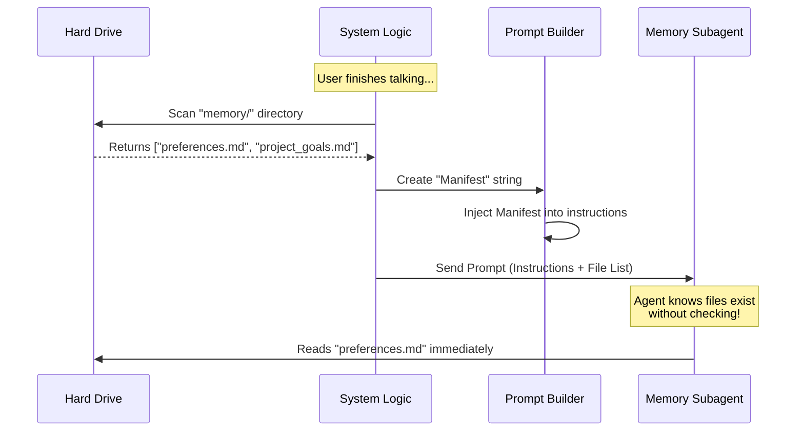

# Chapter 2: Memory Manifest Injection

In the previous chapter, [Extraction Prompt Templates](01_extraction_prompt_templates.md), we designed the "Employee Handbook" for our background scribe. We taught the AI *how* to write memories and *what* tools to use.

However, knowing *how* to write isn't enough. The AI also needs to know *where* to write.

## The Problem: The "Blind" Shopper

Imagine you send a friend to the grocery store to buy "more peanut butter."
1.  **The Problem:** Your friend doesn't know if you already have a jar in the pantry.
2.  **The Wasteful Solution:** They drive to your house, walk into your kitchen, open the pantry, look inside, and *then* decide if they need to buy it.

In AI terms, this "driving to the house" is an expensive waste of time.
If we don't tell the AI what files exist, the conversation goes like this:

1.  **System:** "Please save this memory."
2.  **AI (Turn 1):** "I need to check if a file exists. Running `ls memory/`..."
3.  **System:** "Here is the file list: `user_preferences.md`."
4.  **AI (Turn 2):** "Okay, I will update `user_preferences.md`."

That first turn is a waste of money and time. We want the AI to write the memory immediately in **Turn 1**.

## The Solution: The Manifest

**Memory Manifest Injection** is the act of handing the shopper a list of what's in the pantry *before* they leave for the store.

Instead of making the AI run `ls` (list files), the system runs it automatically behind the scenes. It formats the list of files into a text block (the **Manifest**) and pastes it directly into the initial prompt (the **Injection**).

### Central Use Case

**Scenario:** The user says, "My favorite color is blue."
**Existing Memory:** You already have a file named `preferences.md`.

**Goal:** The AI should see the prompt, notice `preferences.md` is on the list, and immediately decide: *"I will read `preferences.md` to see if I need to update it."*

---

## Visualizing the Flow

Here is how the system prepares the data before the AI ever wakes up.



---

## Implementation Walkthrough

Let's look at how this works in the code. It happens in two main stages: **Scanning** and **Injecting**.

### Step 1: Scanning the Files

Before we create the agent, we look at the hard drive. We use a helper function to find all relevant files in the memory directory.

```typescript
// extractMemories.ts
import { scanMemoryFiles, formatMemoryManifest } from '../../memdir/memoryScan.js'

// 1. Get the path to the memory directory
const memoryDir = getAutoMemPath()

// 2. Scan the hard drive for existing files
const files = await scanMemoryFiles(memoryDir, abortController.signal)

// 3. Turn the file list into a readable string
const existingMemories = formatMemoryManifest(files)
```

**What is `existingMemories`?**
It's just a simple string that looks like this:
```text
- user_profile.md
- project_roadmap.md
- tech_stack.md
```

### Step 2: Injecting into the Prompt

Now that we have this string, we pass it into the prompt generator we discussed in Chapter 1.

```typescript
// extractMemories.ts

// We pass 'existingMemories' (the string) into the builder
const userPrompt = buildExtractCombinedPrompt(
  newMessageCount,
  existingMemories, // <--- The Injection!
  skipIndex
)
```

### Step 3: The Resulting Prompt

Inside the prompt builder, we append this list to the instructions. This is what the AI actually reads:

```typescript
// prompts.ts

function opener(newMessageCount: number, existingMemories: string): string {
  // If we have files, create a formatted block
  const manifest = existingMemories.length > 0
      ? `\n\n## Existing memory files\n\n${existingMemories}\n\nCheck this list before writing...`
      : ''

  // Return the prompt + the manifest
  return [
    `You are now acting as the memory extraction subagent...`,
    // ... other instructions ...
    manifest, 
  ].join('\n')
}
```

*Explanation:*
1.  The function checks if `existingMemories` has content.
2.  It adds a header: `## Existing memory files`.
3.  It adds a crucial instruction: **"Check this list before writing."**
4.  It joins this to the end of the standard instructions.

---

## Why This Matters

By injecting the manifest, we change the AI's behavior logic:

**Without Manifest:**
> "I have a new memory. I don't know where to put it. I better look around first." -> **Uses Tool: `ls`**

**With Manifest:**
> "I have a new memory. I see `preferences.md` in the list provided in my instructions. That sounds relevant." -> **Uses Tool: `read_file preferences.md`**

This simple text injection makes the agent:
1.  **Faster:** It skips an entire step of the conversation loop.
2.  **Cheaper:** Fewer tokens generated means lower API costs.
3.  **Smarter:** It reduces the chance of creating duplicate files (e.g., creating `user_prefs.md` when `preferences.md` already exists).

---

## Summary

In this chapter, we learned about **Memory Manifest Injection**.

- **The Concept:** Pre-scanning the hard drive to create a list of files.
- **The Method:** Injecting that list directly into the "Employee Handbook" (Prompt).
- **The Benefit:** The agent knows the environment immediately, saving a "discovery" turn.

Now the agent has its instructions (Chapter 1) and knows the current state of the file system (Chapter 2). But there is still a major question: **Which messages should the agent read?**

If the agent reads the entire chat history every time, it will re-process old memories over and over again. We need a way to track what the agent has already seen.

[Next Chapter: Incremental Context Cursor](03_incremental_context_cursor.md)

---

Generated by [Code IQ](https://github.com/adityasoni99/Code-IQ)