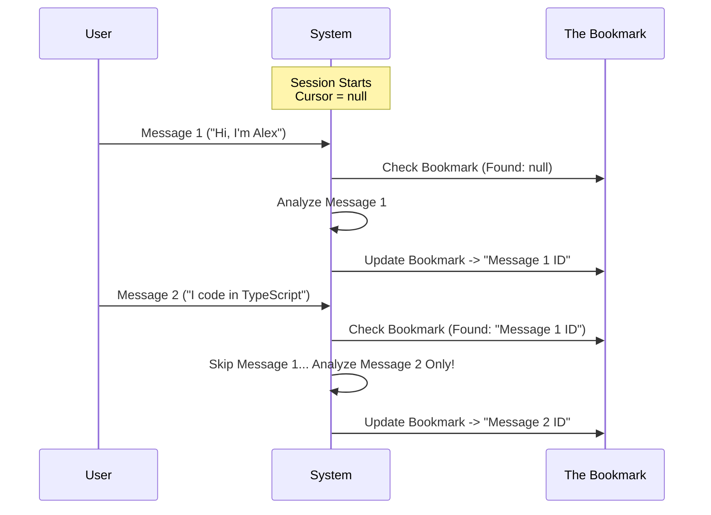

# Chapter 3: Incremental Context Cursor

In the previous chapter, [Memory Manifest Injection](02_memory_manifest_injection.md), we taught our agent to check the "pantry" (existing files) before going shopping.

Now we face a new problem: **How much of the conversation should the agent read?**

## The Problem: The "Groundhog Day" Effect

Imagine you are reading a very long book.
1.  On Monday, you read Chapter 1.
2.  On Tuesday, you want to read Chapter 2.
3.  **But...** if you don't have a bookmark, you have to start over at Page 1, read Chapter 1 *again*, and finally get to Chapter 2.

If an AI reads the entire conversation history every time it tries to save a memory, two bad things happen:
1.  **It's Expensive:** You pay for the AI to re-read old text over and over.
2.  **It Causes Duplicates:** The AI might see "My name is Alex" in the history for the 10th time and think, *"Oh! I should save that!"* even though it already did.

## The Solution: The Incremental Cursor

To solve this, we use a **Cursor**. Think of it exactly like a bookmark in a book.

*   **Before the Agent runs:** It checks where the bookmark is.
*   **The Task:** It only analyzes messages *after* the bookmark.
*   **After the Agent finishes:** It moves the bookmark to the end of the current page.

In our code, this bookmark is a variable called `lastMemoryMessageUuid`.

### Central Use Case

**Scenario:**
1.  **Turn 1:** User says "I love pizza." -> Agent saves memory. **Bookmark is placed at Turn 1.**
2.  **Turn 2:** User says "I hate broccoli."

**Goal:** When the agent wakes up for Turn 2, it should look at the bookmark and realize: *"I have already processed Turn 1. I only need to analyze Turn 2."*

---

## Visualizing the Timeline

Here is how the cursor moves over time.



---

## Implementation Walkthrough

The logic for this is simple but powerful. It happens in three steps within `extractMemories.ts`.

### 1. The State Variable (The Bookmark)

First, we need a place to store our bookmark. We use a variable that sits outside the main function loop so it remembers its value between turns.

```typescript
// extractMemories.ts

// This variable persists across the entire session
let lastMemoryMessageUuid: string | undefined
```
*Explanation:* Initially, it is `undefined` (no bookmark yet). As the chat progresses, this will hold the ID of the last message we successfully analyzed.

### 2. Calculating the Count

When the extraction process starts, we don't send the full conversation to the background agent. We only tell it *how many* new messages to look at.

We use a helper function to count messages that happened **after** our bookmark.

```typescript
// extractMemories.ts

// 'messages' is the full history
// 'lastMemoryMessageUuid' is our bookmark
const newMessageCount = countModelVisibleMessagesSince(
  messages,
  lastMemoryMessageUuid,
)
```
*Explanation:* If the history has 50 messages, but our bookmark is at message 48, `newMessageCount` will be **2**.

This number is then injected into the prompt (remember Chapter 1?) so the agent sees:
> "Analyze the most recent ~2 messages..."

### 3. Moving the Bookmark

Critically, we **only** move the bookmark if the extraction process finishes successfully. If the agent crashes or gets stuck, the bookmark stays put, and we try again next time.

```typescript
// extractMemories.ts (inside runExtraction)

// ... agent performs work ...

// Get the very last message in the current batch
const lastMessage = messages.at(-1)

// Update the bookmark to this new ID
if (lastMessage?.uuid) {
  lastMemoryMessageUuid = lastMessage.uuid
}
```
*Explanation:* We successfully processed up to `lastMessage`. We save its ID. Next time the user talks, we will start counting *after* this ID.

---

## Deep Dive: The Counting Logic

How does `countModelVisibleMessagesSince` actually work? It iterates through the list of messages looking for our bookmark.

```typescript
// extractMemories.ts (Simplified)

function countModelVisibleMessagesSince(allMessages, bookmarkId) {
  // If no bookmark, count everything!
  if (!bookmarkId) return allMessages.length

  let foundBookmark = false
  let count = 0

  for (const msg of allMessages) {
    // 1. We are still looking for the bookmark...
    if (!foundBookmark) {
      if (msg.uuid === bookmarkId) foundBookmark = true
      continue // Skip the bookmark itself
    }
    
    // 2. We passed the bookmark! Start counting.
    count++
  }
  return count
}
```

*   **Step 1:** Iterate through history.
*   **Step 2:** Ignore everything until we see the `bookmarkId`.
*   **Step 3:** Once we find it, count every message that comes after it.

---

## Why "Incremental" Matters

This architecture creates a **Stateful** experience on top of a **Stateless** LLM.

1.  **Efficiency:** The prompt size remains small (usually ~2-5 messages), even if the conversation history is 10,000 messages long.
2.  **Focus:** The agent focuses intensely on recent context. It doesn't get distracted by a fact mentioned 20 turns ago (because it already saved that fact 20 turns ago!).
3.  **Safety:** If the process fails, the cursor doesn't move. The system automatically "retries" the failed messages on the next turn because they are still *after* the bookmark.

## Summary

The **Incremental Context Cursor** is the engine that keeps our memory system efficient.

*   It acts as a **Bookmark**.
*   It calculates a `newMessageCount`.
*   It ensures we never process the same message twice.

Now we have a Prompt (Chapter 1), a File Manifest (Chapter 2), and a Cursor (Chapter 3). We have all the data ready.

But wait—if we run this logic, won't the user have to wait for the memory agent to finish thinking before they can type again? We don't want to block the chat!

In the next chapter, we will learn how to run this process in the background using a **Forked Agent**.

[Next Chapter: Forked Agent Execution](04_forked_agent_execution.md)

---

Generated by [Code IQ](https://github.com/adityasoni99/Code-IQ)