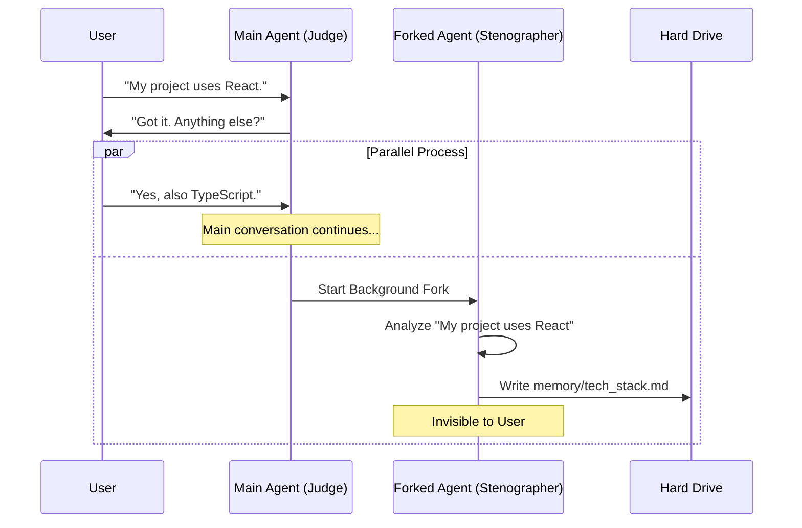

# Chapter 4: Forked Agent Execution

In the previous chapter, [Incremental Context Cursor](03_incremental_context_cursor.md), we taught the system to efficiently track which messages need to be analyzed. We know *what* to read. Now we must decide *how* to read it without annoying the user.

## The Problem: The "Loading Spinner"

Imagine you are chatting with an AI. You say something simple like, "Hello."
If the AI decides to save a memory right then, and it runs in the main process, you have to wait.

1.  **User:** "Hello!"
2.  **System:** (Wait... analyzing... writing file... verifying...)
3.  **System:** (5 seconds later) "Hi there!"

This delay breaks the flow of conversation. We want the memory system to be invisible.

## The Solution: The Invisible Stenographer

To solve this, we use **Forked Agent Execution**.

Think of a courtroom trial.
1.  **The Main Agent** is the Judge. They are talking to you (the Witness) continuously.
2.  **The Forked Agent** is the Court Stenographer.

Periodically, the stenographer quietly slips out the back door to file a report (write a memory) based on what just happened. The Judge doesn't stop the trial. The Judge keeps talking to you while the Stenographer is working in another room.

### Central Use Case

**Scenario:**
1.  **Turn 1:** You tell the AI about a complex project requirement.
2.  **Turn 2:** You immediately ask, "What is the weather?"

**Goal:** The AI answers about the weather *immediately*. In the background, a second, invisible AI process analyzes the project requirement and saves it to a file.

---

## Key Concepts

### 1. The Fork
In software terms, a "fork" splits a process into two.
*   **Path A (Main):** Continues waiting for your next input.
*   **Path B (Background):** Takes the chat history and runs the memory extraction logic.

### 2. Prompt Cache Sharing
Running two agents sounds expensive, right?
This system uses a smart optimization called **Prompt Caching**. Because the Main Agent and the Forked Agent share the exact same chat history (up until the fork happens), the AI provider (like Anthropic) reuses the "processing work" it already did.

This makes the background agent extremely fast and much cheaper than a fresh start.

---

## Implementation Walkthrough

How does the code handle this split? It uses a "Fire-and-Forget" pattern.

### 1. The Trigger
When the main agent finishes a turn (stops generating text), the system calls `executeExtractMemories`.

```typescript
// extractMemories.ts - Public Entry Point
export async function executeExtractMemories(
  context: REPLHookContext,
): Promise<void> {
  // We call the internal extractor, but we don't 'await' it blocking the user.
  // We let it run in the background.
  await extractor?.(context)
}
```
*Explanation:* This function kicks off the process. It doesn't return any text to the user. It just signals the background worker to start.

### 2. The Worker (The Forked Agent)
Inside the background process, we use `runForkedAgent`. This is a special utility that creates our "Stenographer."

```typescript
// extractMemories.ts - Inside runExtraction()

const result = await runForkedAgent({
  // The 'userPrompt' contains our instructions from Chapter 1
  promptMessages: [createUserMessage({ content: userPrompt })],
  
  // We share the cache params so this is cheap and fast
  cacheSafeParams: cacheSafeParams,
  
  // Crucial: This agent is invisible. It does not write to the main transcript.
  skipTranscript: true, 
  
  // Limit the agent so it doesn't get stuck in a loop
  maxTurns: 5, 
})
```
*Explanation:*
*   `promptMessages`: This is where we pass the "Employee Handbook" (Chapter 1) and the File List (Chapter 2).
*   `skipTranscript: true`: This ensures the background agent's internal thoughts ("I should save this file...") never appear in your chat window.

### 3. The Safety Drain
What if you close the application while the background agent is still writing a file? We don't want to corrupt data.
We use a "Drain" function to ensure pending work finishes before the app exits.

```typescript
// extractMemories.ts
export async function drainPendingExtraction(timeoutMs?: number): Promise<void> {
  // Wait for all background tasks (inFlightExtractions) to finish
  await drainer(timeoutMs)
}
```

---

## Visualizing the Parallel Execution

Here is how the Main conversation and the Memory extraction run side-by-side.



---

## Deep Dive: The Extractor Closure

To manage this background state, we use a coding pattern called a **Closure**. We wrap all our state variables inside an `init` function. This ensures that if we run multiple tests or sessions, the variables don't leak into each other.

```typescript
// extractMemories.ts

export function initExtractMemories(): void {
  // 1. Define state variables inside the function scope
  const inFlightExtractions = new Set<Promise<void>>()
  let inProgress = false

  // 2. Define the worker function
  async function runExtraction(inputs) {
    inProgress = true
    try {
        // ... perform the work ...
    } finally {
        inProgress = false
    }
  }

  // 3. Assign to the global export so the outside world can call it
  extractor = async (context) => {
    const p = runExtraction({ context })
    inFlightExtractions.add(p) // Track the promise
    await p
    inFlightExtractions.delete(p)
  }
}
```
*Explanation:*
1.  `inProgress`: Acts as a lock. If the agent is already working, we don't start a second parallel worker (that would be confusing!).
2.  `inFlightExtractions`: A list of active jobs. The "Drain" function checks this list to know when it's safe to quit.

---

## Summary

The **Forked Agent Execution** model is the secret sauce that makes memory extraction feel magical.
1.  It creates a perfect copy of the chat state.
2.  It runs in the background using shared cache (low cost/latency).
3.  It is invisible to the user (`skipTranscript`).

Now we have a background agent that is ready to write files. But wait—this background agent has access to your file system. **Is it safe?** We don't want a background process accidentally deleting your home directory!

In the next chapter, we will learn how we lock down the specific tools this agent is allowed to use.

[Next Chapter: Scoped Tool Permissions](05_scoped_tool_permissions.md)

---

Generated by [Code IQ](https://github.com/adityasoni99/Code-IQ)