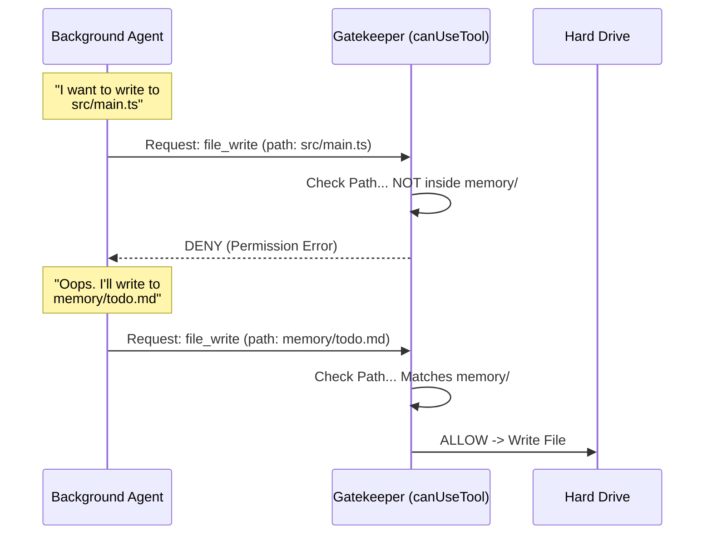

# Chapter 5: Scoped Tool Permissions

In the previous chapter, [Forked Agent Execution](04_forked_agent_execution.md), we learned how to spawn an invisible "stenographer" agent that runs in the background.

This creates a powerful system, but also a dangerous one. This background agent has access to your computer's tools. What if it gets confused? What if it tries to delete your source code or rewrite your project files while trying to be helpful?

## The Problem: The Over-Enthusiastic Intern

Imagine you hire an intern to organize your filing cabinet. You give them a master key to the building.
1.  **The Goal:** "Organize the papers in the cabinet."
2.  **The Mistake:** The intern decides your office furniture is messy, so they throw away your desk.

In our system, the **Extraction Agent** is that intern. By default, an AI agent might have tools like `file_write` or `bash` with full permissions. If the user says "Delete the bad code," the background agent might think, *"I should help with that!"* and accidentally delete files it shouldn't touch.

## The Solution: The Digital Keycard

We need to restrict the agent's permissions strictly. We call this **Scoped Tool Permissions**.

It works like a programmable keycard:
1.  **Read Anywhere:** The agent needs to read your project files to understand what you are working on.
2.  **Write Locally:** The agent can **only** write or edit files inside the specific `memory/` directory.
3.  **Look, Don't Touch:** It can use the command line (Bash), but only for "safe" commands like `ls` (list) or `cat` (read). Commands like `rm` (remove) are blocked.

### Central Use Case

**Scenario:**
The user says: "Refactor `src/server.ts`."
The background agent reads this.

*   **Action A:** Agent tries to edit `src/server.ts`.
    *   **Result:** **ACCESS DENIED**. (Safety triggered).
*   **Action B:** Agent tries to write a note to `memory/tasks.md`.
    *   **Result:** **ALLOWED**.

---

## Key Concepts

### 1. The Gatekeeper Function (`canUseTool`)
In this framework, every time the AI wants to use a tool, it doesn't just happen. The request is sent to a function called `canUseTool`. This function returns either `allow` or `deny`.

### 2. The Allow-List Strategy
Instead of trying to list every bad thing the agent *shouldn't* do, we list the few things it *can* do. If a tool isn't on the list, it is blocked by default.

### 3. Path Validation
For writing files, we don't just check the tool name; we check the **parameters**. We look at the `file_path` the agent wants to write to. If the path doesn't start with the memory directory, we block it.

---

## Visualizing the Gatekeeper

Here is how the system decides whether to let the agent act.



---

## Implementation Walkthrough

Let's look at the code in `extractMemories.ts`. We create a specific permission function called `createAutoMemCanUseTool`.

### 1. Allowing "Safe" Read Tools

Reading files is generally safe. We want the agent to be able to read your entire project so it understands the context of what you are doing.

```typescript
// extractMemories.ts
export function createAutoMemCanUseTool(memoryDir: string): CanUseToolFn {
  return async (tool, input) => {
    // 1. Always allow reading and searching tools
    if (
      tool.name === 'file_read' ||
      tool.name === 'grep' ||
      tool.name === 'glob'
    ) {
      return { behavior: 'allow', updatedInput: input }
    }
    // ... checks continue ...
```
*Explanation:* If the tool is `file_read`, `grep`, or `glob`, we immediately say "Yes."

### 2. restricting the Command Line (Bash)

We want the agent to be able to use `ls` to see what files exist, but we must stop it from running dangerous commands. The `BashTool` has a built-in helper `isReadOnly` that checks this for us.

```typescript
// extractMemories.ts
    // 2. Allow Bash ONLY if it is a read-only command
    if (tool.name === 'bash') {
      const parsed = tool.inputSchema.safeParse(input)
      
      // isReadOnly checks for 'ls', 'cat', 'find', etc.
      if (parsed.success && tool.isReadOnly(parsed.data)) {
        return { behavior: 'allow', updatedInput: input }
      }
      
      return denyAutoMemTool(tool, 'Only read-only shell commands are permitted')
    }
```
*Explanation:* If the command is `rm -rf /`, `isReadOnly` returns false, and we deny the request with a helpful error message.

### 3. The Write Barrier

This is the most critical part. We check if the agent is trying to **Edit** or **Write** a file. If so, we inspect the `file_path`.

```typescript
// extractMemories.ts
    if (
      (tool.name === 'file_edit' || tool.name === 'file_write') &&
      'file_path' in input
    ) {
      const filePath = input.file_path
      
      // 3. Only allow writing if the path is inside the memory folder
      if (typeof filePath === 'string' && isAutoMemPath(filePath)) {
        return { behavior: 'allow', updatedInput: input }
      }
    }
```
*Explanation:* `isAutoMemPath` returns `true` only if the path looks like `.../memory/filename.md`. If the agent tries to write anywhere else, this block is skipped.

### 4. The Final Default Deny

If the request didn't match any of the rules above (e.g., trying to use an API tool, or writing to a forbidden path), we block it.

```typescript
// extractMemories.ts
    return denyAutoMemTool(
      tool,
      `Access Denied: You can only write within ${memoryDir}`
    )
  }
}
```
*Explanation:* This ensures that any new tools added to the system in the future are automatically blocked unless we explicitly add them here.

---

## Why This Matters

By scoping permissions, we transform the AI from a potential liability into a safe utility.

1.  **Confidence:** You can trust the background process to run without monitoring it.
2.  **Focus:** The error messages (when denied) actually help the AI. If it tries to write to `src/`, the error tells it: *"You can only write within memory/"*. The AI then corrects itself and writes to the correct place.
3.  **Isolation:** Even if the main agent is allowed to delete files, the memory subagent is not.

---

## Summary

In this chapter, we learned about **Scoped Tool Permissions**.

*   **The Concept:** Creating a security sandbox for the background agent.
*   **The Mechanism:** A custom `canUseTool` function that inspects every action.
*   **The Result:** An agent that can read globally to understand context, but can only write locally to save memories.

We have now built the entire flow:
1.  **Prompt:** Telling the agent what to do.
2.  **Manifest:** Showing it existing files.
3.  **Cursor:** Showing it only new messages.
4.  **Fork:** Running it in the background.
5.  **Permissions:** Keeping it safe.

However, all of these pieces rely on tracking variables (like `lastMemoryMessageUuid` or `inProgress`). Where do we store these variables so they don't get messy or overwritten?

In the final chapter, we will learn how to wrap everything in a neat code package using **Closures**.

[Next Chapter: Closure-Based State Management](06_closure_based_state_management.md)

---

Generated by [Code IQ](https://github.com/adityasoni99/Code-IQ)