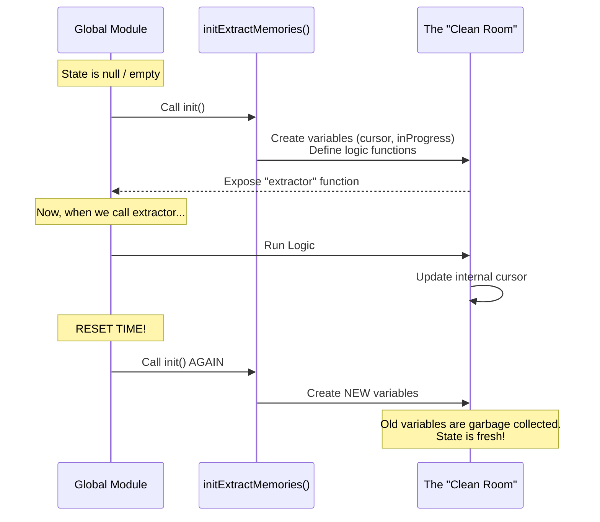

# Chapter 6: Closure-Based State Management

In the previous chapter, [Scoped Tool Permissions](05_scoped_tool_permissions.md), we secured our background agent by giving it a restricted set of tools.

We now have a complete system:
1.  It knows *what* to do (Prompts).
2.  It knows *where* to write (Manifest).
3.  It knows *what* to read (Cursor).
4.  It runs invisibly (Fork).
5.  It runs safely (Permissions).

But there is one final architectural challenge. How do we store the variables that track all of this (like the cursor position or the "in progress" flag) without causing bugs when we run tests or restart sessions?

## The Problem: The "Shared Whiteboard" Mess

In programming, the easiest way to store state is using **Global Variables**.

Imagine a shared whiteboard in the hallway of an office.
1.  **Project A** starts. The manager writes `Current Step: 5` on the board.
2.  **Project B** starts. The manager looks at the board, sees `Current Step: 5`, and gets confused because Project B hasn't started yet!

This is a major problem for:
*   **Testing:** If Test 1 changes a variable, Test 2 might fail because the variable wasn't reset.
*   **Session Resets:** If a user restarts their chat session, we want the memory cursor to reset to zero, not remember the previous conversation's position.

## The Solution: The "Clean Room" Strategy

Instead of a shared whiteboard, we use **Closures**.

Imagine that every time a new project starts, we build a brand new, sealed room.
1.  We put a fresh notebook inside the room.
2.  The worker goes inside and works.
3.  When the project is done, we seal the room or destroy it.
4.  For the next project, we build a **new** room with a **new** notebook.

In JavaScript/TypeScript, we create this "Room" using a function called `initExtractMemories`. All state variables live *inside* this function.

### Central Use Case

**Scenario:** Automated Testing.
We want to run 50 tests in a row to ensure the memory system works.

**Goal:**
*   **Test 1:** Runs. Sets `cursor = 10`. Pass.
*   **Test 2:** Runs. `cursor` should automatically be back at `0`.

If we used global variables, Test 2 would start at `10` and fail. With closures, Test 2 calls `init()` and gets a fresh state.

---

## Visualizing the Scope

Here is how the data is isolated.



---

## Implementation Walkthrough

Let's look at `extractMemories.ts`. We don't declare variables at the top of the file. Instead, we wrap them.

### 1. The Wrapper Function

We start by creating a function that will hold our state.

```typescript
// extractMemories.ts

// 1. This is the "Public Handle". Initially, it does nothing.
let extractor = null 

// 2. The Initialization Function
export function initExtractMemories(): void {
  // 3. State variables are defined INSIDE this function.
  // No other part of the app can touch these directly.
  let lastMemoryMessageUuid: string | undefined
  let inProgress = false
  const inFlightExtractions = new Set<Promise<void>>()
  
  // ... (logic continues inside) ...
}
```
*Why this matters:* Every time `initExtractMemories()` is called, `lastMemoryMessageUuid` is recreated from scratch.

### 2. The Internal Logic

Inside the same function, we define the logic that uses these variables. Because functions in JavaScript remember the variables present when they were created (a "Closure"), `runExtraction` can see `inProgress`.

```typescript
  // Inside initExtractMemories()...

  async function runExtraction(context) {
    // We can read/write the variables defined above
    if (inProgress) {
        return // Block overlapping runs
    }

    inProgress = true
    try {
        // ... do the work ...
    } finally {
        inProgress = false
    }
  }
```

### 3. Exposing the Logic

Finally, at the end of `initExtractMemories`, we assign our internal function to the global `extractor` variable. This gives the outside world a "remote control" to the clean room.

```typescript
  // Inside initExtractMemories()...

  // Assign the internal function to the module-level variable
  extractor = async (context) => {
    // When the outside world calls 'extractor',
    // it actually runs the internal logic bound to this specific scope.
    await runExtraction({ context })
  }
} // End of initExtractMemories
```

---

## Tracking "In-Flight" Jobs

One specific state variable is very important: `inFlightExtractions`.
This is a `Set` (a list) of all background jobs currently running.

When the application needs to shut down, we can't just kill the power. We might corrupt a file if the agent is half-finished writing.

We use a **Drain** pattern (exposed via closure) to wait for safety.

```typescript
  // Inside initExtractMemories()...

  drainer = async (timeoutMs) => {
    // If the Set is empty, we are safe to quit.
    if (inFlightExtractions.size === 0) return

    // Otherwise, wait for all Promises in the Set to finish
    await Promise.all(inFlightExtractions)
  }
```

*Analogy:* It's like a store closing for the night. You lock the door (stop new customers/messages), but you let the customers already inside (in-flight extractions) finish checking out before you turn off the lights.

---

## Summary of the Project

Congratulations! You have completed the tutorial for **extractMemories**.

We have built a sophisticated, background memory system that is:

1.  **Context-Aware:** Uses **Prompt Templates** to tell the AI who it is ([Chapter 1](01_extraction_prompt_templates.md)).
2.  **Efficient:** Uses **Manifest Injection** to avoid unnecessary file checks ([Chapter 2](02_memory_manifest_injection.md)).
3.  **Smart:** Uses a **Context Cursor** to only read new messages ([Chapter 3](03_incremental_context_cursor.md)).
4.  **Non-Blocking:** Uses **Forked Execution** to run without stopping the chat ([Chapter 4](04_forked_agent_execution.md)).
5.  **Safe:** Uses **Scoped Permissions** to prevent file system damage ([Chapter 5](05_scoped_tool_permissions.md)).
6.  **Clean:** Uses **Closures** (this chapter) to manage state and allow clean resets.

### Final Thoughts

This architecture allows the AI to develop long-term memory. It remembers your preferences, your project details, and your rules, all without you having to manage a database or manually write notes. It simply "listens" in the background and writes files, just like a helpful assistant should.

Happy coding!

---

Generated by [Code IQ](https://github.com/adityasoni99/Code-IQ)