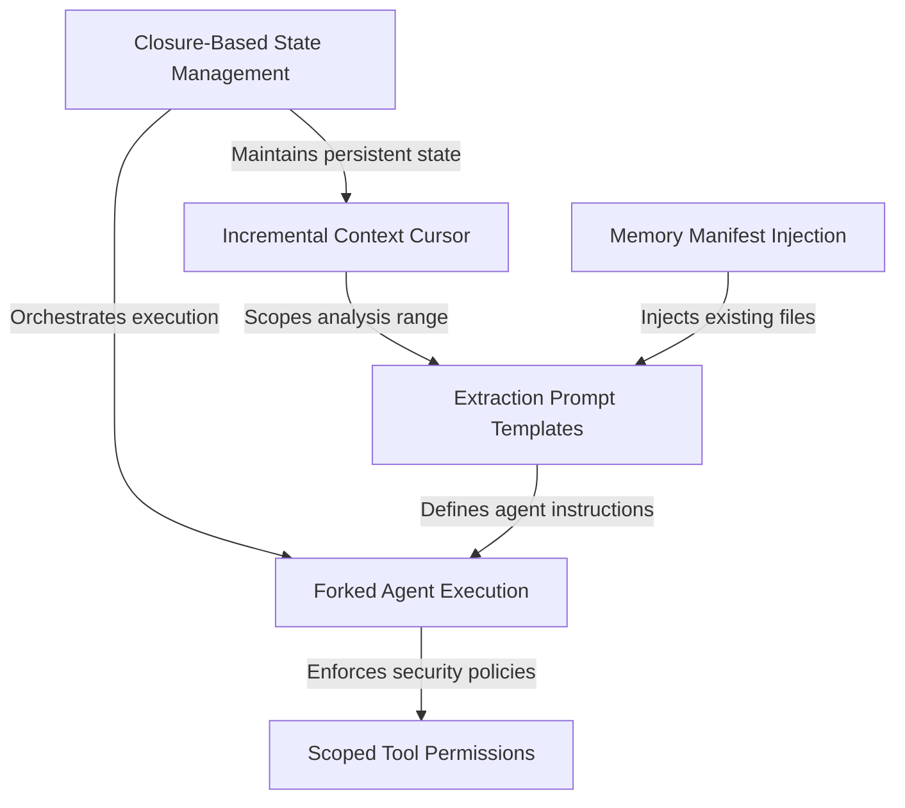

# Tutorial: extractMemories

This project implements a background system for extracting and saving **persistent memories** from user conversations without interrupting the main chat flow. It uses a **Forked Agent Execution** model to analyze only new messages tracked by an **Incremental Context Cursor**. The system ensures safety and consistency by operating within strict **Scoped Tool Permissions** and using **Closure-Based State Management** to isolate its execution environment.

## Chapters

1. [Extraction Prompt Templates](01_extraction_prompt_templates.md)
2. [Memory Manifest Injection](02_memory_manifest_injection.md)
3. [Incremental Context Cursor](03_incremental_context_cursor.md)
4. [Forked Agent Execution](04_forked_agent_execution.md)
5. [Scoped Tool Permissions](05_scoped_tool_permissions.md)
6. [Closure-Based State Management](06_closure_based_state_management.md)

---

Generated by [Code IQ](https://github.com/adityasoni99/Code-IQ)