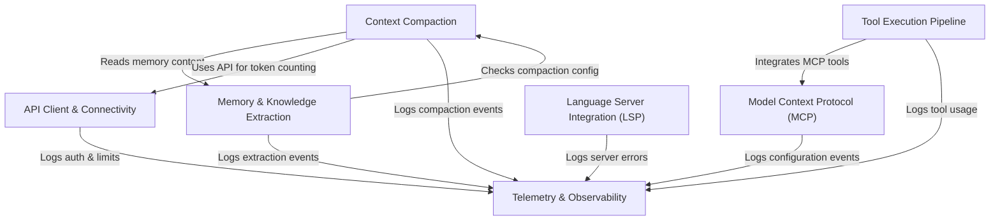

# Tutorial: services

The **services** project implements the core cognitive architecture of an AI agent. It manages the agent's limited **Context Window** through intelligent compaction and maintains persistent **Memory** by extracting key insights from conversations. The system orchestrates a **Tool Execution Pipeline** that connects to external capabilities via **MCP** and **LSP**, while a unified **API Client** handles cloud connectivity and **Telemetry** provides comprehensive system observability.

## Chapters

1. [API Client & Connectivity](01_api_client___connectivity.md)
2. [Memory & Knowledge Extraction](02_memory___knowledge_extraction.md)
3. [Context Compaction](03_context_compaction.md)
4. [Tool Execution Pipeline](04_tool_execution_pipeline.md)
5. [Model Context Protocol (MCP)](05_model_context_protocol__mcp_.md)
6. [Language Server Integration (LSP)](06_language_server_integration__lsp_.md)
7. [Telemetry & Observability](07_telemetry___observability.md)

---

Generated by [Code IQ](https://github.com/adityasoni99/Code-IQ)