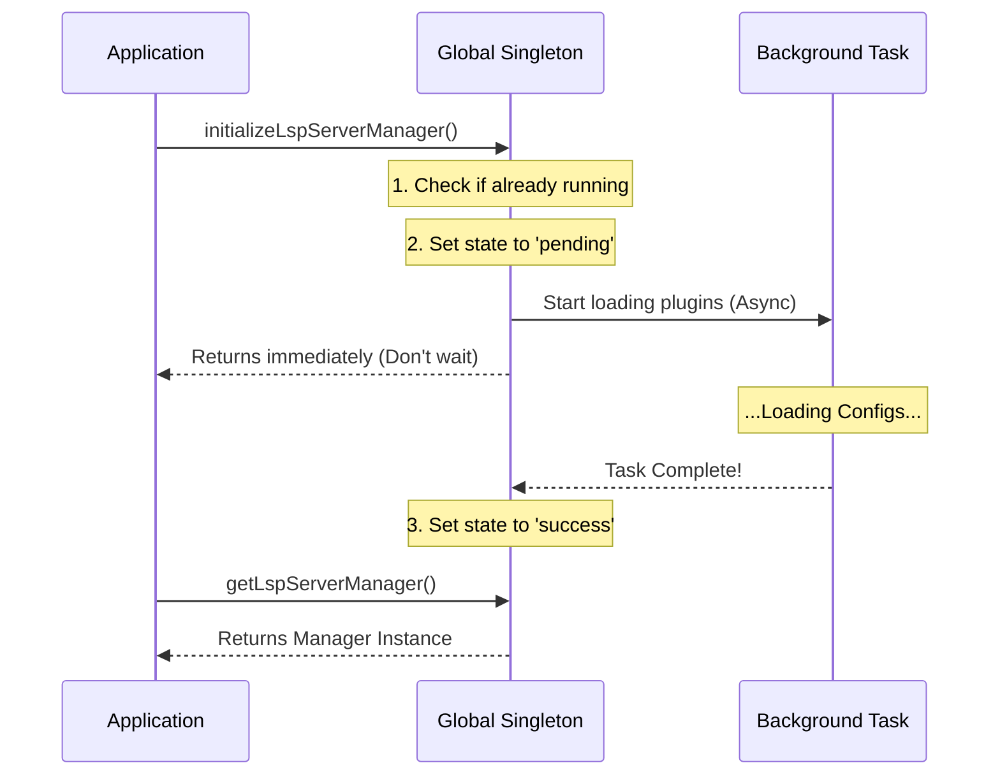

# Chapter 1: Global Lifecycle Singleton (The Anchor)

Welcome to the **LSP Project**! In this tutorial series, we will build a system that allows an AI coding assistant to "talk" to programming languages (like getting errors or auto-complete definitions) using the Language Server Protocol (LSP).

We are starting at the very top level: **The Anchor**.

## The Problem: Who Unlocks the Doors?

Imagine you are running a large office building.
1.  **Morning:** Someone needs to unlock the main doors, turn on the lights, and make sure the security system is active.
2.  **During the Day:** People need to find the building manager to ask for help.
3.  **Evening:** Someone needs to lock everything up safely so no windows are left open.

In software, this is the **Lifecycle**.

We have a problem, though. Setting up the LSP system takes time (it has to read configuration files and prepare plugins). We don't want the whole application to freeze while this happens. We also need to make sure we don't accidentally create *two* managers who fight over the building keys.

## The Solution: The Global Singleton

The **Global Lifecycle Singleton** (which we call "The Anchor") is a single point of control. It guarantees that only **one** system exists, and it manages the timing of starting up and shutting down.

### Core Concept: The Singleton Pattern

The "Singleton" pattern ensures that a class has only one instance and provides a global point of access to it.

> **Analogy:** Think of the Anchor as the **Building Manager**. There is only one Building Manager. If you need something, you go to their desk. You don't hire a new manager every time you have a question.

## Use Case: Application Startup

Let's look at the most common scenario: The application starts up and needs LSP support.

1.  The App asks the Anchor to **initialize**.
2.  The Anchor starts working in the **background** (so the App doesn't freeze).
3.  Later, a user needs to find a definition of a function.
4.  The App asks the Anchor: "Are you ready yet?"
5.  If ready, the Anchor provides the **LSP Server Manager**.

## How to Use It

Here is how other parts of the application interact with the Anchor.

### 1. Starting the System

We call this function once when the application boots up.

```typescript
import { initializeLspServerManager } from './manager'

// This kicks off the process but doesn't wait for it to finish.
// It returns immediately so your app stays responsive!
initializeLspServerManager();

console.log("App is running while LSP starts in the background...");
```

### 2. Getting the Manager

When you need to actually *do* something (like ask for code fixes), you try to get the manager instance.

```typescript
import { getLspServerManager } from './manager'

const manager = getLspServerManager();

if (manager) {
    // The building is open! We can use it.
    console.log("LSP is ready to help.");
} else {
    // The building is still closed or failed to open.
    console.log("LSP is not available yet.");
}
```

### 3. Checking the Status

Sometimes you need to know *why* the manager isn't ready. Is it still loading? Did it crash?

```typescript
import { getInitializationStatus } from './manager'

const status = getInitializationStatus();

if (status.status === 'pending') {
    console.log("Please wait, still loading...");
} else if (status.status === 'failed') {
    console.error("Something went wrong:", status.error);
}
```

## How It Works Under the Hood

The Anchor is essentially a **State Machine**. It tracks the lifecycle of the system using a simple status variable.

### Lifecycle Flow

Here is what happens when `initializeLspServerManager()` is called:



### Implementation Details

Let's look at the actual code in `manager.ts` that powers this logic.

#### The State Variables
Everything revolves around these variables at the top of the file.

```typescript
// The actual object we want to control
let lspManagerInstance: LSPServerManager | undefined

// The traffic light: 'not-started', 'pending', 'success', or 'failed'
let initializationState: InitializationState = 'not-started'

// If something breaks, we store the error here
let initializationError: Error | undefined
```

#### The Initialization Logic
This is the heart of the Anchor. We've simplified the code slightly to show the logic flow.

```typescript
export function initializeLspServerManager(): void {
  // 1. Safety Check: Don't run if we are already running
  if (lspManagerInstance !== undefined) {
    return
  }

  // 2. Setup: Create the object and mark as 'pending'
  lspManagerInstance = createLSPServerManager()
  initializationState = 'pending'

  // 3. Background Work: Start the heavy lifting
  initializationPromise = lspManagerInstance.initialize()
    .then(() => {
      initializationState = 'success' // It worked!
    })
    .catch((error) => {
      initializationState = 'failed'  // It broke.
      lspManagerInstance = undefined  // Clear the broken instance
    })
}
```
*Explanation:* Notice how step 3 uses `.then()` and `.catch()`. This means the code *inside* those blocks runs later, allowing the function to finish instantly.

#### The Shutdown Logic
When the application closes, we must be polite and close our connections.

```typescript
export async function shutdownLspServerManager(): Promise<void> {
  // If we don't have an instance, there is nothing to clean up
  if (lspManagerInstance === undefined) {
    return
  }

  try {
    // Tell the manager to stop all servers
    await lspManagerInstance.shutdown()
  } finally {
    // Reset everything to the beginning state
    lspManagerInstance = undefined
    initializationState = 'not-started'
  }
}
```
*Explanation:* The `finally` block ensures that even if the shutdown crashes, we still reset our variables so the program doesn't get stuck in a weird state.

## Summary

You have just learned about **The Anchor**.
*   **What it is:** A Global Singleton that controls the lifecycle.
*   **Why we need it:** To handle background loading and ensure only one manager exists.
*   **Key State:** It transitions from `not-started` -> `pending` -> `success` (or `failed`).

The Anchor provides the safe environment for the real work to happen. But what exactly is the "Manager" instance that the Anchor is holding?

In the next chapter, we will meet the "Router" that directs traffic to the correct language tools.

[Next Chapter: LSP Server Manager (The Router)](02_lsp_server_manager__the_router_.md)

---

Generated by [Code IQ](https://github.com/adityasoni99/Code-IQ)