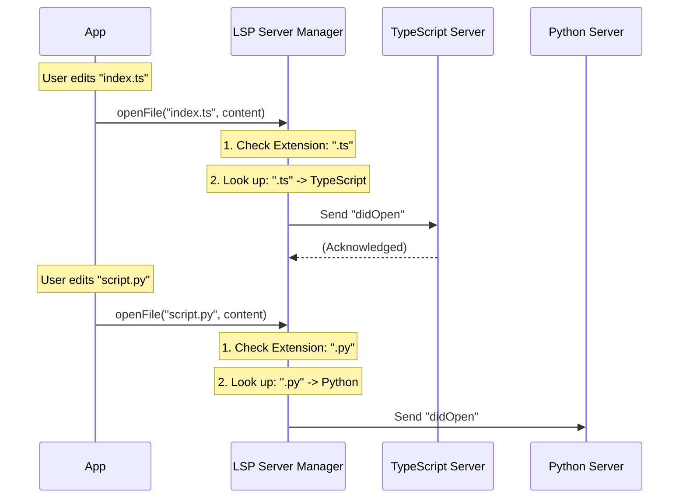

# Chapter 2: LSP Server Manager (The Router)

In the previous chapter, [Global Lifecycle Singleton (The Anchor)](01_global_lifecycle_singleton__the_anchor_.md), we built a safe "home" for our LSP system. We ensured that the system initializes only once and runs in the background.

Now, we open the door to that home and meet the person in charge: **The Router**.

## The Problem: Speaking Many Languages

Imagine you are working on a modern web project. You have:
1.  **Logic** written in **TypeScript** (`.ts`).
2.  **Scripts** written in **Python** (`.py`).
3.  **Styles** written in **CSS** (`.css`).

If you ask the Python tool to check your TypeScript code, it will just say "Syntax Error!" on the first line. Each language requires a specific **Language Server**.

We cannot simply start *one* server. We need a way to manage *many* servers at once and direct traffic to the right one.

## The Solution: The Router

The **LSP Server Manager** acts like a **Switchboard Operator** or a **Traffic Controller**.

1.  **Registration:** It knows which servers are available (e.g., "I have a Python agent and a TypeScript agent").
2.  **Routing:** When a file comes in, it checks the **extension** (`.ts`, `.py`).
3.  **Delegation:** It forwards the request to the correct agent.

## Core Concepts

### 1. The Server Map
The Manager keeps an internal list (a Map) of all running servers. It also keeps a "lookup table" that links file extensions to server names.

| File Extension | Server Name |
| :--- | :--- |
| `.ts` | `typescript-language-server` |
| `.tsx` | `typescript-language-server` |
| `.py` | `python-lsp-server` |

### 2. State Encapsulation
Instead of using a Class (like `class Manager { ... }`), this module uses a **Factory Function**. It creates variables inside a function and returns an object with methods that can access those variables. This is a clean way to keep data private.

## How to Use It

Let's see how the rest of the application uses the Manager to route requests.

### 1. Routing a Request
You don't need to know *which* server you are talking to. You just provide the filename.

```typescript
// The App says: "I want the definition of the symbol in this file"
const result = await manager.sendRequest(
  '/projects/app/utils.ts',   // The File
  'textDocument/definition',  // The Question
  { position: { line: 10, character: 5 } } // The Details
);

// The Manager automatically routes this to the TypeScript server!
```

### 2. Opening a File
Before a server can check a file for errors, it needs to know the file is "open."

```typescript
// The user opened 'script.py' in the editor
await manager.openFile('/projects/app/script.py', 'print("Hello")');

// The Manager sees ".py", finds the Python server, 
// and sends a "didOpen" notification to it.
```

## How It Works Under the Hood

The Manager follows a logical flow whenever it receives a request.

### The Routing Flow



### Implementation Details

Let's look at `LSPServerManager.ts`. We will break down the massive file into small, understandable blocks.

#### 1. The Setup (Closures)
Instead of `this.servers`, we use local variables inside the `create` function. This makes the data truly private.

```typescript
export function createLSPServerManager(): LSPServerManager {
  // 1. The list of actual server instances (The Workers)
  const servers: Map<string, LSPServerInstance> = new Map()
  
  // 2. The Lookup Table: ".ts" -> ["typescript-server"]
  const extensionMap: Map<string, string[]> = new Map()

  // 3. Tracking what is currently open
  const openedFiles: Map<string, string> = new Map()
  
  // ... functions go here ...
}
```

#### 2. Initialization (Loading the Map)
When `initialize()` is called, the manager reads the configuration (from plugins) and builds the `extensionMap`.

```typescript
// Inside initialize() function
const result = await getAllLspServers() // Load configs
const serverConfigs = result.servers

for (const [serverName, config] of Object.entries(serverConfigs)) {
    // For every extension this server supports...
    for (const ext of Object.keys(config.extensionToLanguage)) {
        // ...add it to our lookup map
        const normalized = ext.toLowerCase() 
        // Logic to add serverName to extensionMap.get(normalized)
    }
    // Create the worker (we will learn about this in Chapter 3)
    const instance = createLSPServerInstance(serverName, config)
    servers.set(serverName, instance)
}
```
*Explanation:* This loop prepares the routing table. If a server says "I handle `.py`", the manager notes that down.

#### 3. Finding the Right Server
This is the most critical helper function. It answers the question: "Who handles this file?"

```typescript
function getServerForFile(filePath: string): LSPServerInstance | undefined {
  // 1. Get the extension (e.g., ".ts")
  const ext = path.extname(filePath).toLowerCase()
  
  // 2. Look it up in our map
  const serverNames = extensionMap.get(ext)

  if (!serverNames || serverNames.length === 0) {
    return undefined // No one speaks this language
  }

  // 3. Return the first matching server
  const serverName = serverNames[0]
  return servers.get(serverName)
}
```

#### 4. Sending a Request
When the App wants to send a request, the Manager uses the helper above to find the destination, then ensures that server is turned on.

```typescript
async function sendRequest<T>(filePath: string, method: string, params: unknown) {
  // 1. Find the right server and make sure it's running
  const server = await ensureServerStarted(filePath)
  
  if (!server) return undefined

  try {
    // 2. Pass the message to the worker
    return await server.sendRequest<T>(method, params)
  } catch (error) {
    // Handle errors (log them)
    throw error
  }
}
```

#### 5. Synchronizing Files
LSP is "stateful." The server needs to know if a file is open before it can provide real-time feedback (like red squiggly lines).

```typescript
async function openFile(filePath: string, content: string): Promise<void> {
  const server = await ensureServerStarted(filePath)
  if (!server) return

  // Check if we already told the server about this file
  if (openedFiles.get(filePath) === server.name) {
    return // It's already open, do nothing
  }

  // Tell the server: "Hey, I just opened this file"
  await server.sendNotification('textDocument/didOpen', { ... })
  
  // Remember that it is open
  openedFiles.set(filePath, server.name)
}
```

## Summary

The **LSP Server Manager** is the intelligence center of our system.
1.  It **loads** configurations to understand which tools are available.
2.  It **routes** files based on their extension (`.ts` vs `.py`).
3.  It **manages** the state of open files.

However, the Manager acts like a boss—it delegates the actual heavy lifting. It finds the right "Worker" and hands off the task.

Who are these Workers? How do they actually run the Python or TypeScript tools?

[Next Chapter: Server Instance (The Worker)](03_server_instance__the_worker_.md)

---

Generated by [Code IQ](https://github.com/adityasoni99/Code-IQ)