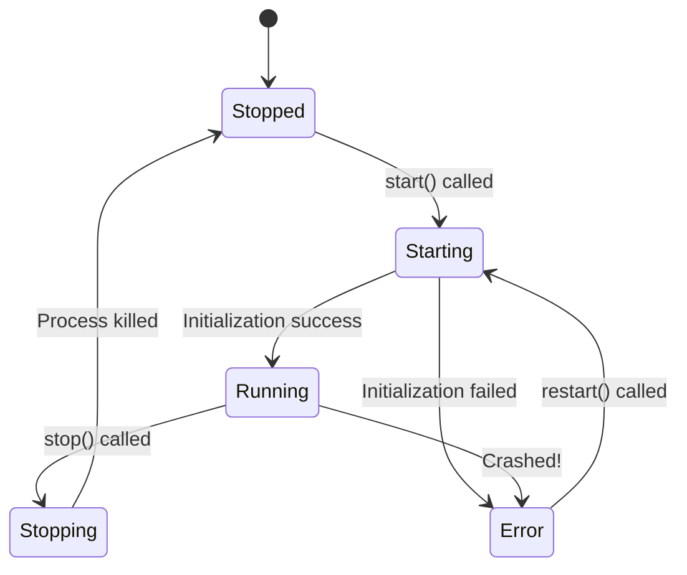

# Chapter 3: Server Instance (The Worker)

In the previous chapter, [LSP Server Manager (The Router)](02_lsp_server_manager__the_router_.md), we built the "Switchboard Operator." The Manager knows *which* tool handles Python and which handles TypeScript.

Now, we zoom in on the specific tools themselves. Meet **The Worker**.

## The Problem: Managing a Contractor

Imagine you hire a contractor to renovate your kitchen. You cannot simply shout "Build!" and walk away. You need to manage the relationship:
1.  **Onboarding:** They need to arrive, unpack their tools, and survey the room (**Startup**).
2.  **Status Checks:** Are they currently working? Are they on a lunch break? (**State**).
3.  **Accidents:** If they accidentally cut the wrong wire and the power goes out, you need a plan to reset the breaker and get them back to work (**Crash Recovery**).

In software, a "Language Server" is a separate computer program. It can crash, it takes time to load, and it might get busy. If our text editor tries to talk to a server that has crashed, the whole app might freeze.

## The Solution: The Server Instance

The **Server Instance** is a wrapper around the actual language server process. It acts like a **Supervisor**.

It doesn't care about *what* the server is saying (e.g., specific Python syntax). It only cares about the server's **health**.

### Core Responsibilities
1.  **State Machine:** Tracks if the server is `stopped`, `starting`, `running`, or in an `error` state.
2.  **Safety:** Ensures we don't send requests to a dead server.
3.  **Resilience:** Automatically restarts the server if it crashes (but stops if it crashes too many times).

## How to Use It

The **Router** (from Chapter 2) creates these instances. Here is how it interacts with a Worker.

### 1. Creating a Worker
We define the worker with a name and a configuration (like the command to run).

```typescript
const pythonWorker = createLSPServerInstance('python-server', {
  command: 'pylsp',
  args: ['--verbose']
});

// At this point, the worker is hired, but hasn't started working yet.
console.log(pythonWorker.state); // Output: 'stopped'
```

### 2. Starting the Shift
We tell the worker to start. This is asynchronous because booting up a server takes time.

```typescript
try {
  console.log("Starting up...");
  await pythonWorker.start();
  console.log("Ready to work!");
} catch (err) {
  console.error("Worker failed to show up:", err);
}
```

### 3. Asking for Work (With Safety)
When we need something done, we ask the instance. The instance checks if the worker is healthy first.

```typescript
// The Instance handles the complexity of checking health
// and retrying if the worker is busy.
const definition = await pythonWorker.sendRequest(
  'textDocument/definition', 
  { ...params }
);
```

## How It Works Under the Hood

The `LSPServerInstance` is designed as a **State Machine**. It strictly controls the transitions between states to prevent bugs (like trying to start a server that is already running).

### The Lifecycle Flow



### Implementation Details

Let's look at `LSPServerInstance.ts`. We use a factory function to keep our variables private (Encapsulation).

#### 1. Private State (The Memory)
We don't use a `class`. We use variables inside a function. Only the methods inside this function can touch these variables.

```typescript
export function createLSPServerInstance(name: string, config: Config) {
  // Private variables - no one outside can mess with these directly
  let state: LspServerState = 'stopped'
  let restartCount = 0
  let lastError: Error | undefined
  
  // The actual connection to the process (The Communicator)
  const client = createLSPClient(name, (error) => {
    // If the client reports an error, we update our state immediately
    state = 'error'
    lastError = error
  })
  
  // ... methods follow ...
}
```

#### 2. The Start Logic
This function manages the transition from `stopped` to `running`. It ensures we don't accidentally start twice.

```typescript
async function start(): Promise<void> {
  // 1. Guard Clause: Don't start if already running
  if (state === 'running' || state === 'starting') return

  try {
    state = 'starting'
    
    // 2. Actually boot up the process
    await client.start(config.command, config.args, { ... })
    
    // 3. Perform the handshake (Initialize)
    await client.initialize({ ...initParams })

    // 4. Success!
    state = 'running'
  } catch (error) {
    state = 'error'
    throw error
  }
}
```
*Explanation:* Notice the `state = 'starting'` line. This prevents other parts of the app from trying to use the server while it's still waking up.

#### 3. Handling "Busy" Servers
Sometimes a server is running but isn't ready. For example, `rust-analyzer` might say "Content Modified" if it's still indexing files. Our worker is smart enough to wait and retry.

```typescript
async function sendRequest<T>(method: string, params: unknown): Promise<T> {
  // 1. Health Check
  if (!isHealthy()) throw new Error("Server is down!")

  // 2. Retry Logic
  for (let attempt = 0; attempt <= 3; attempt++) {
    try {
      return await client.sendRequest(method, params)
    } catch (error) {
      // If server says "I'm busy/modified", wait a bit and try again
      if (isContentModifiedError(error)) {
         await sleep(500) // Wait 0.5 seconds
         continue // Try again
      }
      throw error // Real error, give up
    }
  }
}
```
*Explanation:* This retry loop makes the application feel much more stable to the user. Instead of an error message, they just experience a tiny delay.

#### 4. The Restart Logic
If the server crashes, we can try to turn it off and on again. But we count how many times we do this so we don't get stuck in an infinite loop.

```typescript
async function restart(): Promise<void> {
  // 1. Stop the current broken process
  try { await stop() } catch (e) { /* ignore */ }

  // 2. Check limits
  restartCount++
  if (restartCount > 3) {
    throw new Error("Server keeps crashing. I give up.")
  }

  // 3. Try to start again
  await start()
}
```

## Summary

The **Server Instance (The Worker)** is the reliable supervisor.
*   It wraps the messy reality of running external processes.
*   It acts as a **State Machine** (`stopped` -> `running` -> `error`).
*   It adds **Reliability** by automatically retrying requests when the server is momentarily busy.

However, notice that the Worker calls `client.sendRequest` or `client.start`. The Worker decides *when* to send a message, but it doesn't know *how* to format the message into the specific JSON format that servers understand.

That low-level translation is the job of **The Communicator**.

[Next Chapter: Low-Level Client (The Communicator)](04_low_level_client__the_communicator_.md)

---

Generated by [Code IQ](https://github.com/adityasoni99/Code-IQ)