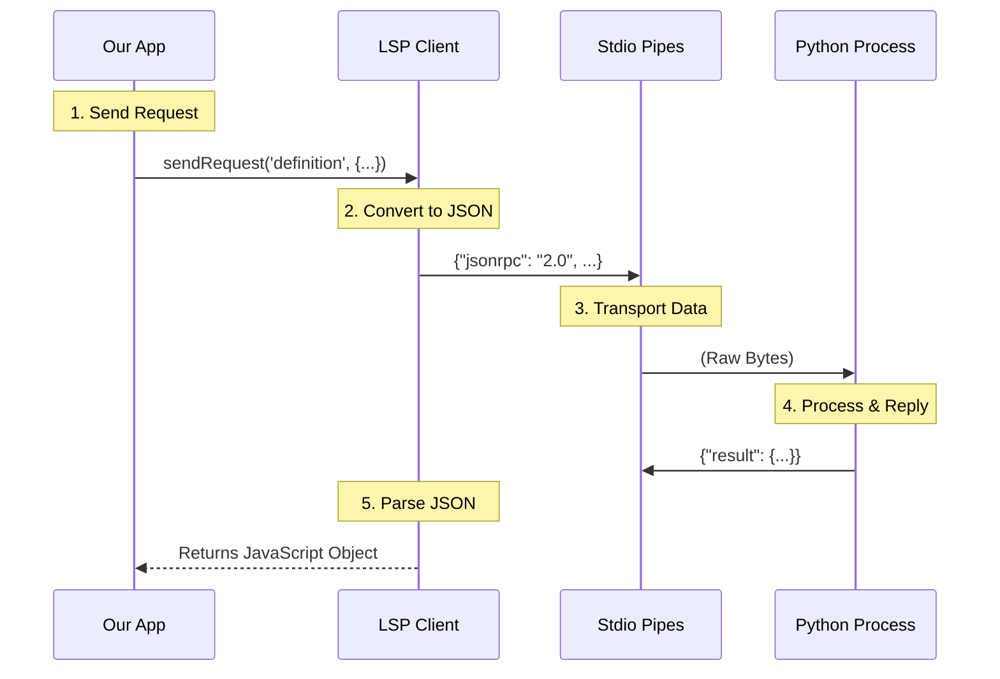

# Chapter 4: Low-Level Client (The Communicator)

In the previous chapter, [Server Instance (The Worker)](03_server_instance__the_worker_.md), we built a "Supervisor" that manages the health of our language tools. We learned how to hire a worker, check if they are busy, and restart them if they crash.

But there is a missing piece. A "Worker" is just a software abstraction. The *actual* language tool (like the Python Language Server) is a totally separate computer program running on your machine.

How do we actually send a message from our Node.js application to that separate Python process? We need a telephone line.

Welcome to **The Communicator**.

## The Problem: Talking to Aliens

Imagine our application is a person speaking **JavaScript**. The tool we want to use is a separate creature speaking **Python** (or Rust, or Go).

They cannot talk directly to each other. They run in different memory spaces. To communicate, they must:
1.  **Launch:** We need to actually run the other program (spawn a process).
2.  **Connect:** We need to run a wire between them (Standard Input/Output).
3.  **Translate:** We need a common language so they understand each other (JSON-RPC).

Writing code to handle raw data streams and formatting JSON strings manually is messy and prone to bugs.

## The Solution: The Low-Level Client

The **LSP Client** is the foundational layer of our system. It wraps the complexity of the Operating System's process management and the JSON-RPC protocol.

It handles three critical jobs:
1.  **Spawning:** It creates the "Child Process" (the actual language server).
2.  **Plumbing:** It connects the pipes (stdin/stdout) so data can flow.
3.  **Transport:** It turns JavaScript objects into JSON messages and sends them down the pipe.

> **Analogy:** If the "Server Instance" (Chapter 3) is the **Manager** deciding *what* to say, the "Low-Level Client" is the **Telephone**. The Manager picks up the phone, but the *phone* is responsible for turning the voice into electrical signals and sending them through the wire.

## Core Concepts

### 1. The Child Process
In Node.js, a "Child Process" is a command line program launched by your script. We use a library function called `spawn` to start it.

### 2. Standard I/O (The Pipes)
Every program has three standard "pipes" connected to it:
*   **Stdin (Standard Input):** The ear. We write data *into* this pipe to talk to the server.
*   **Stdout (Standard Output):** The mouth. The server writes data *out* of this pipe to answer us.
*   **Stderr (Standard Error):** The distress signal. The server shouts here if it crashes.

### 3. JSON-RPC
This is the "grammar" of the conversation. Instead of sending random text, we send a specific JSON structure:
`{ "jsonrpc": "2.0", "method": "initialize", "id": 1 }`.
The Client handles this formatting automatically using the `vscode-jsonrpc` library.

## How to Use It

This module is used internally by the **Server Instance**, but let's look at how simple the interface is.

### 1. Creating the Client
We create the client and provide a "Crash Handler"—a function to run if the line goes dead unexpectedly.

```typescript
import { createLSPClient } from './LSPClient';

const client = createLSPClient('python-server', (error) => {
  console.error("Oh no! The line went dead:", error);
});
```

### 2. Plugging it In (Start)
We tell the client which program to run. This connects the wires.

```typescript
// Start the 'pylsp' (Python Language Server) command
await client.start('pylsp', ['--verbose'], {
  cwd: '/path/to/project' // Where the project is located
});

console.log("Phone line connected!");
```

### 3. Making a Call (Request)
We don't need to format JSON strings. We just pass a JavaScript object.

```typescript
// Ask for the definition of a symbol
const result = await client.sendRequest('textDocument/definition', {
  textDocument: { uri: 'file:///app.py' },
  position: { line: 10, character: 5 }
});

console.log("Server answered:", result);
```

## How It Works Under the Hood

The `LSPClient` coordinates a flow of data between our application and the external process.

### The Communication Flow



### Implementation Details

Let's look at `LSPClient.ts` to see how the magic happens.

#### 1. Spawning the Process
This is the most critical part. We use Node's `spawn` to launch the external tool.

```typescript
// Inside start() function
process = spawn(command, args, {
  // We want to control the pipes programmatically
  stdio: ['pipe', 'pipe', 'pipe'],
  // Set environment variables
  env: { ...subprocessEnv(), ...options?.env },
  // Hide the window on Windows
  windowsHide: true,
})
```
*Explanation:* The `stdio: ['pipe', ...]` setting is the key. It tells the operating system: "Don't print the output to the screen. Give me a data stream so I can read it."

#### 2. Waiting for the Spawn
Spawning isn't instant. We need to ensure the process actually exists before we try to talk to it.

```typescript
// Wait for the 'spawn' event to fire
await new Promise<void>((resolve, reject) => {
  const onSpawn = () => resolve()
  const onError = (err) => reject(err)
  
  // Listen for success or failure
  spawnedProcess.once('spawn', onSpawn)
  spawnedProcess.once('error', onError)
})
```
*Explanation:* If we try to write to the pipe before the process is ready, our app will crash. This Promise ensures we wait safely.

#### 3. Connecting JSON-RPC
Raw pipes just send bytes (0s and 1s). We need the `vscode-jsonrpc` library to turn those bytes into meaningful messages.

```typescript
import { StreamMessageReader, StreamMessageWriter } from 'vscode-jsonrpc/node'

// Listen to the process's MOUTH (stdout)
const reader = new StreamMessageReader(process.stdout)

// Speak into the process's EAR (stdin)
const writer = new StreamMessageWriter(process.stdin)

// Create the translator
connection = createMessageConnection(reader, writer)
connection.listen()
```
*Explanation:* This acts as the translator. It reads the raw data coming from the server, finds the JSON objects, parses them, and hands them to our code.

#### 4. Handling Requests
When we send a request, we first check if the connection is alive.

```typescript
async function sendRequest(method, params) {
  if (!connection) {
    throw new Error('Phone line is cut (Client not started)')
  }

  // The connection library handles the ID matching and JSON formatting
  return await connection.sendRequest(method, params)
}
```

#### 5. Handling Crashes
The Communicator must also listen for disaster. If the server process dies, we need to know.

```typescript
process.on('exit', (code) => {
  // If the exit wasn't planned (code 0 means success)
  if (code !== 0 && !isStopping) {
    const error = new Error(`Server crashed with code ${code}`)
    
    // Call the crash handler provided by the Worker
    onCrash?.(error)
  }
})
```
*Explanation:* This notifies the **Server Instance** (from Chapter 3) that something went wrong, so the Supervisor can decide whether to restart the worker.

## Summary

The **Low-Level Client (The Communicator)** is the nuts and bolts of the operation.
1.  It uses **`spawn`** to create the language tool process.
2.  It uses **Pipes** to transport data.
3.  It uses **JSON-RPC** to translate messages.

At this point, we have a full system:
*   **The Anchor** (Chapter 1) manages the lifecycle.
*   **The Router** (Chapter 2) directs traffic.
*   **The Worker** (Chapter 3) manages the server state.
*   **The Communicator** (Chapter 4) handles the raw data.

But there is one final piece. Sometimes the Server wants to talk to *us* without being asked (like sending a list of errors in the file). How do we handle these unsolicited messages?

[Next Chapter: Diagnostic Feedback Loop (The Mailbox)](05_diagnostic_feedback_loop__the_mailbox_.md)

---

Generated by [Code IQ](https://github.com/adityasoni99/Code-IQ)