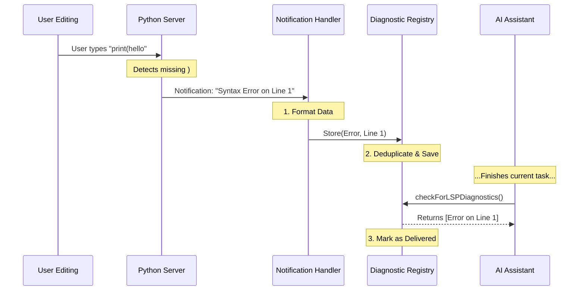

# Chapter 5: Diagnostic Feedback Loop (The Mailbox)

In the previous chapter, [Low-Level Client (The Communicator)](04_low_level_client__the_communicator_.md), we built the telephone line that allows our application to talk to language tools. We learned how to send requests (like "Where is this definition?") and get answers.

But what happens when the tool has something to say, and we didn't ask?

## The Problem: Unsolicited Advice

Imagine you are typing code in a file. You make a typo. Suddenly, a red squiggly line appears under the word.
You didn't *ask* the server "Is there a typo right now?" The server saw you typing, analyzed the code in the background, and decided to tell you about the error immediately.

This creates a problem for our system:
1.  **Asynchronous:** These messages arrive at random times.
2.  **Volume:** If you type fast, the server might send 10 error reports in 1 second.
3.  **Attention:** Our AI Assistant works in "turns." It reads the user's message, thinks, and replies. It cannot be interrupted in the middle of a thought by a random error message from a server.

## The Solution: The Mailbox

We need a buffering system. We need a **Diagnostic Feedback Loop**.

Think of this as a **Voicemail Inbox** or a **Mailbox**:
1.  **The Postman (The Server):** Drops off letters (errors) whenever they want.
2.  **The Mailbox (The Registry):** Safely holds the letters. It also throws away duplicate letters (Spam Filter).
3.  **The Resident (The AI):** Checks the mailbox only when they are ready to read the news.

## Core Concepts

### 1. Passive Feedback
In the previous chapters, we used "Request/Response" (Active).
This chapter deals with "Notifications" (Passive). The server sends data, and it doesn't expect a reply. The most common notification is `textDocument/publishDiagnostics`.

### 2. The Registry
This is a global storage area. When a server sends an error, we don't act on it immediately. We file it away in the Registry with a timestamp.

### 3. Deduplication (The Spam Filter)
LSP servers are chatty. If you have an error on line 10, the server might send the notification for that error 5 times in a row as you move your cursor.
The Mailbox is smart. It looks at the new message, checks if it's the exact same as the last one, and if so, it ignores it. This prevents the AI from being overwhelmed by repeated complaints.

## How to Use It

This system runs automatically in the background, but here is how the data flows when we want to check for errors.

### 1. Listening (The Setup)
We tell the **Server Manager** (from [Chapter 2](02_lsp_server_manager__the_router_.md)) to attach a listener to every server.

```typescript
import { registerLSPNotificationHandlers } from './passiveFeedback';

// We do this once when the app starts
registerLSPNotificationHandlers(lspManager);

console.log("Listening for incoming error reports...");
```

### 2. Checking the Mail
When the AI is preparing its response to the user, it peeks into the mailbox to see if any new errors occurred during the last action.

```typescript
import { checkForLSPDiagnostics } from './LSPDiagnosticRegistry';

// "Open the mailbox"
const newErrors = checkForLSPDiagnostics();

if (newErrors.length > 0) {
    console.log("Hey! The server found some issues:", newErrors);
} else {
    console.log("No news is good news.");
}
```

## How It Works Under the Hood

Let's trace the journey of a "Syntax Error" from the Python server to our AI.

### The Feedback Flow



### Implementation Details

The implementation is split into two files:
1.  `passiveFeedback.ts`: Listens to the phone line.
2.  `LSPDiagnosticRegistry.ts`: Stores and manages the messages.

#### 1. Catching the Message (`passiveFeedback.ts`)
We use the `onNotification` method provided by the **Server Instance** (from [Chapter 3](03_server_instance__the_worker_.md)).

```typescript
// Inside registerLSPNotificationHandlers function
serverInstance.onNotification('textDocument/publishDiagnostics', (params) => {
  // 1. Convert complex LSP JSON into a simple format
  const diagnosticFiles = formatDiagnosticsForAttachment(params);

  // 2. Put it in the registry (The Mailbox)
  registerPendingLSPDiagnostic({
    serverName: serverName,
    files: diagnosticFiles,
  });
});
```
*Explanation:* This code acts as a bridge. It takes the raw, messy data from the server, cleans it up, and hands it off to the registry.

#### 2. Storing the Message (`LSPDiagnosticRegistry.ts`)
We use a `Map` to store pending messages.

```typescript
// The storage container
const pendingDiagnostics = new Map<string, PendingLSPDiagnostic>();

export function registerPendingLSPDiagnostic(data) {
  // Create a unique ID for this batch of mail
  const id = randomUUID();
  
  // Save it
  pendingDiagnostics.set(id, {
    ...data,
    timestamp: Date.now(),
    attachmentSent: false 
  });
}
```

#### 3. Reading and Deduplicating (`LSPDiagnosticRegistry.ts`)
This is the smartest part of the system. When we read the mail, we check if we've already seen this error recently.

```typescript
// Helper to track what we already told the user
const deliveredDiagnostics = new LRUCache({ max: 500 });

export function checkForLSPDiagnostics() {
  // 1. Get all waiting messages
  const allFiles = getAllPendingFiles();

  // 2. Filter out duplicates (Spam Filter)
  // If we told the user about "Error on Line 10" 5 seconds ago,
  // and the error is still there, don't tell them again.
  const uniqueFiles = deduplicateDiagnosticFiles(allFiles);

  // 3. Mark these messages as "Read" so we don't fetch them again
  markDiagnosticsAsSent();

  return uniqueFiles;
}
```
*Explanation:* The `deduplicateDiagnosticFiles` function (simplified above) is critical. It compares the file name, line number, and error message. If they match a message we recently delivered, it silently drops the new one. This keeps the conversation with the AI clean and focused.

## Conclusion

You have now completed the entire **LSP System**!

Let's review what we built:
1.  **The Anchor** ([Chapter 1](01_global_lifecycle_singleton__the_anchor_.md)): A global singleton to manage startup/shutdown.
2.  **The Router** ([Chapter 2](02_lsp_server_manager__the_router_.md)): A manager to direct traffic to the right language tool.
3.  **The Worker** ([Chapter 3](03_server_instance__the_worker_.md)): A supervisor to keep the server processes healthy.
4.  **The Communicator** ([Chapter 4](04_low_level_client__the_communicator_.md)): The low-level wiring to send JSON data.
5.  **The Mailbox** (Chapter 5): A buffer to catch and store asynchronous error reports.

Together, these five components allow an AI to write code, ask for definitions, and receive automatic error feedback just like a human developer using a modern IDE.

**End of Tutorial.**

---

Generated by [Code IQ](https://github.com/adityasoni99/Code-IQ)