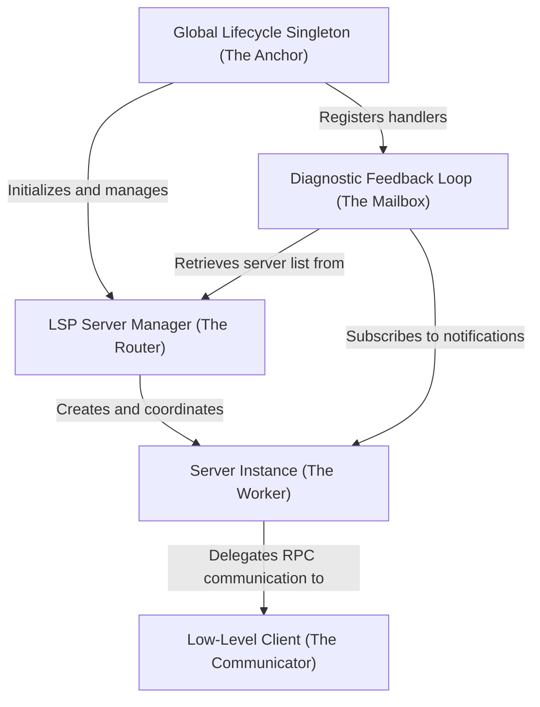

# Tutorial: lsp

This project implements a **Language Server Protocol (LSP)** client system that allows the application to understand code by communicating with external language tools (like `tsserver` or `pyright`). A central **Manager** routes file events (open, change, save) to the appropriate **Server Instance** based on file extension, while a low-level **Communicator** handles the raw process communication. It also features a **Diagnostic Feedback Loop** that asynchronously captures, deduplicates, and stores error messages sent by the servers for later retrieval.

## Chapters

1. [Global Lifecycle Singleton (The Anchor)](01_global_lifecycle_singleton__the_anchor_.md)
2. [LSP Server Manager (The Router)](02_lsp_server_manager__the_router_.md)
3. [Server Instance (The Worker)](03_server_instance__the_worker_.md)
4. [Low-Level Client (The Communicator)](04_low_level_client__the_communicator_.md)
5. [Diagnostic Feedback Loop (The Mailbox)](05_diagnostic_feedback_loop__the_mailbox_.md)

---

Generated by [Code IQ](https://github.com/adityasoni99/Code-IQ)