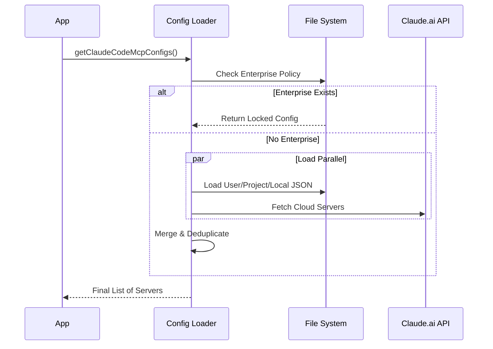

# Chapter 1: Configuration Hierarchy & Loading

Welcome to the first chapter of the **MCP (Model Context Protocol)** project tutorial! 

Before we can send messages, handle security, or manage connections, we need to know *who* we are talking to. We need a map of available servers. 

This chapter covers the **Configuration Hierarchy & Loading** system. Think of this as the "Registry" or "Phonebook" of the application. It decides which tools and servers are available to the user at any given moment.

## The Motivation: Why Hierarchy?

Imagine you are a developer working on two things:
1.  **A Work Project:** You need access to a company database and internal tools.
2.  **A Personal Hobby:** You need access to a public weather API.

You don't want your work database tools cluttering your hobby project, and you definitely don't want your personal API keys leaking into work servers.

MCP solves this using a **Cascading Configuration** system, very similar to how CSS (Cascading Style Sheets) works. We have different "scopes" or layers where settings can live.

### The Use Case
We will walk through how the system loads configurations to answer a simple question: **"Which MCP servers should be running right now?"**

## Core Concept: The 4 Scopes

The system looks for configuration files in a specific order. The more specific scope overrides the general one (unless Enterprise policy locks it down).

1.  **Enterprise:** Managed by IT/Admins. If this exists, it might block everything else.
2.  **User:** Global settings for you (e.g., `~/.config/mcp.json`). available in all your projects.
3.  **Project:** Specific to the folder you are working in.
4.  **Local:** Local overrides for the project (often git-ignored).

### The Configuration Shape

What does a configuration look like? It's a JSON object defining servers. A server usually needs a command to run (like `node server.js`) or a URL to connect to.

Here is a simplified look at the type definition from `types.ts`:

```typescript
// types.ts
export type McpServerConfig = 
  | { type: 'stdio', command: string, args: string[] }
  | { type: 'sse', url: string }
  // ... other types like websocket, http, etc.

export type ScopedMcpServerConfig = McpServerConfig & {
  scope: 'local' | 'user' | 'project' | 'enterprise' // ...
}
```

## How It Works: The Loading Process

When the application starts, it doesn't just read one file. It gathers data from everywhere, cleans it up, and decides who wins.

### High-Level Workflow

1.  **Check Enterprise:** Is there a managed policy file?
2.  **Load Layers:** If allowed, load User, Project, and Local files.
3.  **Fetch Dynamic:** Ask Claude.ai if there are any cloud servers available.
4.  **Merge & Dedup:** Combine them all. If "Server A" is in both User and Project, Project wins.
5.  **Validate:** Ensure commands differ and URLs are valid.



## Internal Implementation

Let's look under the hood at `config.ts`, the brain of this operation.

### 1. Reading and Merging
The main entry point is `getClaudeCodeMcpConfigs`. It orchestrates the gathering of configurations.

```typescript
// config.ts
export async function getClaudeCodeMcpConfigs(
  dynamicServers = {},
  extraDedupTargets = Promise.resolve({})
) {
  // 1. Enterprise has exclusive control if it exists
  if (doesEnterpriseMcpConfigExist()) {
    const { servers } = getMcpConfigsByScope('enterprise');
    return { servers: filterByPolicy(servers), errors: [] };
  }
  
  // 2. Otherwise, load other scopes
  const { servers: userServers } = getMcpConfigsByScope('user');
  const { servers: projectServers } = getMcpConfigsByScope('project');
  // ... load local and plugins ...
}
```
*Explanation:* The code first checks for the "Boss" (Enterprise config). If it exists, it ignores everything else. If not, it proceeds to load User and Project settings.

### 2. Variable Expansion
Configuration files often contain secrets like `${API_KEY}`. We can't use them literally; we must "expand" them using environment variables.

```typescript
// envExpansion.ts
export function expandEnvVarsInString(value: string) {
  // Matches syntax like ${VAR_NAME} or ${VAR:-default}
  return value.replace(/\$\{([^}]+)\}/g, (match, varContent) => {
    const [varName, defaultValue] = varContent.split(':-', 2);
    const envValue = process.env[varName];
    
    return envValue ?? defaultValue ?? match; // Return match if missing
  });
}
```
*Explanation:* This utility takes a string from the config file. It looks for the `${...}` pattern. If it finds one, it looks up that key in `process.env`. If the variable is missing, it keeps the original string (so we can report an error later).

### 3. Deduplication
What if a plugin provides a "Github" tool, but you also manually added a "Github" tool in your config? We don't want to run both. The system uses **Signatures** to detect duplicates.

```typescript
// config.ts
export function getMcpServerSignature(config: McpServerConfig): string | null {
  const cmd = getServerCommandArray(config);
  if (cmd) {
    // Two servers are duplicates if they run the exact same command
    return `stdio:${jsonStringify(cmd)}`;
  }
  const url = getServerUrl(config);
  if (url) {
    // Two servers are duplicates if they hit the same URL
    return `url:${unwrapCcrProxyUrl(url)}`;
  }
  return null;
}
```
*Explanation:* We generate a unique ID (signature) for every server. If `Server A` and `Server B` have the same signature, the system knows they are actually the same tool and will only load the most specific one (Manual config > Plugin).

### 4. Dynamic Loading from Claude.ai
Sometimes, servers aren't files on disk. They are permissions granted by your organization on Claude.ai.

```typescript
// claudeai.ts
export const fetchClaudeAIMcpConfigsIfEligible = memoize(async () => {
  const tokens = getClaudeAIOAuthTokens();
  
  // We need specific permissions (scopes) to read these servers
  if (!tokens.scopes?.includes('user:mcp_servers')) {
    return {};
  }

  // Fetch from the API
  const response = await axios.get(`${baseUrl}/v1/mcp_servers`, { ... });
  // Process and return config objects...
});
```
*Explanation:* This function checks if the user is logged in and has permission. It calls the remote API to see if the organization has assigned any servers to this user remotely.

## Parsing & Validation

Before any of this data is used, it must be validated. We use a library called `zod` to ensure the JSON we read actually matches the shape we expect.

```typescript
// config.ts
export function parseMcpConfig(params: { configObject: unknown, ... }) {
  // Validate against the schema defined in types.ts
  const schemaResult = McpJsonConfigSchema().safeParse(params.configObject);
  
  if (!schemaResult.success) {
    return { config: null, errors: formatErrors(schemaResult.error) };
  }

  // If valid, expand variables and return
  // ...
}
```
*Explanation:* If a user makes a typo in their `.mcp.json` file (like missing a brace or using a number where a string is required), `safeParse` will fail, and the system will report a friendly error instead of crashing.

## Summary

In this chapter, we learned:
1.  **Hierarchy:** Settings cascade from Enterprise -> User -> Project -> Local.
2.  **Expansion:** Secrets in config files (like `${KEY}`) are swapped with real environment variables.
3.  **Deduplication:** The system is smart enough to know if two different configs point to the exact same server.
4.  **Dynamic Loading:** Servers can come from local files or fetch remotely from Claude.ai.

Now that we know *which* servers we want to talk to, we need to ensure we have permission to talk to them.

[Next Chapter: Authentication & Security (OAuth/XAA)](02_authentication___security__oauth_xaa_.md)

---

Generated by [Code IQ](https://github.com/adityasoni99/Code-IQ)