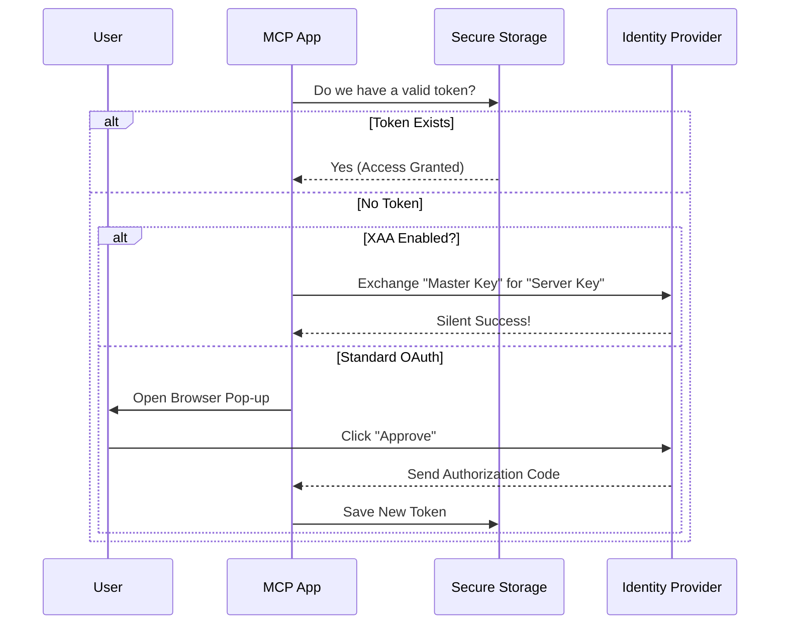

# Chapter 2: Authentication & Security (OAuth/XAA)

Welcome back! In the previous chapter, [Configuration Hierarchy & Loading](01_configuration_hierarchy___loading.md), we learned how the application finds the "phonebook" of available servers.

Now that we know *who* we want to talk to, we face a new problem: **The Door is Locked.**

Most powerful tools (like GitHub, Google Drive, or Slack) require permission to access your data. This chapter covers how the MCP project handles **Authentication & Security**. Think of this as the "Passport Control" of the application.

## The Motivation: Why is this hard?

If you are building a tool that connects to 10 different services, you don't want to:
1.  Paste API keys into text files (insecure!).
2.  Log in manually every time you restart the app (annoying!).
3.  Write 10 different login scripts for 10 different services (exhausting!).

We need a unified system that handles the "handshake" securely and remembers who you are so you don't have to keep proving it.

### The Use Case
Imagine you want to use an MCP tool to read a file from **Google Drive**.
1.  **Without MCP Auth:** You see `Error: 401 Unauthorized`.
2.  **With MCP Auth:** A window pops up, asks "Do you trust this app?", you click "Yes", and the tool works. The next day, it *still* works without asking again.

## Key Concepts

We handle security using two main approaches: **Standard OAuth** and **XAA**.

### 1. Standard OAuth (The "Visitor Pass")
This is what you are likely used to on the web.
1.  The app opens your browser.
2.  You log in to the provider (e.g., GitHub).
3.  You grant permission.
4.  The provider gives the app a special "Token" (like a visitor badge).
5.  The app saves this token in a secure keychain on your computer.

### 2. XAA (Cross-App Access) (The "Master Key")
This is an Enterprise feature designed to reduce "Login Fatigue."

Imagine you work at a big company with 50 internal tools. Logging into all of them individually is painful. **XAA** allows you to log in *once* to your company's Identity Provider (IdP), and that single login acts as a master key to silently unlock all authorized MCP servers.

## How It Works: The Workflow

When the application tries to connect to a protected server, it follows this decision tree:



## Internal Implementation

Let's look at the code that powers this logic. The main entry point is in `auth.ts`.

### 1. The Decision Maker
The function `performMCPOAuthFlow` decides which path to take: XAA or Standard OAuth.

```typescript
// auth.ts
export async function performMCPOAuthFlow(
  serverName: string,
  serverConfig: McpServerConfig,
  // ... callbacks ...
) {
  // 1. Check if this server is configured for Enterprise XAA
  if (serverConfig.oauth?.xaa) {
    // If yes, run the silent "Master Key" flow
    await performMCPXaaAuth(serverName, serverConfig, /*...*/);
    return;
  }

  // 2. Otherwise, run standard OAuth (Browser Pop-up)
  const provider = new ClaudeAuthProvider(serverName, serverConfig, /*...*/);
  
  // Start the standard flow...
  // ...
}
```
*Explanation:* This function checks the configuration we loaded in Chapter 1. If `xaa` is true, it routes to the enterprise flow. Otherwise, it sets up a `ClaudeAuthProvider` to handle the standard browser flow.

### 2. The Local Callback Server
For standard OAuth, after you click "Approve" in your browser, the website needs to send a code back to the running application. How does a website talk to a command-line tool?

The application briefly starts a tiny web server on your computer (usually on `localhost`).

```typescript
// auth.ts
server = createServer((req, res) => {
  const parsedUrl = parse(req.url || '', true)

  // 1. Listen for the /callback URL
  if (parsedUrl.pathname === '/callback') {
    const code = parsedUrl.query.code;
    
    // 2. Validate valid code and security state
    if (code) {
       res.end('<h1>Success! You can close this window.</h1>');
       resolveOnce(code); // Pass the code back to the app
    }
  }
});

server.listen(port, '127.0.0.1');
```
*Explanation:* This code spins up a listener. It waits for the browser to redirect to `http://localhost:port/callback?code=xyz`. Once it catches the code, it shuts down the server.

### 3. Storing Secrets Securely
We never save tokens in plain text files. We use the operating system's Keychain (Mac) or Credential Manager (Windows).

```typescript
// auth.ts (inside ClaudeAuthProvider)
async saveTokens(tokens: OAuthTokens): Promise<void> {
  const storage = getSecureStorage();
  
  // Update the secure storage with the new token
  storage.update({
    mcpOAuth: {
      [this.serverName]: {
        accessToken: tokens.access_token,
        refreshToken: tokens.refresh_token,
        // Calculate exactly when it expires
        expiresAt: Date.now() + (tokens.expires_in || 3600) * 1000,
      },
    },
  });
}
```
*Explanation:* When we get a token, we calculate its expiration date and ask the `SecureStorage` utility to lock it away.

### 4. The XAA "Silent Exchange"
This is the advanced part. If XAA is enabled, we use an `id_token` (proof of who you are) to ask for an `access_token` (permission to use a specific tool) without bothering the user.

```typescript
// xaa.ts
export async function performCrossAppAccess(config: XaaConfig) {
  // 1. Exchange User Identity for a temporary "Grant"
  const jag = await requestJwtAuthorizationGrant({
    idToken: config.idpIdToken, // "I am Alice"
    audience: config.asIssuer,  // "I want to talk to GitHub"
    // ...
  });

  // 2. Exchange "Grant" for the final Access Token
  const tokens = await exchangeJwtAuthGrant({
    assertion: jag.jwtAuthGrant,
    // ...
  });

  return tokens; // Success! No browser needed.
}
```
*Explanation:* This code performs a "Token Exchange." It says to the server: *"Here is proof from our Company ID system that I am Alice. Please give Alice the key to the database."* The server verifies the proof and hands over the key silently.

## Token Refreshing
Tokens usually expire after an hour. It would be annoying to log in every hour. The system handles **Refresh Tokens** automatically.

In `ClaudeAuthProvider.tokens()`, the system checks:
1.  Is the current token expired?
2.  Do we have a refresh token?
3.  If yes, trade the refresh token for a brand new access token.

This happens in the background, so the user flow remains uninterrupted.

## Summary

In this chapter, we learned:
1.  **Standard OAuth:** Uses a local web server to catch the "Approve" code from your browser.
2.  **XAA:** Uses a "Master Key" approach to silently authorize multiple tools using one identity.
3.  **Secure Storage:** Tokens are saved in the OS keychain, not text files.
4.  **Auto-Refresh:** The system renews your "passport" automatically before it expires.

Now that we are configured (Chapter 1) and authenticated (Chapter 2), we are ready to actually open a line of communication.

[Next Chapter: Connection Lifecycle Management](03_connection_lifecycle_management.md)

---

Generated by [Code IQ](https://github.com/adityasoni99/Code-IQ)