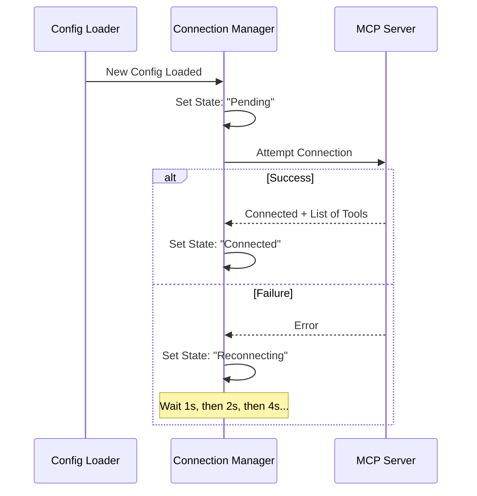

# Chapter 3: Connection Lifecycle Management

Welcome to Chapter 3! 

In the previous chapters, we located our servers using [Configuration Hierarchy & Loading](01_configuration_hierarchy___loading.md), and we obtained the keys to access them in [Authentication & Security (OAuth/XAA)](02_authentication___security__oauth_xaa_.md).

Now we have a configuration and a security token. But a connection isn't a one-time event; it's a living relationship. Internet connections drop, servers crash, and users toggle settings.

This chapter covers **Connection Lifecycle Management**. Think of this system as the "Switchboard Operator" of the application. It ensures that the lines of communication stay open, handles interruptions gracefully, and updates the "phonebook" if a server adds new features while we are talking.

## The Motivation: Why do we need a Manager?

Imagine you are using a tool that connects to a remote database. 
1.  **Scenario A:** Your WiFi flickers for a second. The tool crashes, and you have to restart the whole application. (Frustrating!)
2.  **Scenario B:** You edit your config file to add a new server. Nothing happens until you reboot. (Slow!)

We need a system that:
1.  **Auto-Heals:** If a connection drops, it tries to reconnect automatically.
2.  **Hot-Swaps:** If configs change, it updates immediately without a restart.
3.  **Batches Updates:** If a server sends 50 updates in 1 second, it doesn't freeze the UI 50 times.

### The Use Case
We will look at how the application uses the `useManageMCPConnections` hook to answer: **"Is the GitHub server running? If it crashes, can you bring it back?"**

## Core Concept: The Connection State Machine

Every server connection exists in one of a few specific states. The Lifecycle Manager's job is to move servers between these states correctly.

1.  **Pending:** We know about the server, but haven't connected yet.
2.  **Connected:** The line is open, and we are exchanging messages.
3.  **Reconnecting:** The line dropped; we are waiting to try again.
4.  **Failed:** We tried too many times and gave up.
5.  **Disabled:** The user manually turned this server off.

## High-Level Workflow

The `useManageMCPConnections` hook is the brain. It runs inside the React application and watches the configuration.



## Internal Implementation

Let's look at how this is built in `useManageMCPConnections.ts`.

### 1. Initialization
When the app starts, we take the configuration (from Chapter 1) and mark everything as "Pending". This gives the UI immediate feedback that "something is happening."

```typescript
// useManageMCPConnections.ts
useEffect(() => {
  async function initializeServersAsPending() {
    // 1. Get configs from the loader
    const configs = await getClaudeCodeMcpConfigs(dynamicMcpConfig);

    // 2. Update App State to show "Pending" spinners
    setAppState(prevState => ({
      ...prevState,
      mcp: {
         // Add new servers to the list with status 'pending'
         clients: createPendingClients(configs) 
      }
    }));
  }
  initializeServersAsPending();
}, [dynamicMcpConfig]);
```
*Explanation:* We don't wait for the connection to actually succeed before updating the UI. We immediately say, "We are working on it," so the user doesn't see a blank screen.

### 2. Handling Connection Results
When a server finally connects (or fails), we need to update the application state. We use a **Batching Strategy** here. If 10 servers connect at the exact same millisecond, we don't want to re-render the screen 10 times.

```typescript
// useManageMCPConnections.ts
const flushPendingUpdates = useCallback(() => {
  // Take all queued updates
  const updates = pendingUpdatesRef.current;
  pendingUpdatesRef.current = []; // Clear queue

  // Update React State only ONCE for all of them
  setAppState(prevState => {
    return applyUpdates(prevState, updates);
  });
}, [setAppState]);
```
*Explanation:* We use a tiny timer (16ms). Any updates that come in during that window are bundled together into a single UI update. This keeps the application snappy.

### 3. The "Reconnection Loop" (Exponential Backoff)
This is the most critical part for stability. If a server disconnects, we don't spam it with retries immediately. We wait a bit, then a bit longer, then a lot longer.

```typescript
// useManageMCPConnections.ts
client.client.onclose = () => {
  // If the user didn't turn it off manually...
  if (!isMcpServerDisabled(client.name)) {
    
    // Start a retry loop
    const reconnectWithBackoff = async () => {
      for (let attempt = 1; attempt <= 5; attempt++) {
        // Calculate wait time: 1s, 2s, 4s, 8s...
        const backoffMs = 1000 * Math.pow(2, attempt - 1);
        
        // Wait...
        await sleep(backoffMs);
        
        // Try connecting again
        const result = await reconnectMcpServerImpl(client.name);
        if (result.type === 'connected') return; // Success!
      }
      // If we get here, we gave up.
      updateServer({ ...client, type: 'failed' });
    }
    reconnectWithBackoff();
  }
}
```
*Explanation:* This logic prevents the app from hammering a server that is restarting. It gives the server breathing room to come back online.

### 4. Listening for Live Changes
Sometimes the connection is fine, but the *content* changes. For example, a developer adds a new "Weather Tool" to the server while the app is running. The server sends a notification saying `tools/list_changed`.

```typescript
// useManageMCPConnections.ts
if (client.capabilities?.tools?.listChanged) {
  // Listen for the specific notification
  client.client.setNotificationHandler(
    ToolListChangedNotificationSchema, 
    async () => {
      // The server says tools changed. Fetch the new list!
      const newTools = await fetchToolsForClient(client);
      
      // Update the UI with the new tools
      updateServer({ ...client, tools: newTools });
    }
  );
}
```
*Explanation:* This makes the system "Reactive." You don't need to restart the client to see new capabilities provided by the server.

### 5. Manual Toggling
Finally, the user might want to manually shut down a server via the UI settings. We expose a function to handle the cleanup.

```typescript
// useManageMCPConnections.ts
const toggleMcpServer = useCallback(async (serverName) => {
  if (isDisabled) {
    // Enable it: Save to disk, then Start Reconnect Loop
    setMcpServerEnabled(serverName, true);
    reconnectMcpServer(serverName);
  } else {
    // Disable it: Save to disk, then Kill Connection
    setMcpServerEnabled(serverName, false);
    await clearServerCache(serverName); // Close socket
    updateServer({ name: serverName, type: 'disabled' });
  }
}, []);
```
*Explanation:* This function ensures that the UI state ("Disabled"), the Disk state (Settings file), and the Network state (Active Socket) all stay in sync.

## The React Context Wrapper

To make these features available to buttons in the UI, we wrap the logic in a React Context called `MCPConnectionManager`.

```tsx
// MCPConnectionManager.tsx
export function MCPConnectionManager({ children }) {
  // Initialize the hook we just analyzed
  const { reconnectMcpServer, toggleMcpServer } = useManageMCPConnections(...);

  // Provide these functions to any child component
  return (
    <MCPConnectionContext.Provider value={{ reconnectMcpServer, toggleMcpServer }}>
      {children}
    </MCPConnectionContext.Provider>
  );
}
```
*Explanation:* This component sits near the top of the application tree. It runs the logic invisibly in the background, keeping connections alive, while allowing any button deep in the UI to say `toggleMcpServer('github')`.

## Summary

In this chapter, we learned:
1.  **State Management:** Servers move through Pending, Connected, and Failed states.
2.  **Resilience:** The "Reconnection Loop" uses exponential backoff to recover from crashes automatically.
3.  **Reactivity:** The system listens for `list_changed` events to update tools in real-time.
4.  **Batching:** We group updates together to keep the app performing smoothly.

Now that our connection is stable and self-healing, we can start sending complex messages across the wire. But what if the server wants to talk to *us* proactively?

[Next Chapter: Channel Notifications & Permissions](04_channel_notifications___permissions.md)

---

Generated by [Code IQ](https://github.com/adityasoni99/Code-IQ)