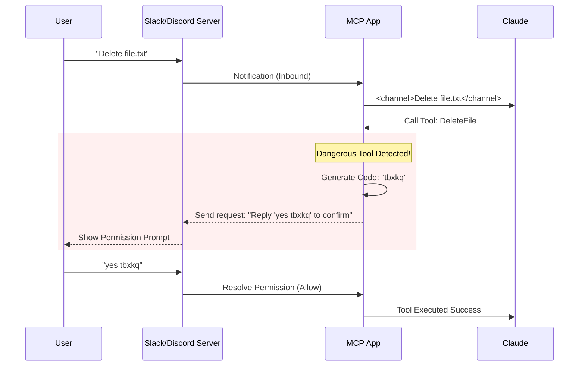

# Chapter 4: Channel Notifications & Permissions

Welcome to Chapter 4!

In the previous chapter, [Connection Lifecycle Management](03_connection_lifecycle_management.md), we learned how to keep the "phone lines" open between our application and the servers. We handled connections dropping and reconnecting automatically.

Now that the line is open, we have a new challenge. What if we aren't sitting at our computer? What if we are talking to Claude via **Slack**, **Discord**, or **Telegram**?

This chapter covers **Channel Notifications & Permissions**. Think of this as a **"Message Bridge" with a strict "Security Guard"**. It allows external apps to talk to Claude, but it ensures no one can trick Claude into doing something dangerous without your explicit permission.

## The Motivation: Why do we need a Guard?

Imagine you are using a Telegram bot connected to Claude to manage your cloud servers.

1.  **The Scenario:** You ask, "Restart the production database."
2.  **The Risk:** This is a dangerous command. In a normal terminal, a popup asks "Are you sure?". But on Telegram, you can't see popups.
3.  **The Attack:** A malicious script might try to spam "Yes" to the bot to force the command through.

### The Solution
We need a system that:
1.  **Notifies:** Pushes messages from Telegram into Claude's context.
2.  **Protects:** Requires a specific, randomized code (like `yes tbxkq`) to approve dangerous actions, so scripts cannot guess the answer.

## Key Concepts

We will break this down into two parts: **Inbound Notifications** (The Bridge) and **Permission Handshakes** (The Guard).

### 1. The Bridge (Notifications)
Usually, Claude talks only when you talk to it. But a "Channel" (like a Slack bot) might receive a message from a colleague at any time. The **Bridge** wraps this message in a special format so Claude knows, *"Hey, this came from Slack, not the user typing directly."*

### 2. The Guard (Permission Handshake)
When a tool needs permission, we don't just ask "Yes/No". We generate a unique **5-letter code** (e.g., `abcde`).
*   **App:** "To approve this, reply with: **yes abcde**"
*   **User:** "yes abcde"
*   **App:** Verified. Action taken.

If a hacker sends "yes", it fails. If they guess "yes qwert", it fails. They must know the exact code shown to you.

## How It Works: The Workflow

Here is how a message travels from a chat app to Claude, and how a permission is verified.



## Internal Implementation

Let's look at the code that powers this security system.

### 1. The Gatekeeper
Not every server is allowed to interrupt you. We check a strict "Allowlist" before letting a server act as a channel.

This logic lives in `channelNotification.ts`.

```typescript
// channelNotification.ts
export function gateChannelServer(
  serverName: string,
  capabilities: ServerCapabilities,
  // ...
): ChannelGateResult {
  // 1. Does the server claim to be a channel?
  if (!capabilities?.experimental?.['claude/channel']) {
    return { action: 'skip', reason: 'No capability declared' };
  }

  // 2. Is the user logged in securely?
  if (!getClaudeAIOAuthTokens()?.accessToken) {
    return { action: 'skip', reason: 'Requires auth' };
  }

  // 3. Is this server in the user's allowlist?
  // ... checks allowlist ...

  return { action: 'register' };
}
```
*Explanation:* Before listening to a server, we ensure it has the right capabilities (`claude/channel`) and that the user is authenticated. This prevents random tools from spamming your chat window.

### 2. The Message Wrapper
When a message comes in, we wrap it in XML tags. This helps Claude distinguish between "System Instructions", "User Input", and "Channel Messages".

```typescript
// channelNotification.ts
export function wrapChannelMessage(
  serverName: string,
  content: string,
  meta?: Record<string, string>,
): string {
  // Create attributes like source="discord"
  const attrs = Object.entries(meta ?? {})
    .map(([k, v]) => ` ${k}="${escapeXmlAttr(v)}"`)
    .join('');

  // Wrap the content
  return `<${CHANNEL_TAG} source="${serverName}"${attrs}>\n${content}\n</${CHANNEL_TAG}>`;
}
```
*Explanation:* If a message comes from Discord, it gets transformed into `<channel source="discord">Hello</channel>`. This gives Claude context about where the text originated.

### 3. Generating the "Secret Code"
This is the core of the security system. We generate a short, random-looking ID for every permission request.

This logic is in `channelPermissions.ts`.

```typescript
// channelPermissions.ts
export function shortRequestId(toolUseID: string): string {
  // 1. Create a candidate ID based on the tool usage
  let candidate = hashToId(toolUseID);

  // 2. Safety Check: Ensure the random letters don't spell bad words
  for (let salt = 0; salt < 10; salt++) {
    if (!ID_AVOID_SUBSTRINGS.some(bad => candidate.includes(bad))) {
      return candidate; // Safe to use!
    }
    // Try again with a different salt
    candidate = hashToId(`${toolUseID}:${salt}`);
  }
  return candidate;
}
```
*Explanation:* We turn the tool request ID into a 5-letter code (like `tbxkq`). Crucially, we check against a blocklist (`ID_AVOID_SUBSTRINGS`) to ensure the random code doesn't accidentally spell something offensive before sending it to your phone.

### 4. Resolving the Permission
When the user replies "yes tbxkq", the server sends a structured event back to the MCP app. We need to match that ID to the pending request.

```typescript
// channelPermissions.ts
export function createChannelPermissionCallbacks() {
  const pending = new Map<string, (response: Response) => void>();

  return {
    // 1. Verification Logic
    resolve(requestId, behavior, fromServer) {
      const key = requestId.toLowerCase();
      const resolver = pending.get(key);
      
      if (!resolver) return false; // ID not found or expired

      pending.delete(key); // Remove it so it can't be reused
      resolver({ behavior, fromServer }); // Unlock the tool!
      return true;
    }
  }
}
```
*Explanation:* This acts like a ticket booth. 
1. When a request starts, we put a ticket in the `pending` box. 
2. When the user replies, we look for the matching ticket. 
3. If found, we approve the action and tear up the ticket immediately so it can't be used twice.

## Summary

In this chapter, we learned:
1.  **Channels:** Are MCP servers that act as a bridge between chat apps (Slack/Discord) and Claude.
2.  **Gating:** We only allow trusted, authenticated servers to push messages.
3.  **The XML Wrapper:** Messages are wrapped in `<channel>` tags for context.
4.  **Security Codes:** We use 5-letter random codes (like `tbxkq`) to prevent spoofing and ensure the human actually approved the specific action.

Now that we can securely talk to external channels, we need to ensure that the data passing through these channels is clean and that the servers identify themselves correctly.

[Next Chapter: Normalization & Identification Utilities](05_normalization___identification_utilities.md)

---

Generated by [Code IQ](https://github.com/adityasoni99/Code-IQ)