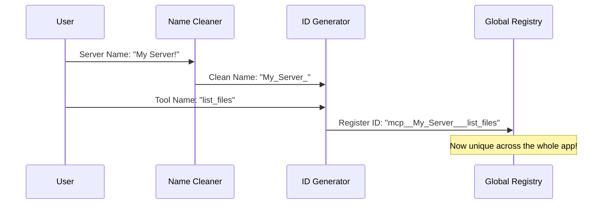

# Chapter 5: Normalization & Identification Utilities

Welcome to Chapter 5!

In the previous chapter, [Channel Notifications & Permissions](04_channel_notifications___permissions.md), we learned how to securely bridge external chat apps (like Slack) with our local tools.

Now we face a simpler, but messy problem: **Nomenclature (Naming Things).**

Computer systems hate ambiguity. If you have a server named "My Files" and another named "my-files", are they the same? What if both servers have a tool called `read_file`? If you ask Claude to "read the file," which tool should it use?

This chapter covers **Normalization & Identification Utilities**. Think of this as the "Translator" and "Label Maker" of the system. It ensures that every tool and server has a unique, clean, and identifiable name, no matter where it came from.

## The Motivation: Why standardizing matters

Imagine you are a librarian.
1.  **The Scenario:** You receive books from 10 different publishers.
2.  **The Problem:** Publisher A puts the title on the spine. Publisher B puts it on the cover. Publisher C uses emojis in the title.
3.  **The Chaos:** When a customer asks for a book, you can't find it because your sorting system is broken by the inconsistencies.

In MCP, servers come from:
*   Local files (e.g., `my script.js`)
*   URLs (e.g., `http://localhost:3000`)
*   Cloud APIs (e.g., `Claude.ai Integration`)

We need a system that:
1.  **Sanitizes:** Removes spaces, dots, and emojis from names (Normalization).
2.  **Namespaces:** Prevents collisions by attaching the server name to the tool name.

### The Use Case
We will look at how the system takes a messy server name like `"My Github Tool!"` and a tool named `"get_issue"`, and turns it into a system-safe ID: `mcp__my_github_tool___get_issue`.

## Core Concepts

### 1. Normalization (The Cleaner)
This process strips away "illegal" characters. In our internal system, names should only contain letters, numbers, and underscores.
*   Input: `Visual Studio Code`
*   Output: `Visual_Studio_Code`

### 2. Namespacing (The Prefix)
To ensure two tools never have the same ID, we wrap them in a special format using double underscores (`__`).
*   Format: `mcp__<SERVER_NAME>__<TOOL_NAME>`

This allows us to look at a tool ID and immediately know which server owns it.

## How It Works: The Workflow

When a new server is loaded, its name goes through a factory line before it can register any tools.



## Internal Implementation

Let's look at the utility files that handle this logic: `normalization.ts`, `mcpStringUtils.ts`, and `utils.ts`.

### 1. The Cleaner (Normalization)
Located in `normalization.ts`, this function ensures names are safe to use as programming variables.

```typescript
// normalization.ts
export function normalizeNameForMCP(name: string): string {
  // Replace anything that ISN'T a letter, number, or underscore with '_'
  let normalized = name.replace(/[^a-zA-Z0-9_-]/g, '_');
  
  // Special handling for Claude.ai servers to prevent double underscores
  if (name.startsWith('claude.ai ')) {
    normalized = normalized.replace(/_+/g, '_').replace(/^_|_$/g, '');
  }
  
  return normalized;
}
```
*Explanation:* If you pass in `Hello World.js`, the regex replaces the space and the dot with underscores, resulting in `Hello_World_js`.

### 2. The Label Maker (ID Generation)
Located in `mcpStringUtils.ts`, this utility creates the unique ID for a tool.

```typescript
// mcpStringUtils.ts
export function buildMcpToolName(serverName: string, toolName: string): string {
  // 1. Get the prefix (e.g., "mcp__server__")
  const prefix = `mcp__${normalizeNameForMCP(serverName)}__`;
  
  // 2. Combine with the normalized tool name
  return `${prefix}${normalizeNameForMCP(toolName)}`;
}
```
*Explanation:* This function combines the server name and tool name into a single string. This is the ID that the AI actually sees.

### 3. The Detective (Reverse Engineering)
Sometimes we have the long ID (`mcp__github__create_issue`) and we need to know: "Which server does this belong to?"

```typescript
// mcpStringUtils.ts
export function mcpInfoFromString(toolString: string) {
  // Split the string by the double underscore separator
  const parts = toolString.split('__');
  
  // Check if it starts with 'mcp'
  const [mcpPart, serverName, ...toolNameParts] = parts;
  
  if (mcpPart !== 'mcp' || !serverName) {
    return null; // Not an MCP tool
  }
  
  return { serverName, toolName: toolNameParts.join('__') };
}
```
*Explanation:* This parses the string. It verifies the `mcp` prefix, extracts the middle part as the `serverName`, and the rest as the `toolName`.

### 4. The Filter (Routing)
In `utils.ts`, we often have a list of *all* available tools, but we want to show the user only the tools for a specific server.

```typescript
// utils.ts
export function filterToolsByServer(tools: Tool[], serverName: string): Tool[] {
  // 1. Create the prefix we are looking for
  const prefix = `mcp__${normalizeNameForMCP(serverName)}__`;
  
  // 2. Keep only tools that start with that prefix
  return tools.filter(tool => tool.name?.startsWith(prefix));
}
```
*Explanation:* This acts like a search filter. It allows the UI to say, "Show me only the tools provided by GitHub."

### 5. Config Fingerprinting (Hashing)
Finally, how do we know if a server's configuration has changed? Maybe the user changed an API Key in the config file. We use a **Hash** to detect changes.

```typescript
// utils.ts
export function hashMcpConfig(config: ScopedMcpServerConfig): string {
  // Remove the 'scope' (because moving a config from User to Project shouldn't restart it)
  const { scope: _scope, ...rest } = config;
  
  // Convert the object to a stable string string
  const stable = jsonStringify(rest, sortKeys);
  
  // Generate a unique SHA-256 ID
  return createHash('sha256').update(stable).digest('hex').slice(0, 16);
}
```
*Explanation:* We take the configuration object and turn it into a mathematical fingerprint. If even one letter changes in the config, the fingerprint changes completely. This tells the connection manager (from Chapter 3) that it needs to reconnect.

## Summary

In this chapter, we learned:
1.  **Normalization:** We sanitize messy names (replacing spaces/dots with underscores) so the system doesn't crash.
2.  **Namespacing:** We use the `mcp__server__tool` format to ensure every tool has a unique ID.
3.  **Reverse Lookup:** We can parse a tool ID to find out which server owns it.
4.  **Filtering:** We use prefixes to group tools together for the UI.

We have now covered Configuration, Authentication, Connection Management, Security, and Naming. The final piece of the puzzle is the actual wire that carries the data.

[Next Chapter: Transport Layer](06_transport_layer.md)

---

Generated by [Code IQ](https://github.com/adityasoni99/Code-IQ)