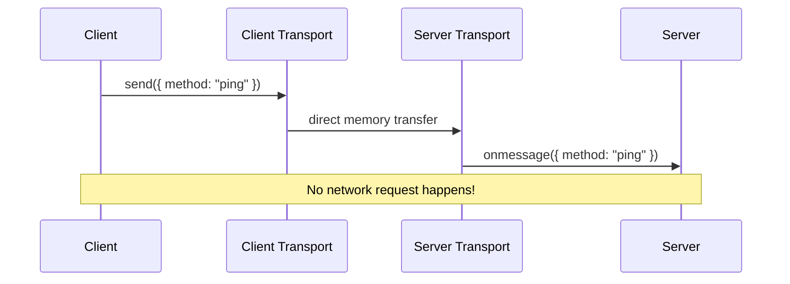
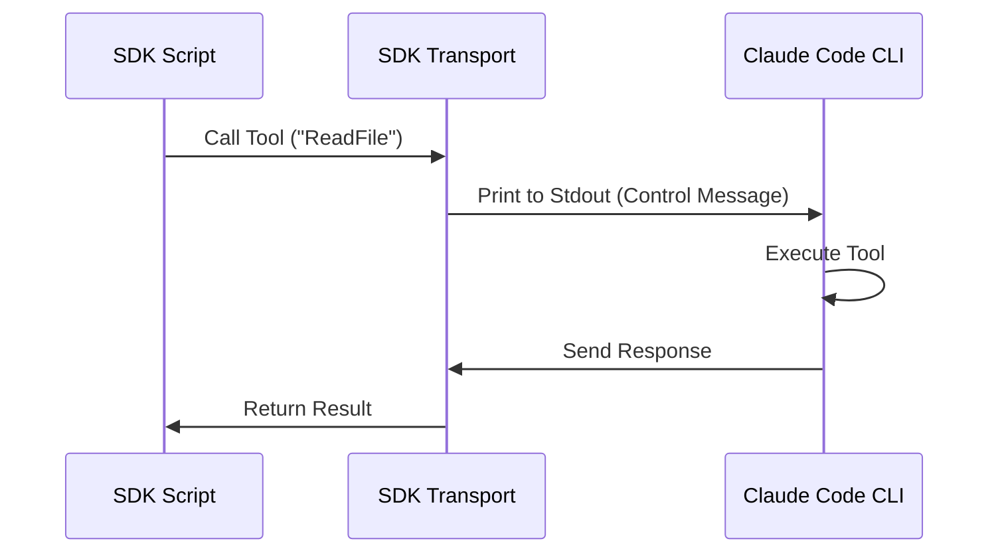

# Chapter 6: Transport Layer

Welcome to Chapter 6!

In the previous chapter, [Normalization & Identification Utilities](05_normalization___identification_utilities.md), we learned how to name our tools and servers so the system doesn't get confused. We essentially addressed the envelope.

Now, we need to actually **mail the letter**.

This chapter covers the **Transport Layer**. In the world of MCP, a "Transport" is the physical (or virtual) wire that carries data from the Client (the App) to the Server (the Tool).

## The Motivation: Why Custom Transports?

Standard MCP usually works over **Stdio** (Standard Input/Output) or **SSE** (Server-Sent Events over HTTP). These are great for connecting to external programs or remote clouds.

But what if:
1.  **Testing:** You want to run a server *inside* your test suite without starting a separate process?
2.  **SDK Integration:** You are writing a script using the SDK and need to talk to the CLI tool via the terminal's text output?

We need specialized "pipes" that can handle these specific scenarios efficiently.

### The Use Case
We will explore how the application uses **In-Process Transports** to simulate a full network connection between two variables in the same memory space. This allows for incredibly fast internal communication.

## Core Concept 1: In-Process Transport

Think of a standard network connection like **mailing a letter**. You write it, put it in a box, a truck comes, and delivers it. It takes time.

**In-Process Transport** is like **passing a note to your friend** sitting at the next desk. You don't need a truck. You just hand it over.

### How It Works

We create two "ends" of a wire: `clientTransport` and `serverTransport`. When you push data into one, it immediately pops out of the other.



### Internal Implementation

Let's look at `InProcessTransport.ts`. This class implements the standard `Transport` interface but cheats by just calling a function on the other side.

#### 1. The Class Structure
The transport needs to know who its "peer" (partner) is.

```typescript
// InProcessTransport.ts
class InProcessTransport implements Transport {
  private peer: InProcessTransport | undefined
  
  // This is where we receive messages from the other side
  onmessage?: (message: JSONRPCMessage) => void

  // Link this transport to its partner
  _setPeer(peer: InProcessTransport): void {
    this.peer = peer
  }
  // ...
}
```
*Explanation:* Every transport has a `peer`. If I am the Client Transport, my peer is the Server Transport.

#### 2. Sending Messages
When we send a message, we don't open a socket. We just call `peer.onmessage()`.

```typescript
// InProcessTransport.ts
async send(message: JSONRPCMessage): Promise<void> {
  if (this.closed) throw new Error('Transport is closed')

  // Use microtask to simulate async network behavior
  queueMicrotask(() => {
    this.peer?.onmessage?.(message)
  })
}
```
*Explanation:* We use `queueMicrotask`. Why? If we called it synchronously, `Client` calls `Server`, which calls `Client`, which calls `Server`... the computer's stack would fill up and crash (Stack Overflow). This tiny pause keeps the system stable.

#### 3. Creating the Pair
You never create just one. You always need two ends of the wire.

```typescript
// InProcessTransport.ts
export function createLinkedTransportPair(): [Transport, Transport] {
  const a = new InProcessTransport()
  const b = new InProcessTransport()
  
  // Introduce them to each other
  a._setPeer(b)
  b._setPeer(a)
  
  return [a, b]
}
```
*Explanation:* This helper creates the two ends, links them, and hands them back to you. One goes to the Client, one goes to the Server.

## Core Concept 2: SDK Control Transport

This transport is more complex. It's designed for the **SDK** (Software Development Kit).

Imagine you are running a script in your terminal. You want that script to ask the **Claude CLI** (which is running the script) to do something.

*   **Problem:** The script and the CLI are different processes.
*   **Solution:** We use `stdout` (printing text) as a transport layer.

### The Message Flow

1.  **Script:** Wants to call a tool.
2.  **Transport:** Wraps the request in a specific format.
3.  **Terminal:** Prints the request.
4.  **CLI:** Reads the printed text, executes the tool, and sends the answer back.



### Internal Implementation

This logic lives in `SdkControlTransport.ts`.

#### 1. The Client Side (The Script)
This transport takes a message and hands it off to a callback function (`sendMcpMessage`) that knows how to talk to the CLI.

```typescript
// SdkControlTransport.ts
export class SdkControlClientTransport implements Transport {
  constructor(
    private serverName: string,
    private sendMcpMessage: SendMcpMessageCallback,
  ) {}

  async send(message: JSONRPCMessage): Promise<void> {
    // 1. Send message via the callback (bridging to CLI)
    const response = await this.sendMcpMessage(this.serverName, message)

    // 2. When response returns, notify the client
    if (this.onmessage) {
      this.onmessage(response)
    }
  }
}
```
*Explanation:* This class hides the complexity. The MCP Client just thinks it's sending a message. Internally, `sendMcpMessage` handles the messy work of formatting it for the CLI.

#### 2. The Server Side (The SDK)
On the other side, the SDK needs to receive messages from the CLI and pass them to the tool.

```typescript
// SdkControlTransport.ts
export class SdkControlServerTransport implements Transport {
  constructor(private sendMcpMessage: (message: JSONRPCMessage) => void) {}

  async send(message: JSONRPCMessage): Promise<void> {
    // Pass the response back to the CLI
    this.sendMcpMessage(message)
  }
}
```
*Explanation:* This acts as a pass-through. When the internal tool finishes its job, this transport sends the result back out to the CLI.

## Summary

In this final chapter of the tutorial, we explored the "physical" layer of MCP:

1.  **Transport Interface:** All transports must implement `start`, `send`, `close`, and `onmessage`.
2.  **In-Process:** A way to link two parts of the *same* program instantly, useful for testing and internal tools.
3.  **SDK Control:** A bridge that allows a script to talk to the CLI running it, enabling powerful automation workflows.

### Conclusion

Congratulations! You have navigated the entire architecture of the **MCP** project.

1.  We found servers using [Configuration](01_configuration_hierarchy___loading.md).
2.  We logged in using [Authentication](02_authentication___security__oauth_xaa_.md).
3.  We kept the line open with [Lifecycle Management](03_connection_lifecycle_management.md).
4.  We bridged chat apps with [Notifications](04_channel_notifications___permissions.md).
5.  We organized everything with [Normalization](05_normalization___identification_utilities.md).
6.  And finally, we delivered the messages with the **Transport Layer**.

You now have a complete understanding of how this complex, multi-layered system facilitates communication between AI models, local tools, and remote servers. Happy coding!

---

Generated by [Code IQ](https://github.com/adityasoni99/Code-IQ)