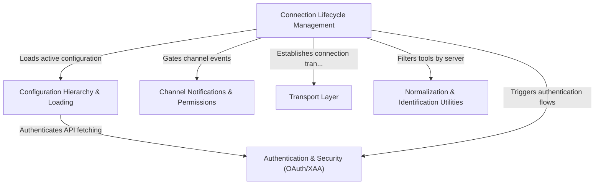

# Tutorial: mcp

This project implements a robust integration layer for the **Model Context Protocol (MCP)**, acting as a dynamic "switchboard" that connects the AI assistant to various external tools and servers. It manages the *lifecycle of connections* (auto-reconnecting and handling errors), merges **configuration settings** from local and enterprise scopes, and enforces strict **security** via OAuth and permission gating. Additionally, it handles *real-time notifications* from external channels (like Slack) and normalizes data to ensure consistent communication across the system.

## Chapters

1. [Configuration Hierarchy & Loading](01_configuration_hierarchy___loading.md)
2. [Authentication & Security (OAuth/XAA)](02_authentication___security__oauth_xaa_.md)
3. [Connection Lifecycle Management](03_connection_lifecycle_management.md)
4. [Channel Notifications & Permissions](04_channel_notifications___permissions.md)
5. [Normalization & Identification Utilities](05_normalization___identification_utilities.md)
6. [Transport Layer](06_transport_layer.md)

---

Generated by [Code IQ](https://github.com/adityasoni99/Code-IQ)