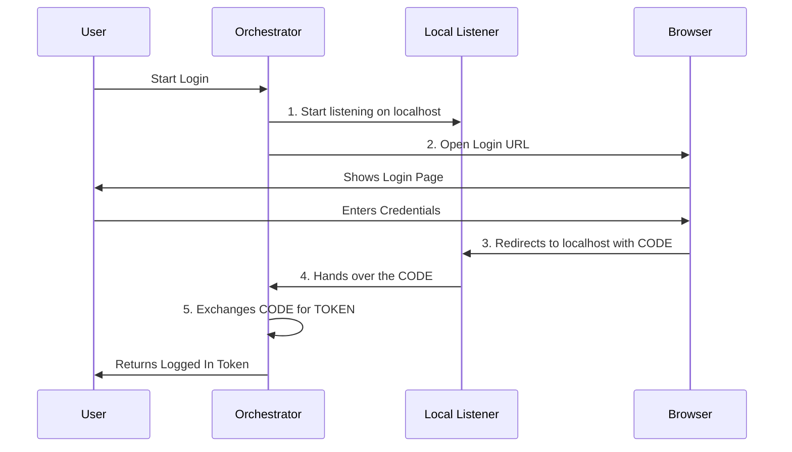

# Chapter 1: OAuth Flow Orchestrator

Welcome to the first chapter of our OAuth tutorial!

If you have ever clicked "Log in with Google" or "Log in with GitHub," you have used OAuth. It feels simple: you click a button, a window pops up, you say "Yes," and you are logged in.

But behind the scenes, there is a complex dance happening between your application, a web browser, and the authentication server.

In this chapter, we will build the **OAuth Flow Orchestrator**.

## The Concierge Analogy

Imagine you are hiring a **Concierge** to handle a trip for you. You don't want to know the flight numbers or call the taxi yourself. You just want to say, "Book my trip," and wait for the confirmation.

The **OAuth Orchestrator** is that concierge.

1.  **Preparation:** It gathers your ID papers (Security).
2.  **The Setup:** It opens a private gate for you to return through (Local Listener).
3.  **The Journey:** It sends you to the destination (Browser).
4.  **The Wait:** It waits patiently until you return.
5.  **The Result:** It hands you the keys to your hotel room (Access Token).

## Use Case: The One-Click Login

We want to allow a user to log in via their terminal/command line with a single function call.

**Our Goal:**
We want to write code that looks as simple as this:

```typescript
const authService = new OAuthService();

// Start the magic!
const tokens = await authService.startOAuthFlow(async (url) => {
    // Tell the user where to go
    console.log(`Please login at: ${url}`);
});

console.log("Login successful! Token:", tokens.accessToken);
```

Let's explore how the Orchestrator (`OAuthService`) makes this happen.

## Key Concepts

To orchestrate this flow, our service needs to manage three specific tasks.

### 1. Security First (PKCE)
Before doing anything, the Orchestrator generates a secret "password" (called a **Verifier**) and creates a scrambled version of it (called a **Challenge**). It sends the scrambled version when you log in and proves it has the real password later. This prevents bad actors from intercepting your login.
*We will cover the math behind this in [PKCE Security (Crypto)](05_pkce_security__crypto_.md).*

### 2. The Meeting Point (Listener)
Since this is a desktop/CLI application, we need a way for the web browser to talk back to our code. The Orchestrator spins up a temporary web server on your computer (like `http://localhost:1234`) to "catch" the user when they return from logging in.
*We will detail this in [Local Callback Listener](02_local_callback_listener.md).*

### 3. The Exchange
When you return from the web browser, you don't bring back a usable token immediately. You bring back a temporary **Authorization Code**. The Orchestrator takes this code and swaps it for the actual Access Token.
*We will cover this in [API Client & Token Management](03_api_client___token_management.md).*

## How It Works: Step-by-Step

Before looking at the code, let's look at the flow of events managed by the Orchestrator.



## Internal Implementation

Let's look at how we implement this in `src/oauth/index.ts`. We call our class `OAuthService`.

### Step 1: Initialization
When we create the service, we immediately generate our cryptographic secrets.

```typescript
export class OAuthService {
  private codeVerifier: string;
  // ... other properties

  constructor() {
    // Generate the secret "password" for this session immediately
    // See Chapter 5 for details on generateCodeVerifier
    this.codeVerifier = crypto.generateCodeVerifier();
  }
  // ...
}
```

### Step 2: Setting the Stage
The main method is `startOAuthFlow`. The first thing it does is set up the "Meeting Point" (the local server).

```typescript
async startOAuthFlow(authURLHandler): Promise<OAuthTokens> {
    // 1. Create the listener that catches the browser return
    this.authCodeListener = new AuthCodeListener()
    
    // 2. Start it and find out which port uses (e.g., 8080)
    // See Chapter 2 for how this listener works
    this.port = await this.authCodeListener.start()
    
    // ... continues below
```

### Step 3: Building the URL
Now the Orchestrator prepares the travel documents. It bundles the security challenge and the meeting point info into a URL.

```typescript
    // 3. Create the security challenge (See Chapter 5)
    const codeChallenge = crypto.generateCodeChallenge(this.codeVerifier)
    const state = crypto.generateState()

    // 4. Build the URL the user needs to visit
    // See Chapter 3 regarding the client builder
    const opts = { codeChallenge, state, port: this.port /* ... */ }
    const automaticFlowUrl = client.buildAuthUrl({ ...opts, isManual: false })
```

### Step 4: Sending the User & Waiting
This is the most critical part. The Orchestrator asks the user to open the browser and then **pauses** execution to wait for the result.

```typescript
    // 5. Open the browser (automatic) or ask user to click (manual)
    // We wait here until the user finishes logging in!
    const authorizationCode = await this.waitForAuthorizationCode(
      state,
      async () => {
         await openBrowser(automaticFlowUrl) 
      },
    )
```

### Step 5: The Exchange
Once the `authorizationCode` arrives, the Orchestrator performs the final swap to get the actual tokens.

```typescript
    // 6. Swap the temporary code for the real Access Token
    // See Chapter 3 for exchangeCodeForTokens
    const tokenResponse = await client.exchangeCodeForTokens(
        authorizationCode,
        state,
        this.codeVerifier, // We prove we own the secret here
        this.port!
    )
    
    // 7. Success! Return the tokens to the application
    return this.formatTokens(tokenResponse, /* ... */);
}
```

## Waiting for the Code
You might wonder how `waitForAuthorizationCode` works. It wraps the process in a JavaScript `Promise`. It's like telling the program: "Don't do anything else until the Listener tells us someone has arrived."

```typescript
private async waitForAuthorizationCode(state, onReady): Promise<string> {
    return new Promise((resolve, reject) => {
      // Tell the listener: "If a browser hits you with this 'state',
      // call 'resolve' with the code."
      this.authCodeListener
        ?.waitForAuthorization(state, onReady)
        .then(code => resolve(code))
        .catch(err => reject(err))
    })
}
```

## Summary
The **OAuth Flow Orchestrator** is the manager of the login process. It doesn't do the heavy lifting itself; instead, it delegates tasks:

1.  It asks [PKCE Security (Crypto)](05_pkce_security__crypto_.md) for secrets.
2.  It asks [Local Callback Listener](02_local_callback_listener.md) to listen for the browser.
3.  It asks [API Client & Token Management](03_api_client___token_management.md) to trade codes for tokens.

However, the Orchestrator has a dependency that is arguably the most complex part of this setup: **How do we actually catch the user returning from the web browser?**

Let's dive into exactly how that "Meeting Point" works in the next chapter.

[Next Chapter: Local Callback Listener](02_local_callback_listener.md)

---

Generated by [Code IQ](https://github.com/adityasoni99/Code-IQ)