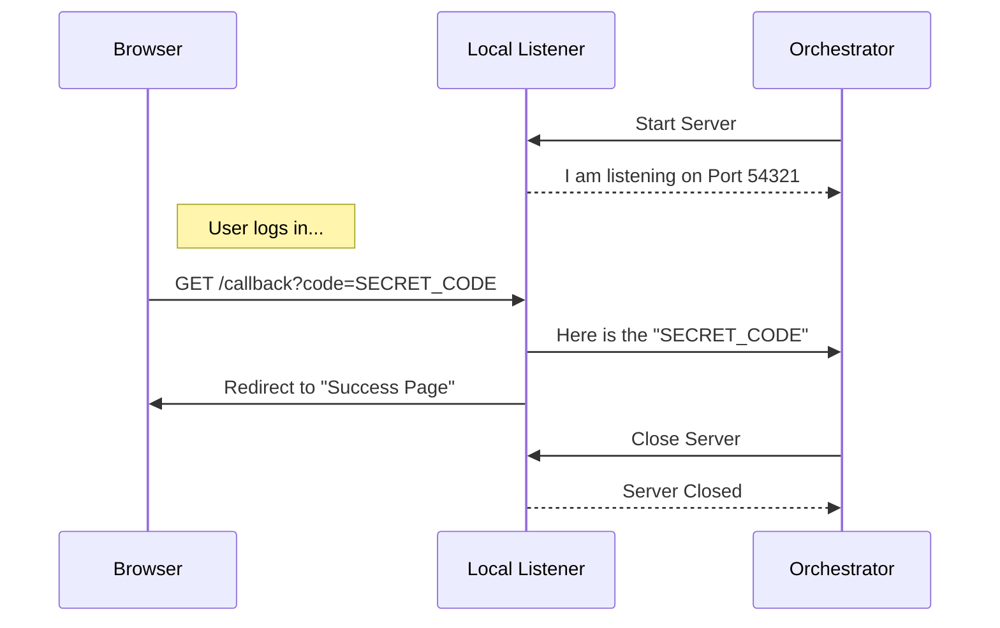

# Chapter 2: Local Callback Listener

Welcome to the second chapter of our OAuth tutorial!

In the previous chapter, we built the [OAuth Flow Orchestrator](01_oauth_flow_orchestrator.md), which manages the overall login journey. We mentioned that the Orchestrator needs a "Meeting Point" to know when the user has successfully logged in.

In this chapter, we will build that meeting point: the **Local Callback Listener**.

## The Problem: The Communication Gap

Here is the challenge:
1.  **Your CLI tool** runs in a text-based terminal window.
2.  **The Login Page** runs in a web browser (like Chrome or Safari).

These two programs are completely separate. When you click "Accept" in Chrome, your terminal has no idea that it happened. We need a bridge between them.

## The Solution: A Temporary Catcher's Mitt

To solve this, our CLI tool briefly pretends to be a web server.

Imagine a baseball game. The Authorization Server is the pitcher. It is going to throw the ball (the **Authorization Code**) back to your computer.

The **Local Callback Listener** is the catcher's mitt.
1.  It opens up (starts a server).
2.  It waits for the ball (the network request).
3.  Once it catches the ball, it hands it to the Orchestrator.
4.  It immediately closes (stops the server).

## Use Case: Catching the Code

We want to be able to start a listener that waits for a specific signal from the browser, grabs the data, and shuts down.

**The Goal:**
We want to use the listener like this:

```typescript
const listener = new AuthCodeListener();

// 1. Open the mitt (start server on a random port)
const port = await listener.start(); 
console.log(`Listening on localhost:${port}`);

// 2. Wait for the ball!
// The code pauses here until the browser hits our server
const code = await listener.waitForAuthorization(expectedState, async () => {
    console.log("Ready to catch!");
});
```

## Internal Implementation: How It Works

This listener is built using Node.js's built-in `http` module. It doesn't need heavy frameworks like Express; it just needs to handle one specific request.

### The Flow of Events



Let's break down the implementation in `src/oauth/auth-code-listener.ts`.

### 1. Starting the Server
The first step is to start an HTTP server.

A crucial detail here is the **Port**. If we try to use port `80`, it might be blocked. If we use `8080`, another app might be using it.

**The Trick:** If we ask to listen on port `0`, the operating system will automatically find a free, random port for us (like `54321`) and assign it. This prevents crashes!

```typescript
// Inside AuthCodeListener class
async start(port?: number): Promise<number> {
  return new Promise((resolve, reject) => {
    // Listen on port 0 to let OS assign a free port
    this.localServer.listen(port ?? 0, 'localhost', () => {
      const address = this.localServer.address() as AddressInfo
      this.port = address.port
      // Return the port number so we can put it in the Redirect URL
      resolve(this.port)
    })
  })
}
```

### 2. The Waiting Game
Since we don't know when the user will finish logging in (it could take 5 seconds or 5 minutes), we use a **Promise**.

This method creates a Promise that *only* resolves when a request hits our server.

```typescript
async waitForAuthorization(state: string, onReady): Promise<string> {
  return new Promise<string>((resolve, reject) => {
    // Save these functions so we can call them later
    // when the request actually arrives
    this.promiseResolver = resolve
    this.promiseRejecter = reject
    
    this.expectedState = state
    this.startLocalListener(onReady)
  })
}
```

### 3. Handling the Redirect (The Catch)
When the browser redirects the user to `http://localhost:54321/callback?code=abc&state=xyz`, our server wakes up.

We need to extract the `code` from the URL.

```typescript
private handleRedirect(req: IncomingMessage, res: ServerResponse): void {
  // Parse the full URL to find query parameters
  const parsedUrl = new URL(req.url || '', `http://localhost`)

  // 1. Grab the code from ?code=...
  const authCode = parsedUrl.searchParams.get('code')
  
  // 2. Validate security state (CSRF protection)
  const state = parsedUrl.searchParams.get('state')

  // Pass it to our validation logic
  this.validateAndRespond(authCode, state, res)
}
```

### 4. Validation & Handoff
We must ensure the `state` matches what we sent. This prevents "Man-in-the-Middle" attacks where someone else tries to trick your local server.

If it matches, we fulfill the Promise we made in Step 2.

```typescript
private validateAndRespond(authCode, state, res): void {
  // Check if the state matches what the Orchestrator generated
  if (state !== this.expectedState) {
    res.writeHead(400); res.end('Invalid state');
    return;
  }

  // Save the response object so we can redirect the user later
  this.pendingResponse = res

  // SUCCESS! Unlock the 'waitForAuthorization' promise
  this.resolve(authCode!)
}
```

### 5. Cleaning Up (Closing the Loop)
Once we have the code, the CLI logic resumes. However, the user's browser is still spinning, waiting for the page to load.

We should be polite and redirect the browser to a "Success" page (like "You have successfully logged in, you may close this tab").

```typescript
handleSuccessRedirect(scopes: string[]): void {
  if (!this.pendingResponse) return

  // Determine where to send the user
  const successUrl = getOauthConfig().CONSOLE_SUCCESS_URL

  // Tell the browser: "Go here instead"
  this.pendingResponse.writeHead(302, { Location: successUrl })
  this.pendingResponse.end()
  
  // Clean up memory
  this.pendingResponse = null
}
```

## Summary

The **Local Callback Listener** is a clever hack to bridge the gap between desktop applications and web browsers.

1.  It spins up a temporary web server.
2.  It uses port `0` to safely find an open lane.
3.  It parses the URL to "catch" the Authorization Code.

Now that our Orchestrator has successfully "caught" the Authorization Code, it holds a valuable ticket. But this ticket isn't the final key. We need to trade this code for the actual Access Token.

In the next chapter, we will build the client that performs this trade.

[Next Chapter: API Client & Token Management](03_api_client___token_management.md)

---

Generated by [Code IQ](https://github.com/adityasoni99/Code-IQ)